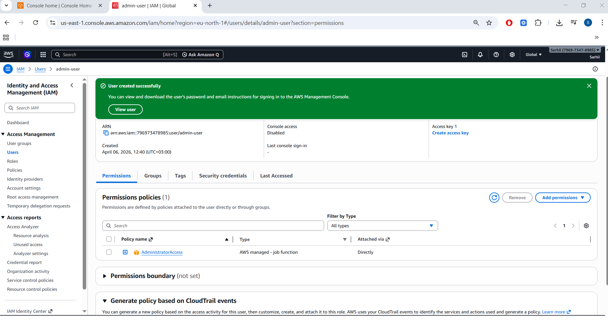
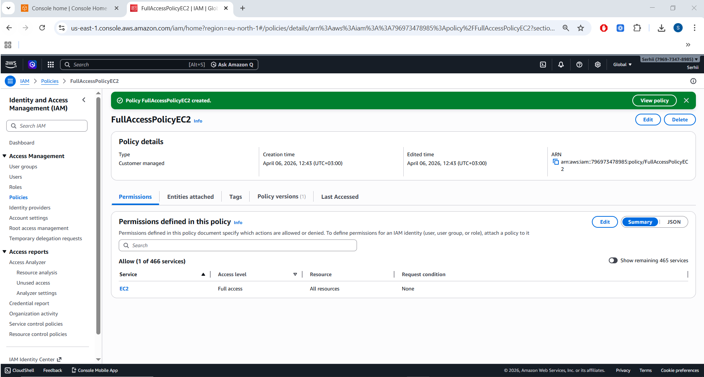
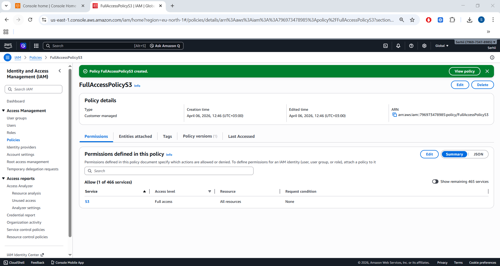
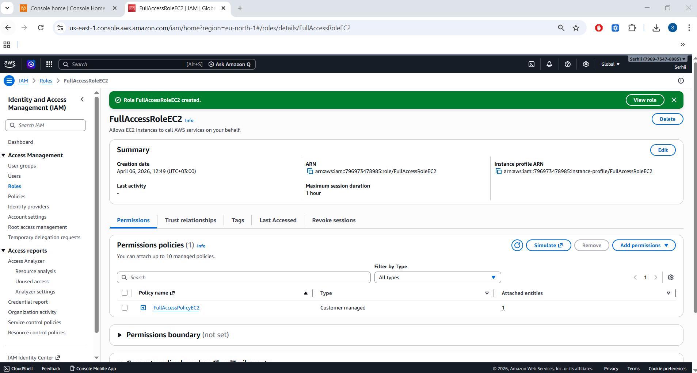
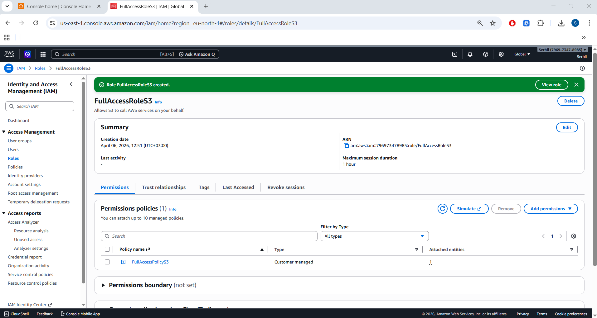
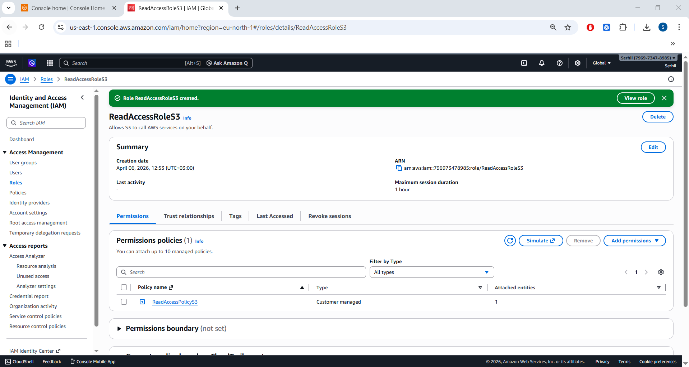
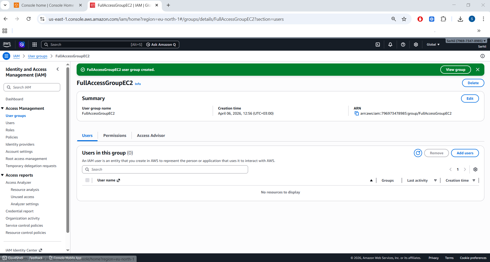
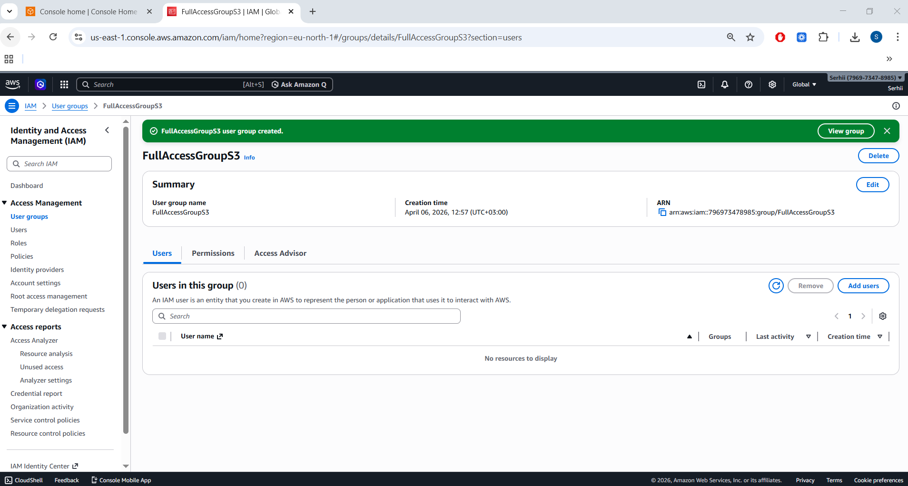
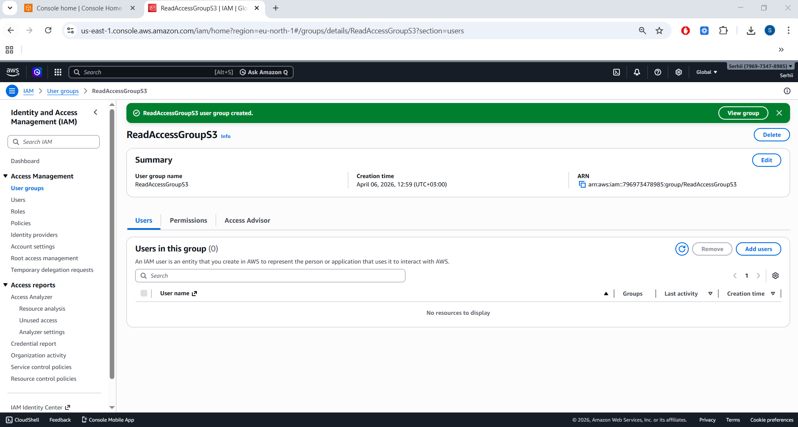
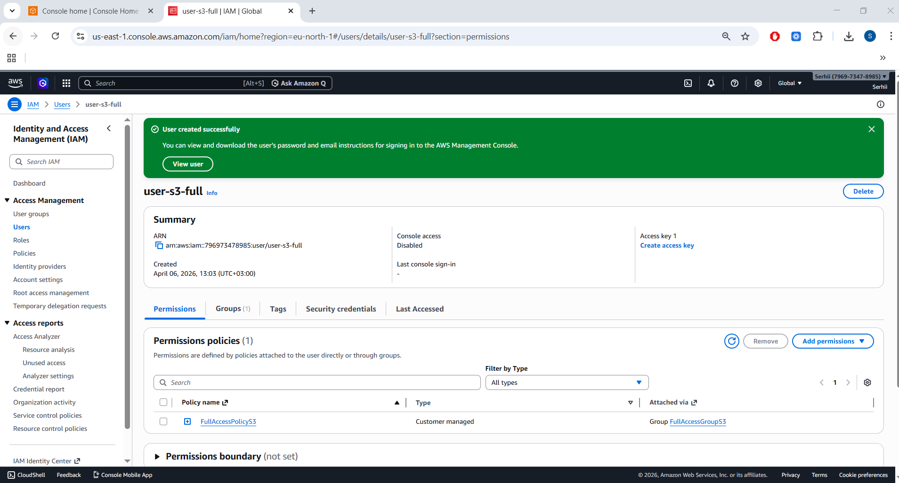

# 📘 Project 01 — DevOps Methodology & AWS IAM Foundations

This project demonstrates foundational DevOps concepts through practical AWS IAM configuration.
The goal is to build a secure, structured identity and access management setup using:

- IAM Users

- IAM Groups

- IAM Policies

- IAM Roles

All actions were performed under a dedicated Administrator IAM user, following best practices.

## 🧭 Project Objectives

✔ Create an IAM Administrator user

✔ Create 3 custom IAM policies

✔ Create 3 IAM roles

✔ Create 3 IAM groups

✔ Create 3 IAM users and assign them to groups

✔ Document everything with screenshots

## 🏷️ Technologies and Tools Used in This Project

This project focuses on AWS Identity and Access Management (IAM) fundamentals — a core building block of secure DevOps workflows.
It demonstrates how permissions, roles, groups, and users are structured in real cloud environments.

🌐 AWS Cloud Services


🔐 Identity & Access Management


🛠️ DevOps & Cloud Foundations


📋 Project Status


---

## 📂 Repository Structure


``` Code
project-01-devops-methodology/
│
├── README.md
└── images/
    ├── iam-admin-user-created.png
    ├── policy-fullaccess-ec2.png
    ├── policy-fullaccess-s3.png
    ├── policy-readaccess-s3.png
    ├── role-fullaccess-ec2.png
    ├── role-fullaccess-s3.png
    ├── role-readaccess-s3.png
    ├── group-fullaccess-ec2.png
    ├── group-fullaccess-s3.png
    ├── group-readaccess-s3.png
    ├── user-ec2-full.png
    ├── user-s3-full.png
    └── user-s3-read.png
	
``` 
	
	
## 🚀 Step‑by‑Step Implementation

Below is the full workflow used to complete this project.

### 1️⃣ Create IAM Administrator User
1) Log in to AWS Console using the root account

2) Navigate to IAM → Users → Create user

3) Name: admin-user

4) Permissions: Attach existing policies directly

5) Add: AdministratorAccess

6) Create user
  



### 2️⃣ Create IAM Policies
Policy 1 — FullAccessPolicyEC2

``` JSON:


json
{
  "Version": "2012-10-17",
  "Statement": [
    {
      "Effect": "Allow",
      "Action": "ec2:*",
      "Resource": "*"
    }
  ]
}
``` 



---

Policy 2 — FullAccessPolicyS3

``` JSON:


json
{
  "Version": "2012-10-17",
  "Statement": [
    {
      "Effect": "Allow",
      "Action": "s3:*",
      "Resource": "*"
    }
  ]
}
```



---

Policy 3 — ReadAccessPolicyS3

``` JSON:


json
{
  "Version": "2012-10-17",
  "Statement": [
    {
      "Effect": "Allow",
      "Action": [
        "s3:Get*",
        "s3:List*"
      ],
      "Resource": "*"
    }
  ]
}
``` 


---

### 3️⃣ Create IAM Roles

Role 1 — FullAccessRoleEC2
- Trusted entity: AWS service → EC2

- Attach: FullAccessPolicyEC2



---

Role 2 — FullAccessRoleS3
- Trusted entity: AWS service → EC2

- Attach: FullAccessPolicyS3



---

Role 3 — ReadAccessRoleS3
- Trusted entity: AWS service → EC2

- Attach: ReadAccessPolicyS3



---

### 4️⃣ Create IAM Groups

Group 1 — FullAccessGroupEC2
- Attach: FullAccessPolicyEC2



---

Group 2 — FullAccessGroupS3
- Attach: FullAccessPolicyS3



---

Group 3 — ReadAccessGroupS3
- Attach: ReadAccessPolicyS3



---

### 5️⃣ Create IAM Users and Assign Groups
User 1 — user-ec2-full
- Add to group: FullAccessGroupEC2


---

User 2 — user-s3-full
- Add to group: FullAccessGroupS3



---

User 3 — user-s3-read
- Add to group: ReadAccessGroupS3


---

## 🎯 Outcome
By completing this project, I demonstrated:

- Understanding of IAM identity structure

- Ability to design access control using policies, roles, and groups

- Practical AWS Console navigation

- Documentation of cloud operations

This forms the foundation for more advanced DevOps automation and cloud security practices.
