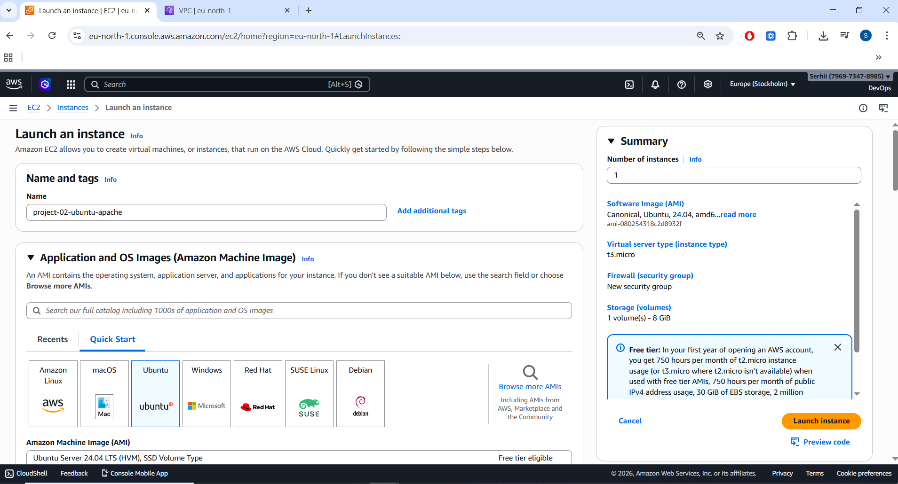
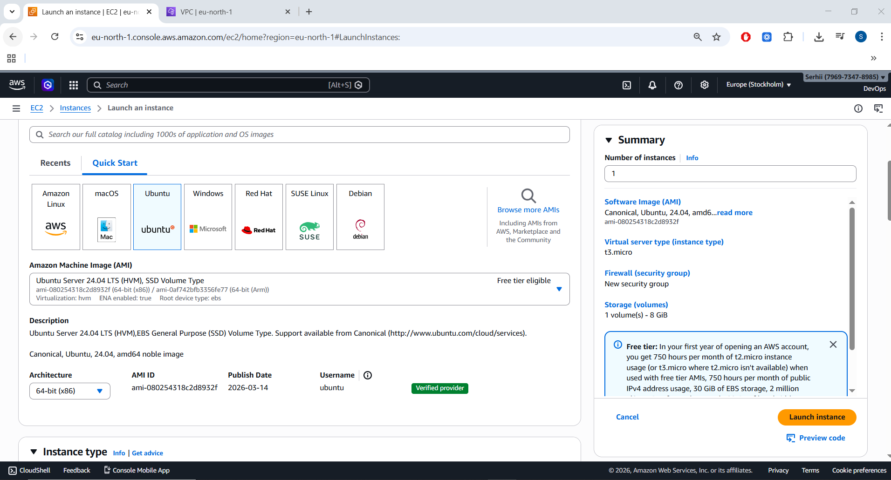
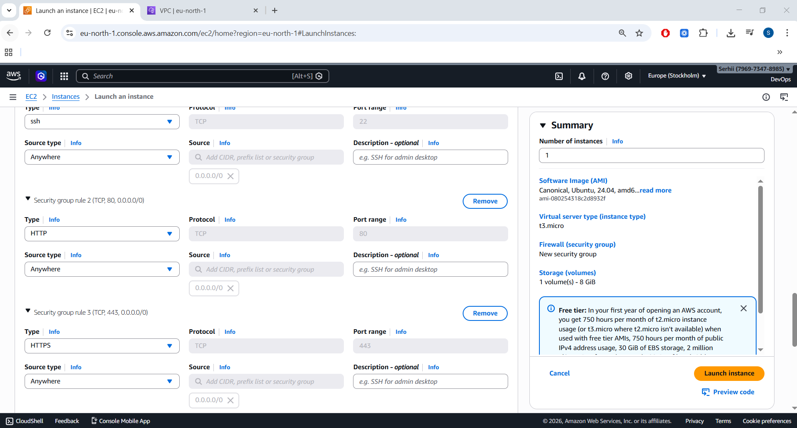
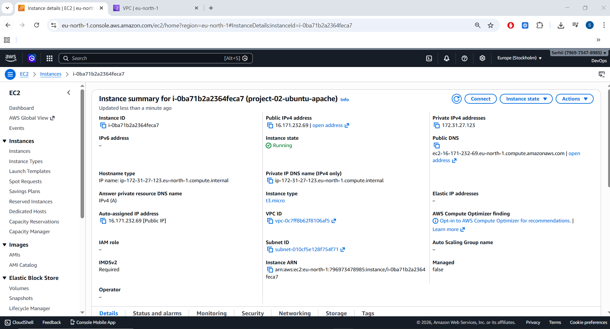
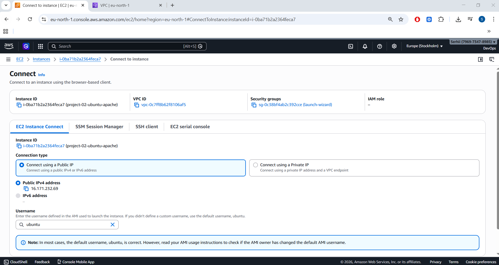
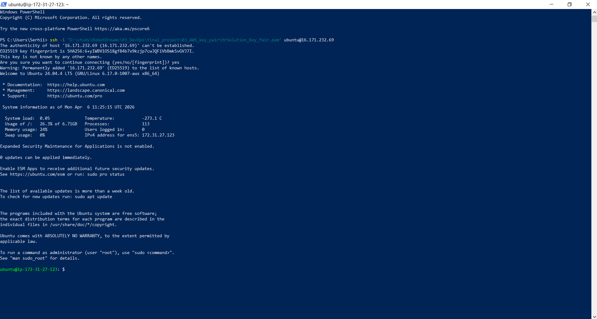
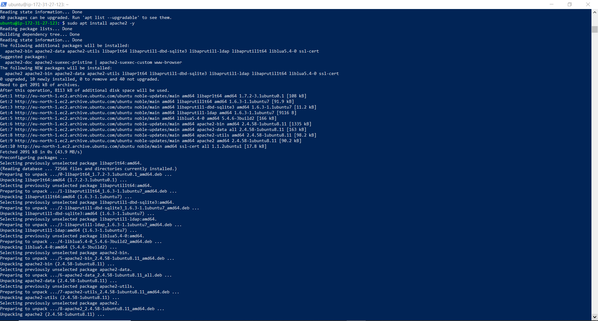
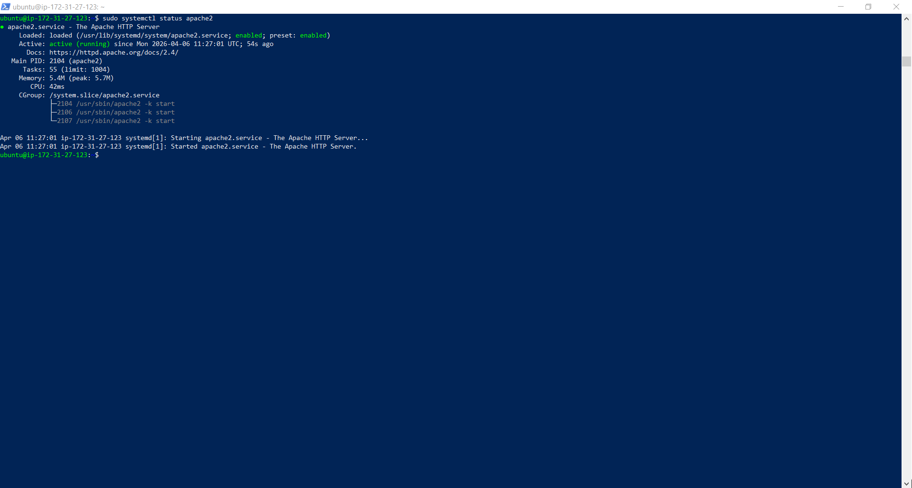
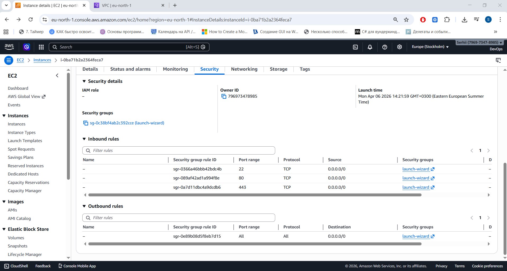
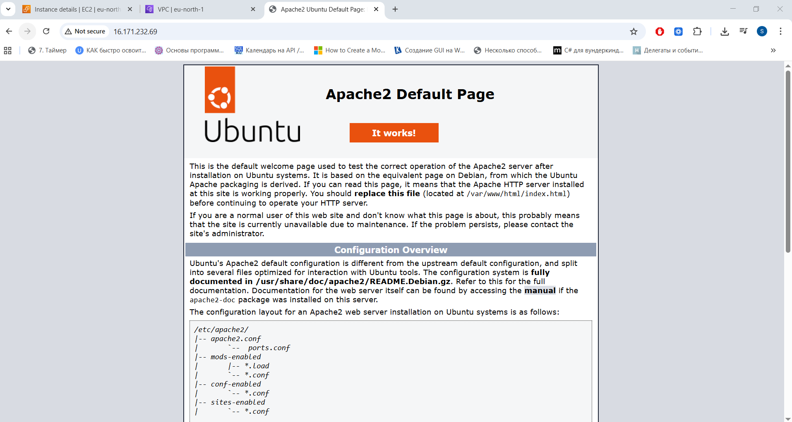

# 📘 Project 02 — Network Fundamentals: TCP/IP & OSI Model (AWS Practical Lab)

This project demonstrates practical networking fundamentals using AWS EC2.
The goal is to launch an Ubuntu instance, configure networking, install Apache, and verify access via a public browser.

This hands‑on lab reinforces key DevOps networking concepts:

- Public vs private IP

- Security groups (firewall rules)

- SSH connectivity

- HTTP/HTTPS access

- Basic Linux administration
---

## 🏷️ Technologies and Tools Used in This Project

This project combines essential cloud, networking, and Linux technologies to demonstrate how real-world DevOps engineers deploy and expose web services on AWS.

🌐 AWS Cloud Services


🐧 Linux & Networking


🛠️ Web Server


📌 Project Status


---


## 🧭 Project Structure

``` Code
project-02-network-fundamentals/
│
├── README.md
└── images/
    ├── 01_ec2_launch_screen.png
    ├── 02_instance_type_t2micro.png
    ├── 03_security_group_rules.png
    ├── 04_instance_running.png
    ├── 05_connect_button.png
    ├── 06_ssh_terminal_connected.png
    ├── 07_apache_installation.png
    ├── 08_apache_service_status.png
    ├── 09_security_group_port80.png
    └── 10_apache_browser_page.png
	
```
---

## 🚀 Step‑by‑Step Implementation

Below is the complete workflow used to complete this project, including screenshot points.

---

### 1️⃣ Launch EC2 Instance (Ubuntu t2.micro)

Step 1 — Open EC2 Dashboard
AWS Console → EC2 → Launch instance

 

---

Step 2 — Choose AMI
Select:

Ubuntu Server 22.04 LTS (or latest LTS available)

---

Step 3 — Choose Instance Type
Select:

t2.micro (Free Tier eligible)



---

### 2️⃣ Configure Security Group (SSH + HTTP + HTTPS)

Step 4 — Create or Edit Security Group
Add inbound rules:

Type	Port	Source

SSH	    22	     My IP

HTTP	80	     0.0.0.0/0

HTTPS	443	     0.0.0.0/0



---

### 3️⃣ Launch the Instance

Step 5 — Launch
Click Launch instance.

---

Step 6 — Verify Instance is Running
Go to:

EC2 → Instances → Status = Running



---

### 4️⃣ Connect to EC2 via SSH

Step 7 — Click “Connect”
Select the SSH client tab.



---

Step 8 — Connect from Terminal
Use .pem key:

``` Code
chmod 400 HrSolution_Key_Pair.pem
ssh -i "D:\study\HrSolution_Key_Pair.pem" ubuntu@16.171.232.69
``` 



---

### 5️⃣ Install Apache Web Server

Step 9 — Update Packages

``` Code
sudo apt update
``` 
---
Step 10 — Install Apache

``` Code
sudo apt install apache2 -y
``` 



---

Step 11 — Check Apache Status

``` Code
sudo systemctl status apache2
``` 

Expected result: active (running)



---


### 6️⃣ Open Port 80

If HTTP wasn’t added earlier:

1) EC2 → Instances

2) Select your instance

3) Open Security tab

4) Click the Security Group

5) Add inbound rule:

-- Type: HTTP

-- Port: 80

-- Source: 0.0.0.0/0



---


### 7️⃣ Verify Apache in Browser

Step 12 — Open Browser
Go to:

``` Code
http://16.171.232.69/
``` 

We see the Apache2 Ubuntu Default Page.

📸 images/10_apache_browser_page.png 
 
---


## 🎯 Outcome
By completing this project, I demonstrated:

Understanding of EC2 networking

Ability to configure security groups

SSH connectivity and Linux administration

Installing and managing Apache web server

Verifying public HTTP access

This lab reinforces core DevOps networking and cloud fundamentals.

---