# Linux Essentials & Command-Line Operations

  
  
  


## 📂 Project Structure

``` Code
project/
│
├── README.md
│
├── images/
│   ├── 01_ec2_launch_screen.png
│   ├── 02_instance_running.png
│   ├── 03_create_groups.png
│   ├── 04_create_users.png
│   ├── 05_assign_groups.png
│   ├── 06_permissions_var_www_html.png
│   ├── 07_ssh_dev_user.png
│   ├── 08_ssh_ops_user.png
│   ├── 09_ssh_test_user.png
│   ├── 10_html_directory_listing.png
│   ├── 11_create_users_groups_run.png
│   ├── 12_check_users_groups_run.png
│   ├── 13_install_apache_run.png
│   ├── 14_apache_default_page.png
│   ├── 14_apache_status.png
│   ├── 15_install_lamp_run.png
│   ├── 16_services_status.png
│   ├── 17_phpinfo_browser.png
│
└── scripts/
    ├── create_users_groups.sh
    ├── install_apache.sh
    └── install_lamp.sh

``` 

---

## 🧩 Task 1 — Linux Users, Groups, Permissions & SSH Setup

📌 Task Description
This task required:

- creating three users: devuser, opsuser, testuser

- creating two groups: Dev and Ops

- assigning users to the correct groups

- configuring SSH key‑based authentication

- configuring permissions for /var/www/html

- testing access via SSH

- providing screenshots

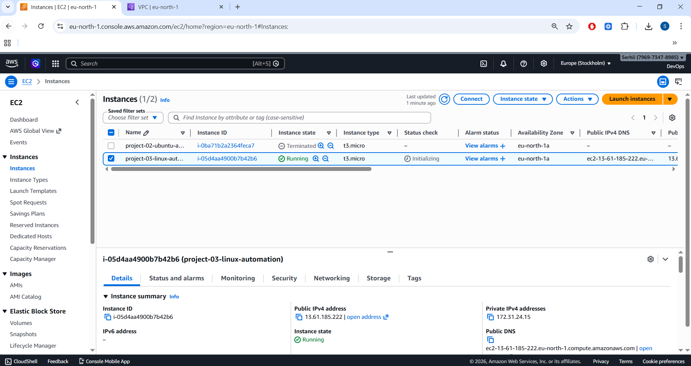


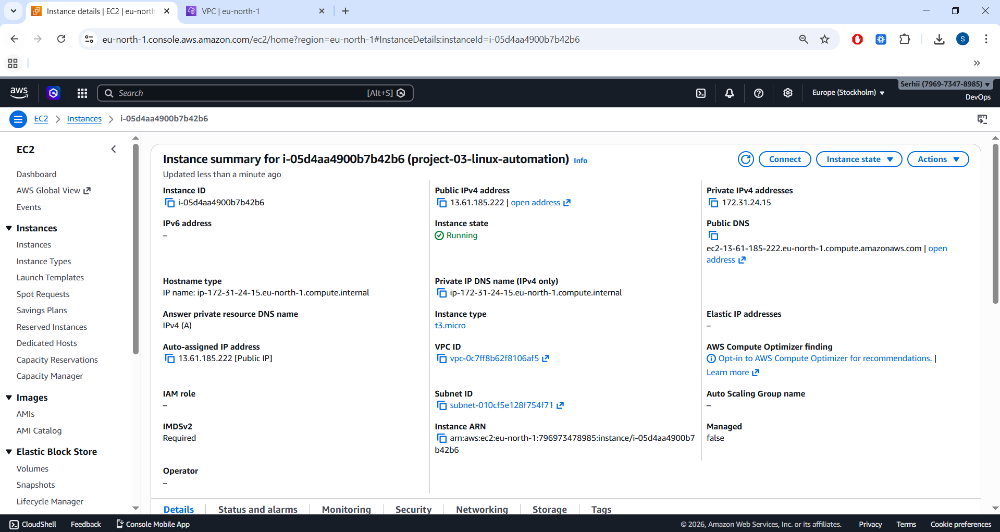


---


## 🧩 Steps Performed

### 1️⃣ Creating users

``` bash
sudo adduser devuser
sudo adduser opsuser
sudo adduser testuser
``` 

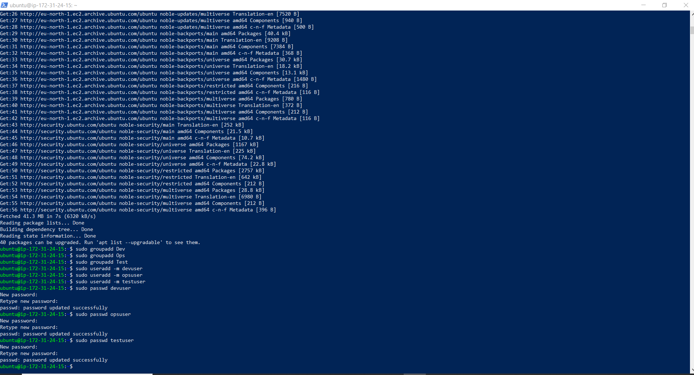


### 2️⃣ Creating groups

``` bash
sudo groupadd Dev
sudo groupadd Ops
``` 

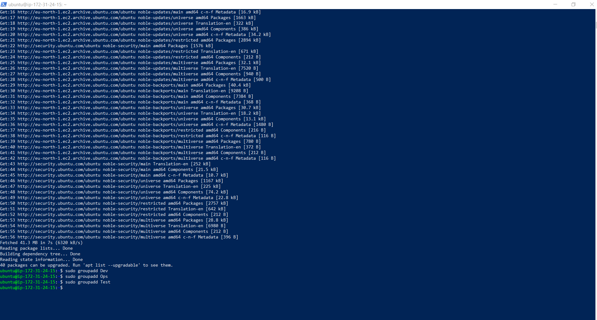


### 3️⃣ Assigning users to groups

``` bash
sudo usermod -aG Dev devuser
sudo usermod -aG Dev opsuser
sudo usermod -aG Ops opsuser
``` 

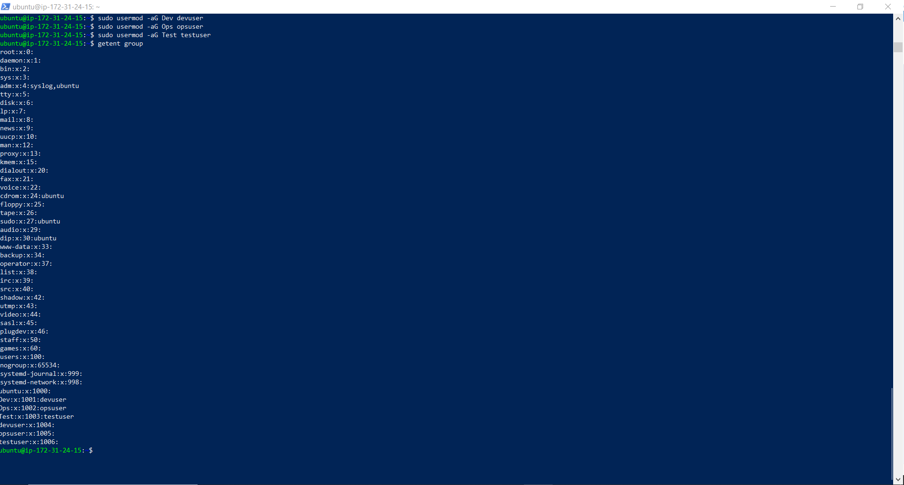


testuser is intentionally not added to any group.

### 4️⃣ Configuring SSH keys
Example for devuser:

``` bash
sudo mkdir /home/devuser/.ssh
sudo cp /home/ubuntu/.ssh/authorized_keys /home/devuser/.ssh/
sudo chown -R devuser:devuser /home/devuser/.ssh
sudo chmod 700 /home/devuser/.ssh
sudo chmod 600 /home/devuser/.ssh/authorized_keys
``` 

### 5️⃣ Setting permissions on /var/www/html

``` bash
sudo chgrp Dev /var/www/html
sudo chmod 775 /var/www/html
``` 

Expected:

``` Code
drwxrwxr-x root Dev /var/www/html
``` 

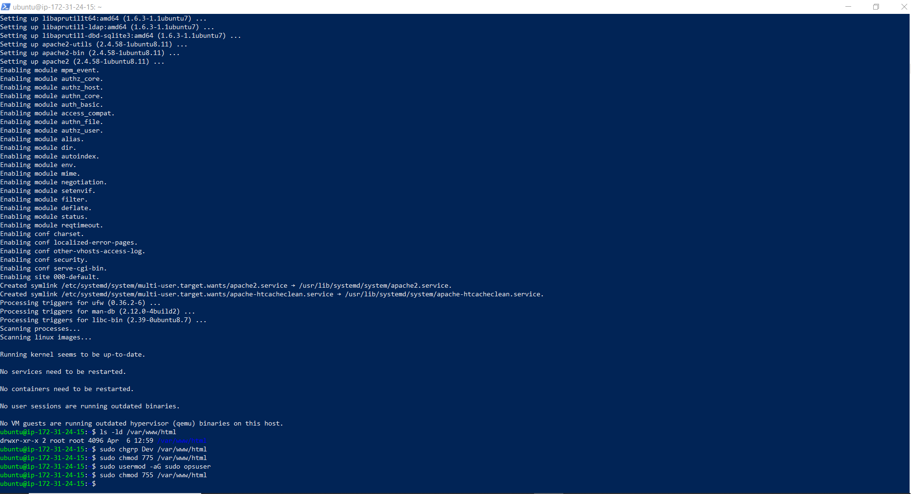


## 🧪 SSH Testing

✔ devuser — should have write access

``` Code
ssh -i /home/ubuntu/.ssh/id_rsa devuser@<ip>
cd /var/www/html
touch devfile.txt
``` 


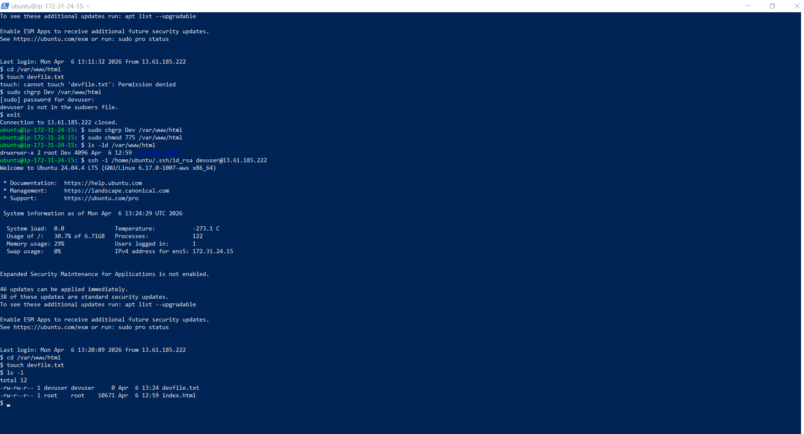

---


✔ opsuser — should have write access + sudo

``` Code
ssh -i /home/ubuntu/.ssh/id_rsa opsuser@<ip>
cd /var/www/html
touch opsfile.txt
sudo apt update
``` 


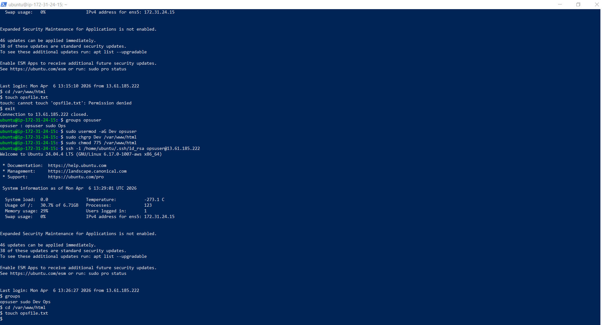

---


✔ testuser — should NOT have write access

``` Code
ssh -i /home/ubuntu/.ssh/id_rsa testuser@<ip>
cd /var/www/html
touch testfile.txt
``` 

Expected:

``` Code
Permission denied
``` 


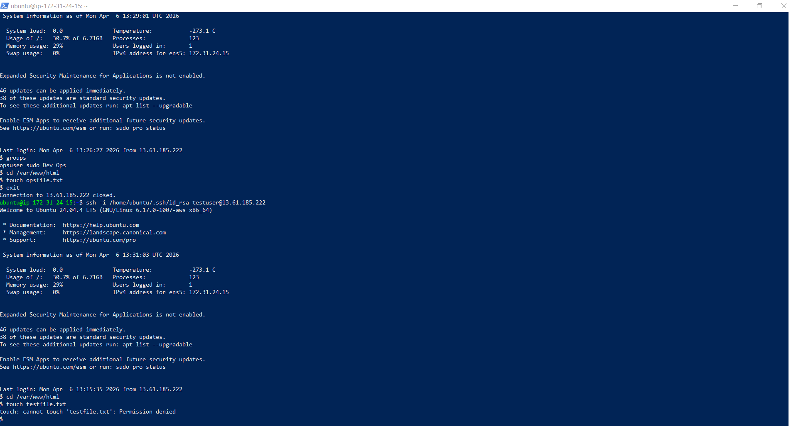

---

## ⚠️ Issues Encountered & Solutions

❗ devuser could not write to /var/www/html

Cause:

``` Code
sudo chmod 755 /var/www/html
``` 

Solution:

``` bash
sudo chgrp Dev /var/www/html
sudo chmod 775 /var/www/html
```

---
 

❗ opsuser could not write to /var/www/html

Cause: user was not in Dev group.

Solution:

``` bash
sudo usermod -aG Dev opsuser
``` 

Then re‑login.

---


❗ testuser had to be restricted
Verified:

- not in Dev

- not in Ops

- no sudo

- no write permissions

Result: Permission denied

---


## 🟩 Final State

- devuser → write access

- opsuser → write access + sudo

- testuser → no access

- SSH keys working

- Permissions correct

- All tests passed


---


## 🎉 Task 1 — Completed

---

## 🧩 Task 2 — Automation Scripts & LAMP Stack
This task required:

1) A script to automate user/group creation

2) A script to install Apache (Debian + RHEL)

3) A script to install a full LAMP stack (Debian + RHEL)

4) Screenshots of execution

---


### 📜 Script 1 — create_users_groups.sh

Located in: 
 [`scripts/create_users_groups.sh`](scripts/create_users_groups.sh)

Creates:

- groups: Dev2, Ops2

- users: devuser2, opsuser2, testuser2

- checks if they already exist

- assigns groups


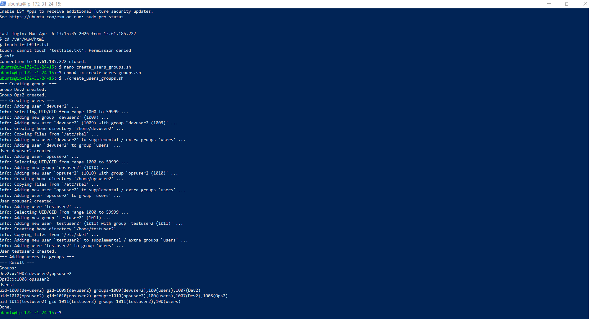  


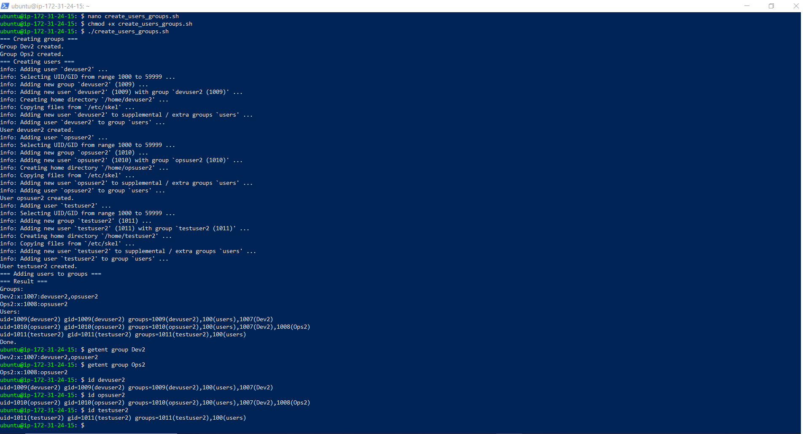

### 📜 Script 2 — install_apache.sh

Located in: 
 [`scripts/install_apache.sh`](scripts/install_apache.sh)

Features:

- detects OS automatically

- installs Apache2 (Ubuntu) or httpd (CentOS)

- enables and starts the service


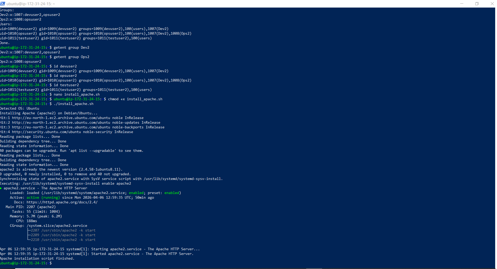  


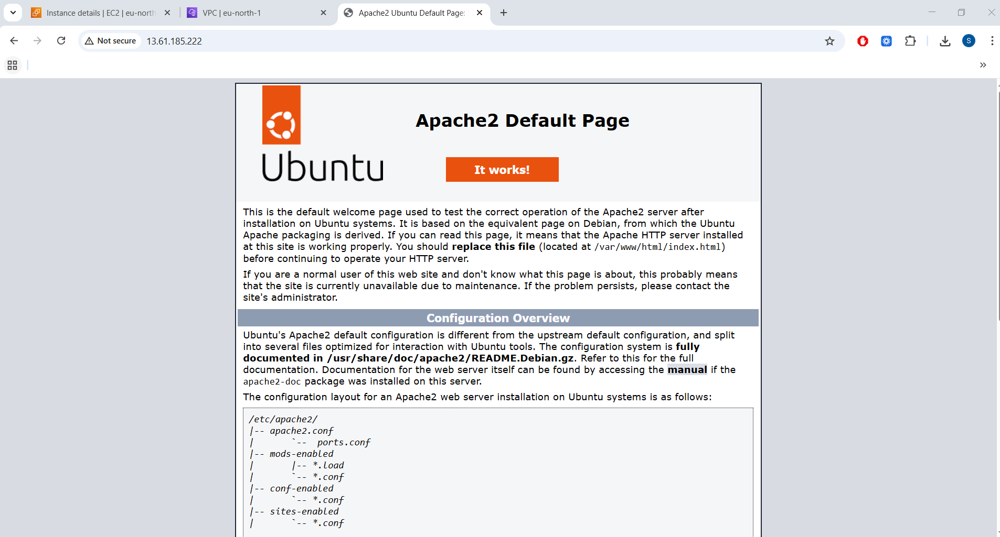 

### 📜 Script 3 — install_lamp.sh

Located in: 
 [`scripts/install_lamp.sh`](scripts/install_lamp.sh)

Installs:

- Apache

- MariaDB

- PHP

- PHP modules

- creates /var/www/html/info.php


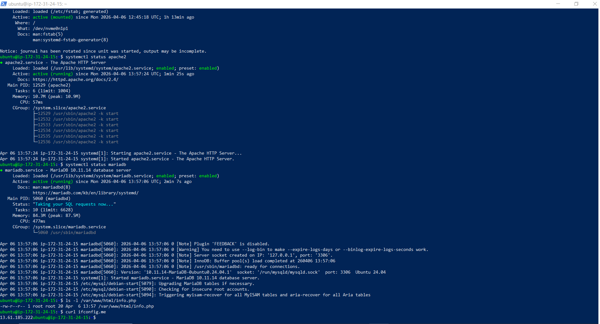  


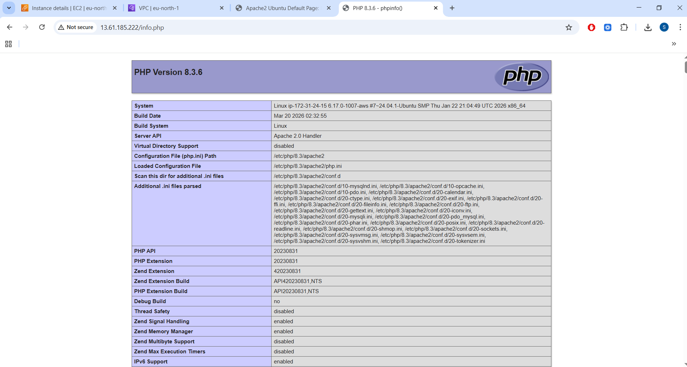

---


## 🎉 Task 2 — Completed

---

## 🏁 Final Result
Both tasks are fully completed:

✔ Linux users, groups, permissions

✔ SSH key authentication

✔ Automation scripts

✔ Apache installation

✔ LAMP stack installation

✔ Cross‑OS support (Debian + RHEL)

✔ Full screenshot set


---
