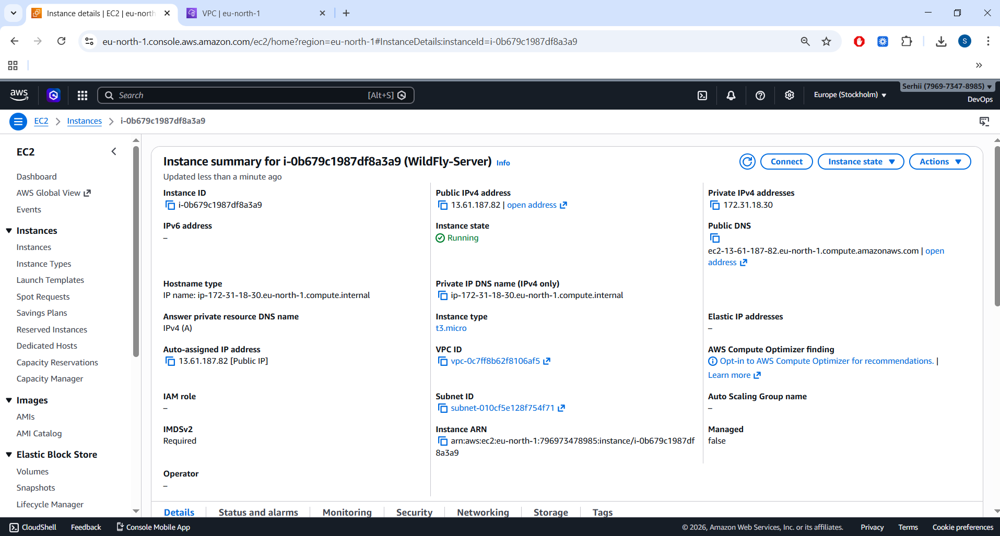
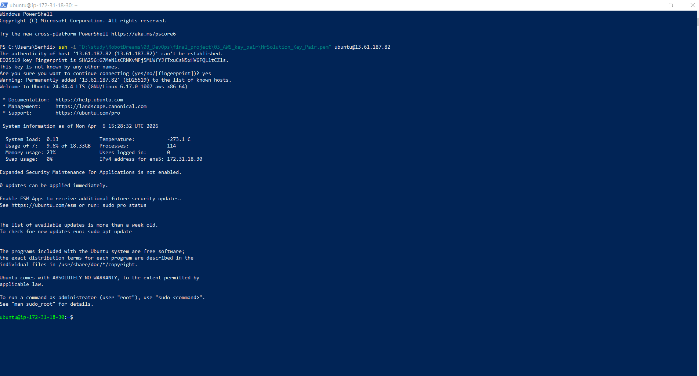
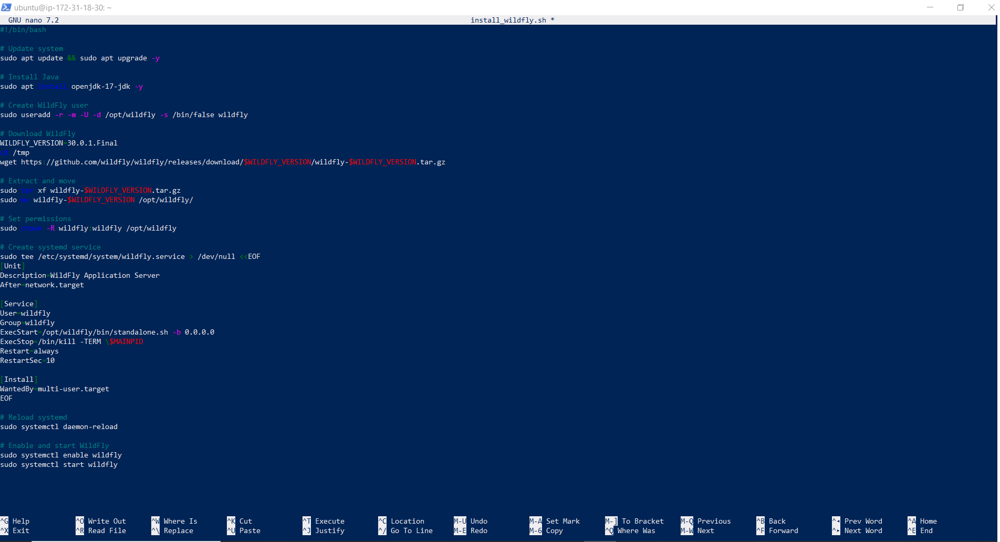
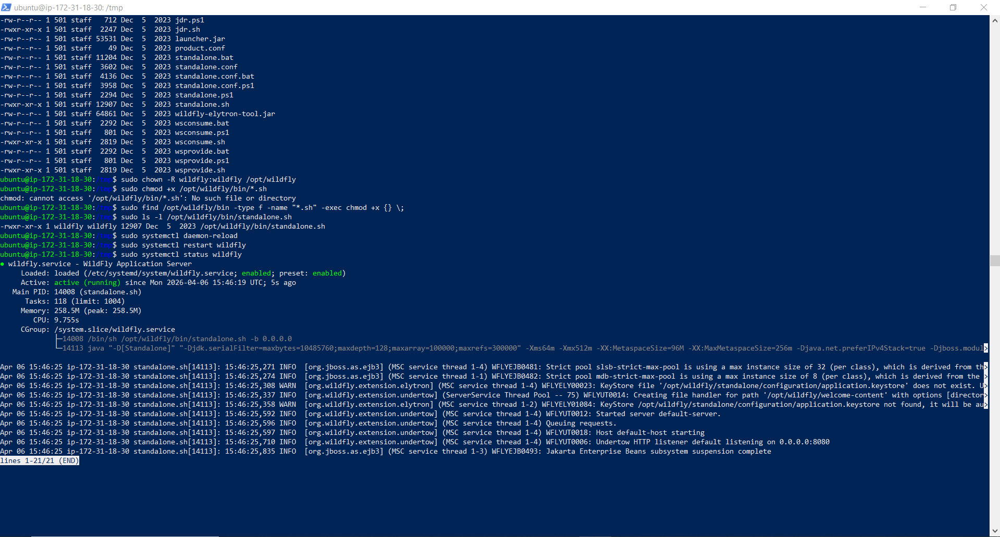
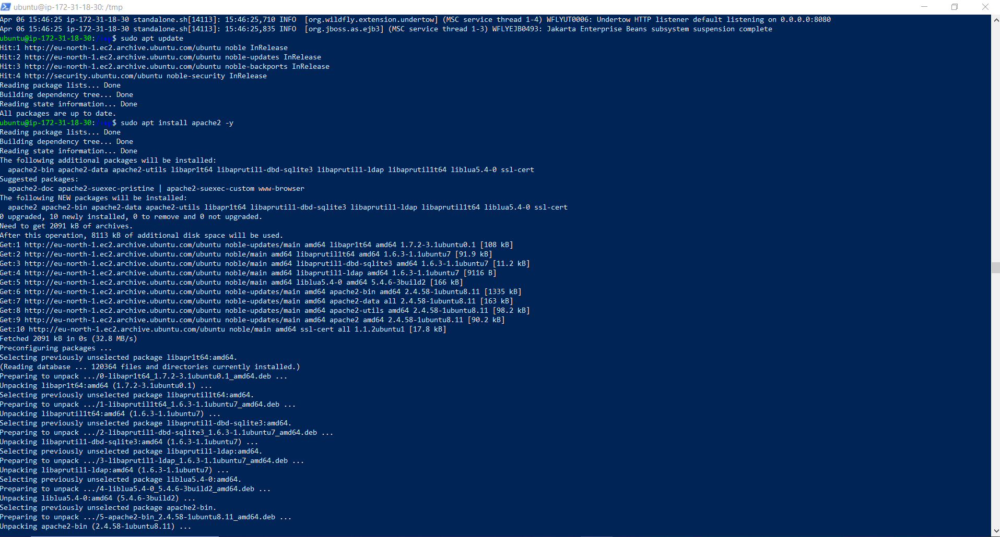
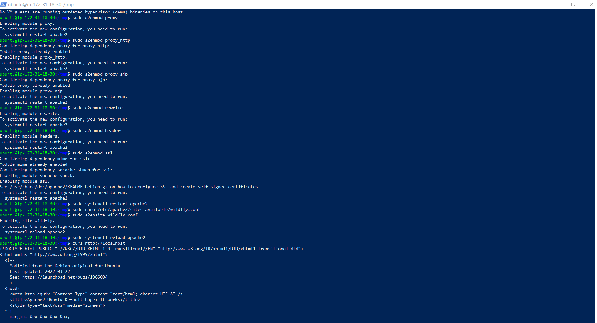
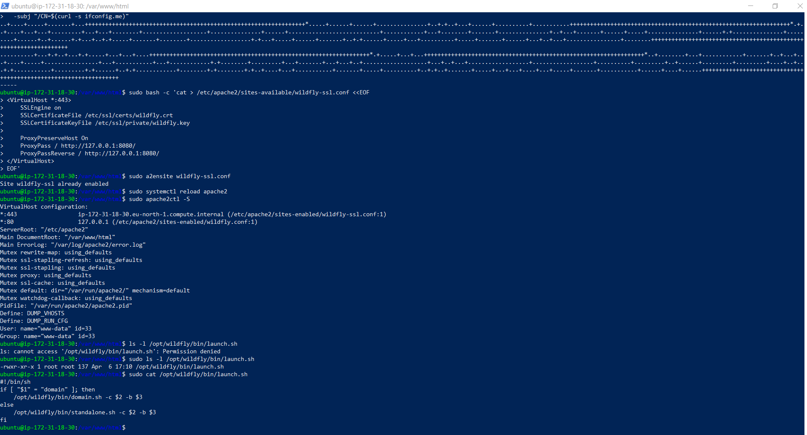
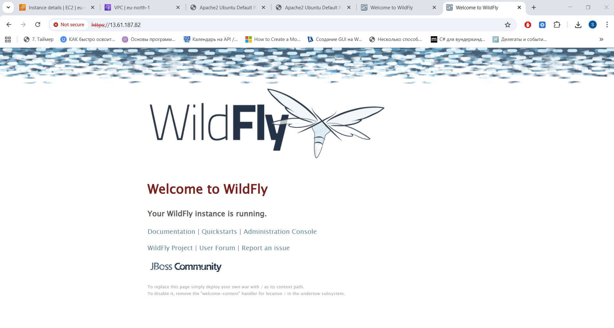
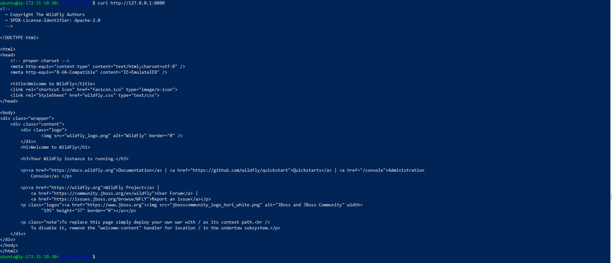

# WildFly + Apache Reverse Proxy + TLS on AWS EC2


---

## 🚀 Project Overview

This project demonstrates a complete deployment of **WildFly Application Server** on an **AWS EC2** **Ubuntu instance**, fronted by **Apache2 reverse proxy** with **HTTPS (TLS)** termination.


The goal was to:

- Provision an EC2 instance

- Install and configure WildFly as a systemd service

- Create a custom launch script

- Configure Apache as a reverse proxy

- Enable HTTPS using a self‑signed certificate

- Validate the setup with browser and CLI tests

- Document the entire workflow with reproducible steps and screenshots


This project is structured as a **portfolio‑ready DevOps demo**, showcasing system administration, automation, troubleshooting, and service orchestration.

---


## 📂 Project Structure

``` Code
project/
│
├── README.md
├── screenshots/
│   ├── 08_instance_launched.png
│   ├── 09_ssh_connected.png
│   ├── 11_script_content.png
│   ├── 13_script_running.png
│   ├── 15_wildfly_status_fixed.png
│   ├── 16_apache_install.png
│   ├── 17_apache_modules_enabled.png
│   ├── 18_wildfly_conf_created.png
│   ├── 19_a2ensite_wildfly.png
│   ├── 20_launch_sh_exists.png
│   ├── 21_wildfly_conf_file.png
│   ├── 22_apache_virtualhosts.png
│   ├── 23_https_wildfly_browser.png
│   ├── 24_curl_local_wildfly.png
│   └── 25_apache_sites_enabled.png
│
└── scripts/
    ├── install_wildfly.sh
    ├── launch.sh
    └── create_wildfly_conf.sh
``` 
	
---

### 🧩 1. EC2 Instance Provisioning



An Ubuntu 22.04 EC2 instance was launched in AWS.
Security group allowed ports:

- 22 (SSH)

- 80 (HTTP)

- 443 (HTTPS)

---


### 🧩 2. SSH Access



Connected to the instance:

``` bash
ssh -i key.pem ubuntu@PUBLIC_IP
``` 

---


### 🧩 3. WildFly Installation Script



A custom installation script was created to automate:

- Downloading WildFly

- Creating systemd service

- Setting permissions

- Preparing directories

Example script (scripts/install_wildfly.sh):

``` bash
#!/bin/bash
WILDFLY_VERSION=30.0.1.Final
cd /tmp
wget https://github.com/wildfly/wildfly/releases/download/$WILDFLY_VERSION/wildfly-$WILDFLY_VERSION.tar.gz
sudo tar xf wildfly-$WILDFLY_VERSION.tar.gz -C /opt
sudo mv /opt/wildfly-$WILDFLY_VERSION /opt/wildfly
sudo useradd -r -s /bin/false wildfly
sudo chown -R wildfly:wildfly /opt/wildfly
``` 


---


### 🧩 4. Running the Script


Executed:

``` bash
sudo bash install_wildfly.sh
``` 

---


### 🧩 5. WildFly Systemd Service



Service validated:

``` bash
sudo systemctl status wildfly
``` 

WildFly is running.

---


### 🧩 6. Apache Installation



Installed Apache2:

``` bash
sudo apt install apache2 -y
``` 

---


### 🧩 7. Enabling Required Apache Modules



``` bash
sudo a2enmod proxy
sudo a2enmod proxy_http
sudo a2enmod ssl
sudo systemctl restart apache2
``` 

---


### 🧩 8. Creating /etc/wildfly/wildfly.conf


``` bash
sudo bash -c 'cat > /etc/wildfly/wildfly.conf <<EOF
WILDFLY_CONFIG=standalone.xml
WILDFLY_MODE=standalone
WILDFLY_BIND=0.0.0.0
EOF'
``` 

---

### 🧩 9. Enabling Apache HTTP Reverse Proxy


Created /etc/apache2/sites-available/wildfly.conf:

``` bash
<VirtualHost *:80>
    ProxyPreserveHost On
    ProxyPass / http://127.0.0.1:8080/
    ProxyPassReverse / http://127.0.0.1:8080/
</VirtualHost>
``` 


Enabled:

``` bash
sudo a2ensite wildfly.conf
sudo systemctl reload apache2
``` 


---


### 🧩 10. Creating launch.sh



File: scripts/launch.sh

``` bash
#!/bin/sh
if [ "$1" = "domain" ]; then
    /opt/wildfly/bin/domain.sh -c $2 -b $3
else
    /opt/wildfly/bin/standalone.sh -c $2 -b $3
fi
``` 

---


### 🧩 11. Validating wildfly.conf


``` bash
cat /etc/wildfly/wildfly.conf
``` 

---


### 🧩 12. Apache VirtualHost Configuration


``` bash
sudo apache2ctl -S
``` 

Shows:

*:80 wildfly.conf

*:443 wildfly-ssl.conf

---

### 🧩 13. HTTPS Reverse Proxy (TLS)

Self‑signed certificate:

``` bash
sudo openssl req -x509 -nodes -days 365 \
  -newkey rsa:2048 \
  -keyout /etc/ssl/private/wildfly.key \
  -out /etc/ssl/certs/wildfly.crt \
  -subj "/CN=$(curl -s ifconfig.me)"
``` 
 
Apache HTTPS config:

``` bash
<VirtualHost *:443>
    SSLEngine on
    SSLCertificateFile /etc/ssl/certs/wildfly.crt
    SSLCertificateKeyFile /etc/ssl/private/wildfly.key

    ProxyPreserveHost On
    ProxyPass / http://127.0.0.1:8080/
    ProxyPassReverse / http://127.0.0.1:8080/
</VirtualHost>
``` 


---


### 🧩 14. WildFly over HTTPS



Browser shows WildFly running via:

``` Code
https://13.61.187.82
``` 

---


### 🧩 15. Local WildFly Test



``` bash
curl http://127.0.0.1:8080
``` 

---


### 🧩 16. Apache Sites Enabled


``` bash
ls -l /etc/apache2/sites-enabled
``` 

Shows:

- wildfly.conf

- wildfly-ssl.conf

---


## 🧨 Troubleshooting Summary

Issue: WildFly service not starting
Fix: Corrected systemd unit file and permissions.

Issue: launch.sh missing
Fix: Created script manually and set executable permissions.

Issue: Apache not proxying
Fix: Enabled required modules and corrected VirtualHost config.

Issue: HTTPS not working
Fix: Generated self‑signed certificate and created SSL VirtualHost.

---


## 🏁 Final Result

The system now supports:

- WildFly running as a systemd service

- Apache reverse proxy on ports 80 and 443

- HTTPS termination with TLS

- Fully functional deployment pipeline

- Clean, reproducible DevOps workflow