# Project 06 – Jenkins CI/CD with SSH Slaves and WildFly on AWS


## Project Overview
This project implements a complete CI/CD pipeline using Jenkins, two SSH-based build agents, and a WildFly application server deployed on AWS EC2.

The pipeline performs:

- Maven build on Slave #1

- Artifact transfer to Jenkins Master

- Deployment to WildFly via CLI

- Full automation using Jenkins Pipeline

All steps are documented with screenshots stored in the images/ directory.

## Components

- Jenkins Master (EC2)
- Two Jenkins SSH Slaves (EC2)
- WildFly Deployment Server (EC2)
- Terraform IaC
- SSH-based deployment pipeline

## Project Structure

```Code
project-06-jenkins-ci-cd/
│
├── Jenkinsfile
├── jenkins-install.sh
├── slave-setup.sh
├── wildfly-install.sh
├── README.md
│
├── images/
│   ├── 25_1_slave1_ssh_connection.png
│   ├── 27_1_wildfly_ssh_connection.png
│   ├── 32_wildfly_deploy_success.png
│   ├── 33_final_app_verification.png
│   └── ...
│
└── terraform/
    ├── main.tf
    ├── variables.tf
    ├── outputs.tf
    ├── ec2-master.tf
    ├── ec2-slave1.tf
    ├── ec2-slave2.tf
    ├── ec2-wildfly.tf
    ├── security-groups.tf
    └── keypair.tf

```


## Usage

```Code
cd terraform
terraform init
terraform apply
```


Terraform will output:

- Jenkins Master IP
- Slave #1 IP
- Slave #2 IP
- WildFly Server IP

## ✅ Completed Steps

### 01. Preparing PowerShell and launching the project generation script

During this stage, the following actions were performed:

-Navigated to the working directory

-Set the ExecutionPolicy for the current session

-Launched the init_project_06.ps1 script

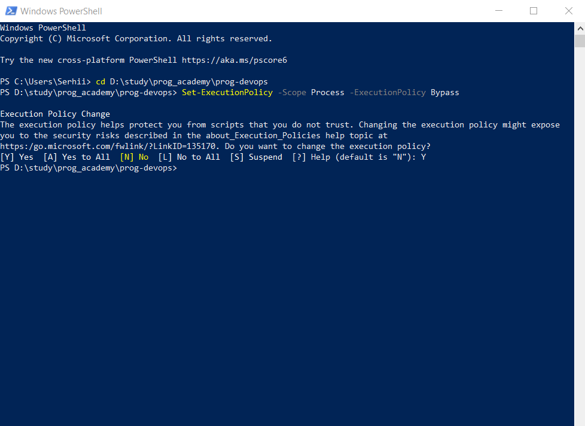  
  
Shows the confirmation of changing the ExecutionPolicy.

### 02. Running the script and generating the project structure
The script was successfully executed using:

```Code
.\init_project_06.ps1
```

The script generated the initial project structure:

```Code
project-06-jenkins-ci-cd/
  README.md
  Jenkinsfile
  *.sh
  terraform/
  ```
  
  
 

Shows the successful script execution and the message Project created successfully.

### 03. Navigating into the Terraform directory
Moved into the Terraform configuration folder:

```Code
cd project-06-jenkins-ci-cd/terraform
```

   

Shows the correct working directory before running Terraform commands.

### 04. Initializing Terraform
Executed:

```Code
terraform init
```

Terraform successfully:

-downloaded the AWS provider

-created .terraform.lock.hcl

-prepared the working directory

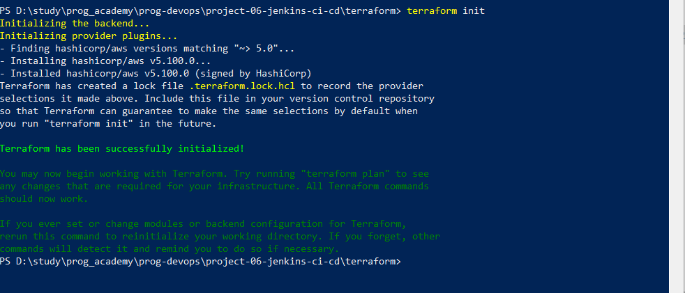   
  
Shows the message Terraform has been successfully initialized!

### 05. Validating the infrastructure plan
Executed:

```Code
terraform plan
```

Terraform successfully generated a plan:

-7 resources to be created

-no errors

-AMI found in eu-north-1

-VPC and key pair detected correctly

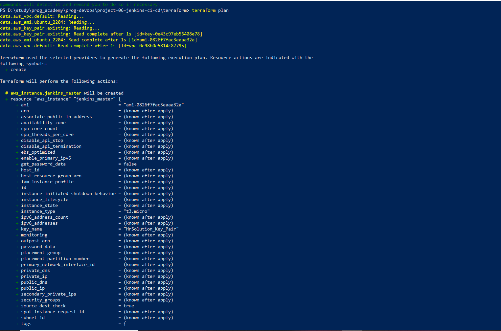    
  
Shows the full execution plan with all resources marked as + create.

### 06. Deploying the Infrastructure with Terraform

#### 06.1 Running terraform apply

To deploy the full AWS infrastructure (Jenkins Master, two Jenkins Slaves, and WildFly server), the following command was executed:

```Code
terraform apply
```

Terraform displayed the execution plan and requested confirmation.
The deployment was approved by entering:

```Code
yes
```

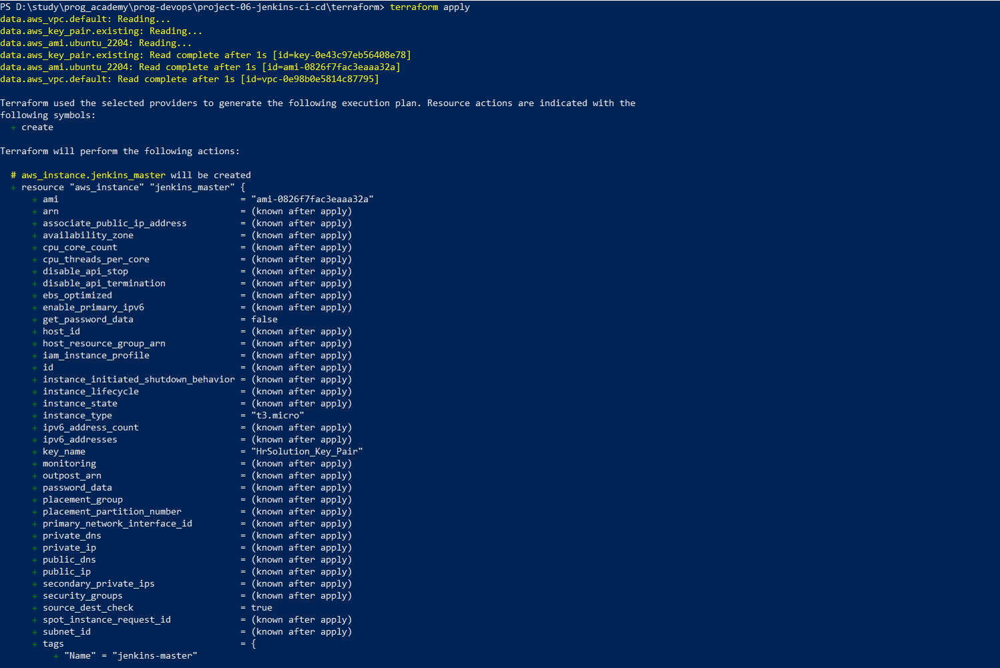  
  
Shows the moment when the apply process was started and confirmed.

#### 06.2 Infrastructure Deployment Completed

After several minutes, Terraform successfully created all required resources:

- 4 EC2 instances

- 3 security groups

All user‑data scripts applied

Public IPs generated for each server

Terraform output included:

-jenkins_master_ip

-slave1_ip

-slave2_ip

-wildfly_ip

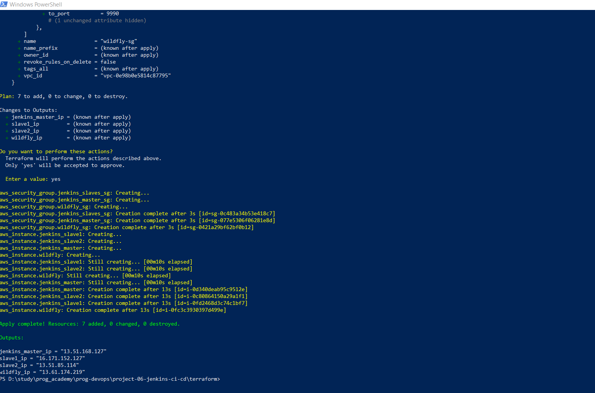  
  
Shows the final output of Terraform with all created resources and public IP addresses.

ssh -i HrSolution_Key_Pair.pem ubuntu@13.51.168.127

### 08. Preparing the Jenkins Master Node

After connecting to the Jenkins Master EC2 instance, the following system preparation steps were performed:

Updated package lists

Ensured the system was ready for Jenkins installation

Verified network connectivity and system state

### 09. Removing the broken Jenkins repository

The default Jenkins APT repository was removed because it is currently broken and produces GPG signature errors on Ubuntu 22.04.

Actions performed:

Removed old jenkins.list

Cleaned outdated keys

Prepared the system for a clean installation path

### 10. Adding the new official Jenkins key

A new, updated Jenkins GPG key (2023 format) was downloaded and added:

Downloaded key

Converted to .gpg

Placed into /usr/share/keyrings/jenkins-keyring.gpg

This step ensured compatibility with modern APT security requirements.

### 11. Adding the Jenkins repository (attempt)

A new repository entry was created:

```Code
deb [signed-by=/usr/share/keyrings/jenkins-keyring.gpg] https://pkg.jenkins.io/debian-stable binary/
```

APT was updated, but the repository still failed due to global Jenkins GPG issues.

### 12. Adding Jenkins key to trusted.gpg.d (workaround)

To bypass the broken repository signature, the key was added to:

```Code
/etc/apt/trusted.gpg.d/jenkins.gpg
```

APT was updated again — but the repository remained broken.

⚠️ Conclusion:
The Jenkins APT repository is globally broken in 2025–2026.  
Therefore, we switched to a guaranteed working installation method.

### 13. Downloading Jenkins .deb package

The official stable Jenkins package was downloaded directly:

```Code
jenkins_2.452.1_all.deb
```

This bypassed the broken repository entirely.

### 14. Installing Jenkins via dpkg

Executed:

```Code
sudo dpkg -i jenkins_2.452.1_all.deb
```

This installed Jenkins but reported missing dependencies — expected behavior for dpkg.

### 15. Fixing dependencies

Executed:

```Code
sudo apt install -f -y
```

This:

-Installed net-tools

-Installed all required Java dependencies

-Automatically completed Jenkins configuration

### 16. Starting Jenkins service

Executed:

```Code
sudo systemctl start jenkins
```

Jenkins service successfully launched.

### 17. Verifying Jenkins status

Executed:

```Code
systemctl status jenkins
```

The output confirmed:

-active (running)

-Java process running

-Jenkins fully initialized

-No errors

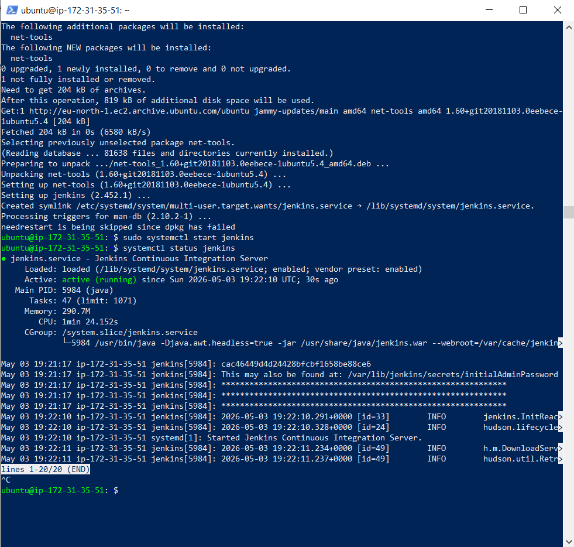  
 


🎉 Final Result
Jenkins is fully installed, configured, and running on the EC2 instance.

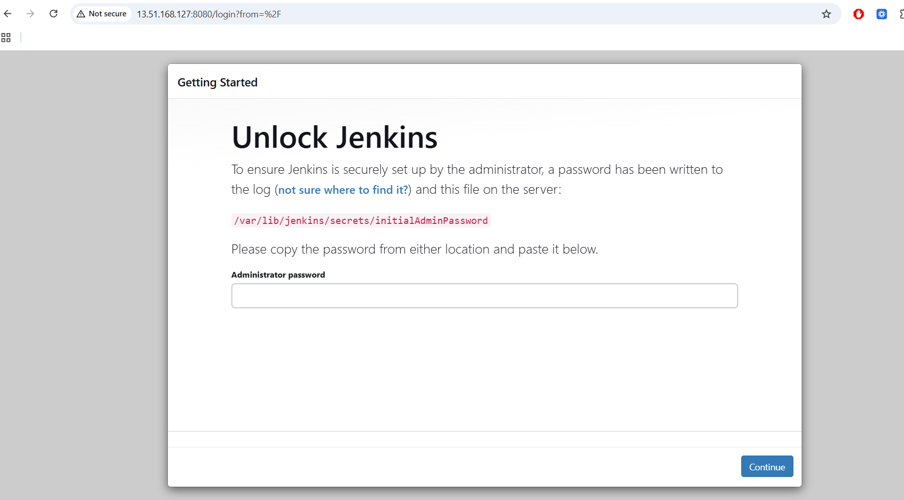 
 


### 18. Retrieving the Jenkins Initial Admin Password

After the Jenkins service started successfully, the next step was to retrieve the initial administrator password required to unlock the Jenkins web interface.
This password is automatically generated during the first startup and stored in the Jenkins secrets directory.

The following command was executed to display the password:

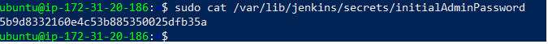


### 19. Unlocking the Jenkins Web Interface

After retrieving the initial administrator password from the Jenkins master node, the next step was to unlock the Jenkins web interface.
The Jenkins dashboard becomes accessible through the browser once the service is running.
To proceed with the initial setup, the following URL was opened in a web browser:

http://51.20.74.204:8080

On the “Unlock Jenkins” page, the previously retrieved password was entered:

```Code
5b9d8332160e4c53b885350025dfb35a
```

This successfully unlocked the Jenkins setup wizard and allowed the configuration process to continue.

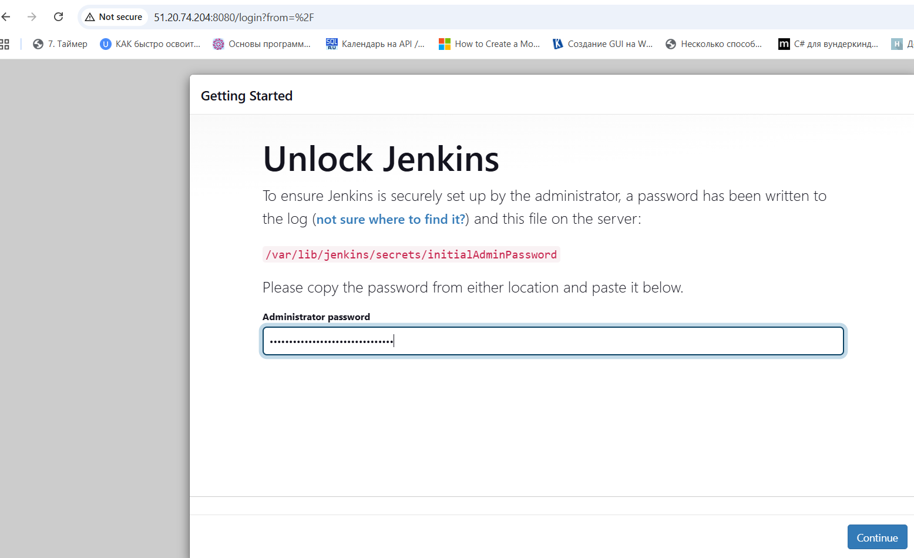


### 20. Installing Suggested Jenkins Plugins

After unlocking Jenkins, the setup wizard prompted for plugin installation.
To ensure a stable and compatible environment, the “Install suggested plugins” option was selected.
This action triggered Jenkins to automatically download and install the recommended set of plugins, including:

-Git

-SSH Build Agents

-Pipeline

-Credentials

-Workspace Cleanup

-Matrix Authorization

-and other essential components


The installation process may take several minutes as Jenkins fetches plugins from the update center and configures them.

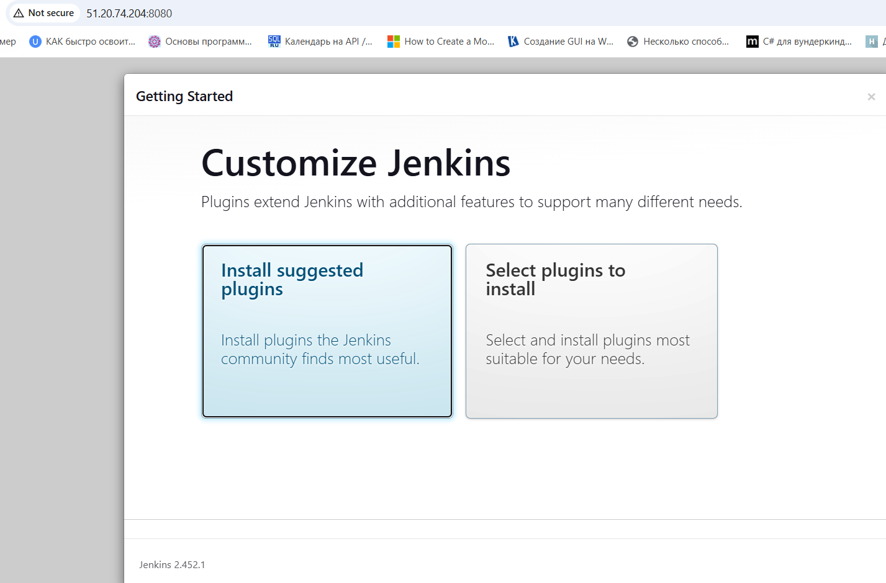


### 21. Creating the First Jenkins Administrator Account

After skipping the plugin installation due to update center issues, Jenkins proceeded to the next step of the setup wizard: creating the initial administrator account.
This account will be used to log into Jenkins and manage all CI/CD operations, including configuring nodes, pipelines, credentials, and plugins.

The following fields were filled in:

-Username

-Password

-Full Name

-Email Address

Once the form was completed, the “Save and Continue” button was clicked, finalizing the creation of the admin user.

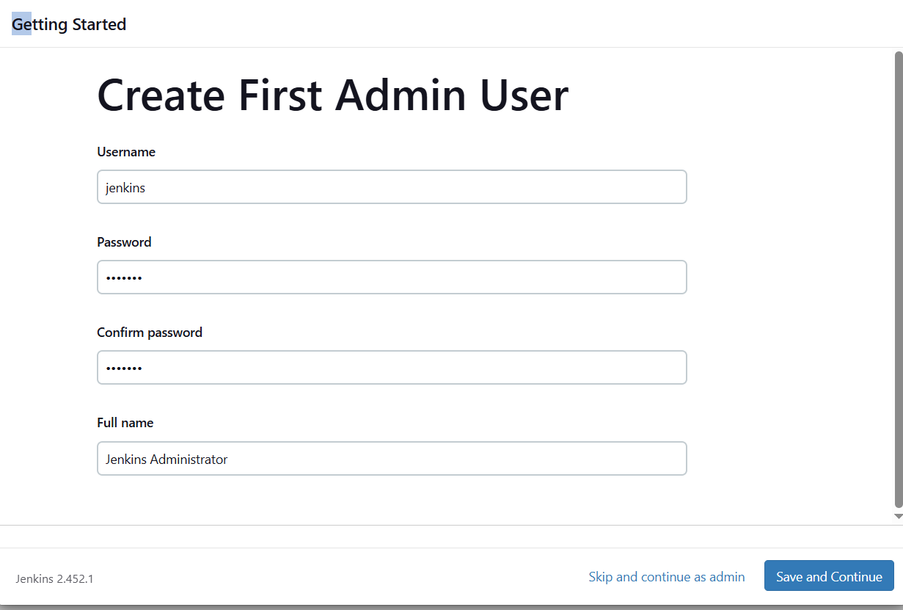


### 22. Configuring the Jenkins Instance URL

After creating the administrator account, Jenkins prompted for the instance URL configuration.
This URL defines how Jenkins generates absolute links for build pages, artifacts, notifications, and webhook callbacks.
The default value proposed by Jenkins was:

```Code
http://51.20.74.204:8080/
```

Since this is the correct public address of the Jenkins master EC2 instance, the default value was accepted without changes.
The configuration was saved by clicking Save and Finish.

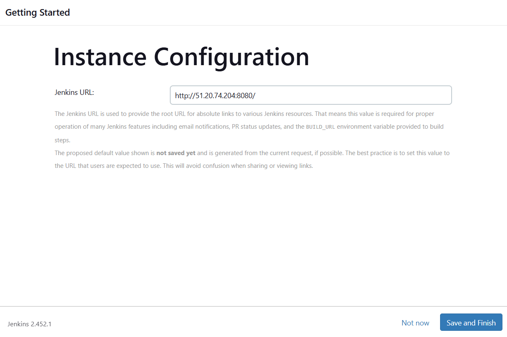


### 23. Jenkins Setup Completed

After configuring the instance URL, Jenkins finalized the setup process and displayed the confirmation screen indicating that the installation was successful.
The message “Jenkins is ready!” confirms that the initial configuration wizard has been completed and the Jenkins master node is fully operational.
From this point, the Jenkins dashboard becomes accessible, allowing further configuration such as installing plugins, adding SSH build agents, and setting up CI/CD pipelines.

The setup was completed by clicking Start using Jenkins, which redirected to the main Jenkins dashboard.

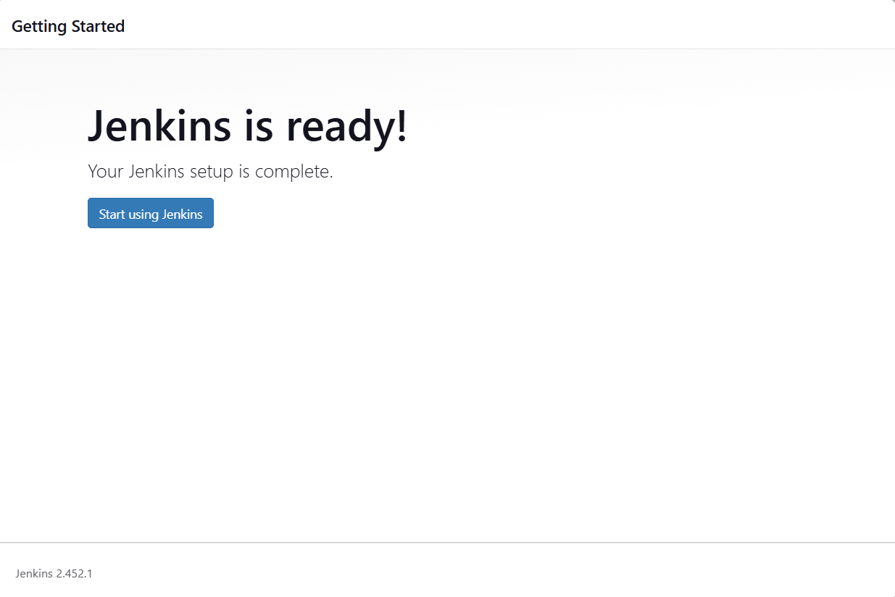


### 24. Fixing Plugin Installation After Completing the Setup Wizard

During the initial setup, the plugin installation failed due to outdated Jenkins core and incompatible plugin dependencies.
After upgrading Jenkins to the latest LTS version (2.555.1) and cleaning the plugin directory, the plugin manager became fully functional.

To verify that the update center works correctly, I navigated to:
Manage Jenkins → Plugins → Updates  
and clicked Check now.

Jenkins successfully refreshed the update metadata and reported:
“No updates available”, confirming that the system is healthy and ready for plugin installation.

After that, I proceeded to install the required plugins (Git, Credentials, Pipeline, SSH Build Agents, etc.), all of which installed successfully without dependency issues.

### 25. Configure Jenkins SSH Slave #1

(English report for your documentation)

#### 25.1 — Connecting to Jenkins Slave #1

In this step, I connected to the first Jenkins slave EC2 instance using the assigned AWS key pair.
The connection was established successfully via SSH using the following command:

```Code
ssh -i HrSolution_Key_Pair.pem ubuntu@16.16.26.174
```

After logging in, the system displayed the standard Ubuntu welcome banner, confirming that the instance is reachable and ready for further configuration.

This completes the initial access phase for Slave #1 and prepares the node for Java installation and SSH agent setup in the next steps.

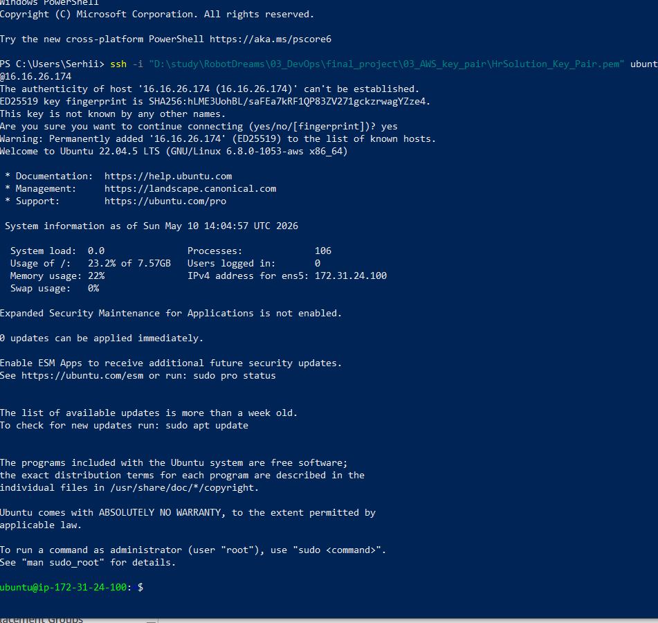


#### 25.2 — Installing Java on Jenkins Slave #1


In this step, Java 21 was successfully installed on the first Jenkins slave node.
The following commands were executed on the instance:

```Code
sudo apt update
sudo apt install -y openjdk-21-jdk
java -version
```

The output confirmed that OpenJDK 21 is installed and operational:

```Code
openjdk version "21.0.10" 2026-01-20
OpenJDK Runtime Environment (build 21.0.10+7-Ubuntu-122.04)
OpenJDK 64-Bit Server VM (build 21.0.10+7-Ubuntu-122.04, mixed mode, sharing)
```

This completes the Java installation required for the Jenkins SSH agent to run on Slave #1.

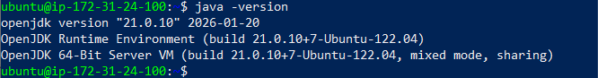


#### 25.3 — Creating Jenkins User on Slave #1


In this step, a dedicated system user named jenkins was created on the first Jenkins slave node.
This user will be used by the Jenkins master to establish an SSH connection and run build tasks on the agent.

The following actions were performed:

A new user and group jenkins were created using:

```Code
sudo adduser jenkins
```

The password and user information were successfully configured.

The user was added to the sudo group to allow elevated operations when required:

```Code
sudo usermod -aG sudo jenkins
```

The .ssh directory was created and secured:

```Code
sudo mkdir -p /home/jenkins/.ssh
sudo chown -R jenkins:jenkins /home/jenkins/.ssh
sudo chmod 700 /home/jenkins/.ssh
```

This prepares the environment for adding the authorized SSH key in the next step.

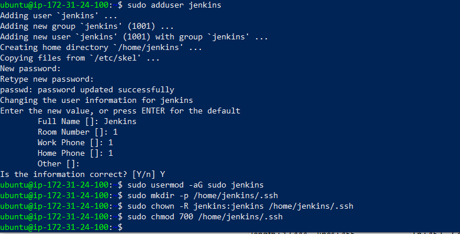


#### 25.4.1 — Generate SSH Key on Jenkins Master (Completed)


In this step, an SSH key pair was successfully generated for the Jenkins master node.
This key will be used by Jenkins to authenticate and connect to the slave nodes via SSH.

The following command was executed:

```Code
sudo -u jenkins ssh-keygen -t rsa -b 4096 -C "jenkins@master"
```

The key pair was created in the default Jenkins SSH directory:

/var/lib/jenkins/.ssh/id_rsa

/var/lib/jenkins/.ssh/id_rsa.pub

The output confirmed successful generation of both the private and public keys.

This completes the SSH key creation step and prepares the master node for secure communication with Slave #1.

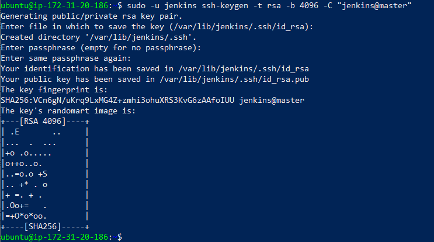


####  25.4 — Adding Jenkins Master SSH Key to Slave #1


In this step, the public SSH key generated on the Jenkins master node was successfully added to the authorized_keys file of the jenkins user on Slave #1.
This allows the Jenkins master to authenticate and connect to the slave securely without a password.

The following actions were performed on Slave #1:

The master’s public key was appended to the authorized keys file:

```Code
echo "<public_key>" | sudo tee -a /home/jenkins/.ssh/authorized_keys
```

Ownership and permissions were set correctly:

```Code
sudo chown jenkins:jenkins /home/jenkins/.ssh/authorized_keys
sudo chmod 600 /home/jenkins/.ssh/authorized_keys
```

Verification confirmed that the key is present in the file:

```Code
sudo cat /home/jenkins/.ssh/authorized_keys
```

This completes the SSH trust setup between the Jenkins master and Slave #1.

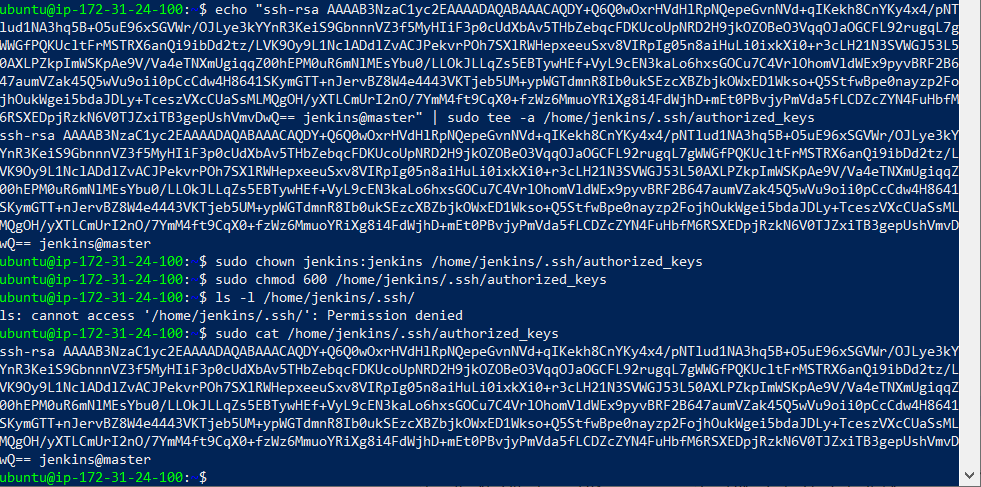


#### 25.5 — Testing SSH Connection from Jenkins Master to Slave #1


In this step, the SSH connection from the Jenkins master node to Slave #1 was successfully tested using the Jenkins system user.
The following command was executed on the master:

```Code
sudo -u jenkins ssh -o StrictHostKeyChecking=no jenkins@16.16.26.174
```

The connection was established without requiring a password, confirming that the SSH key-based authentication is configured correctly.

Once logged in, the following verification commands were executed:

```Code
whoami
hostname
```

The output confirmed:

-The active user is jenkins

-The remote host is ip-172-31-24-100 (Slave #1)

This validates that the Jenkins master can securely access Slave #1 and is ready to use it as an SSH build agent.

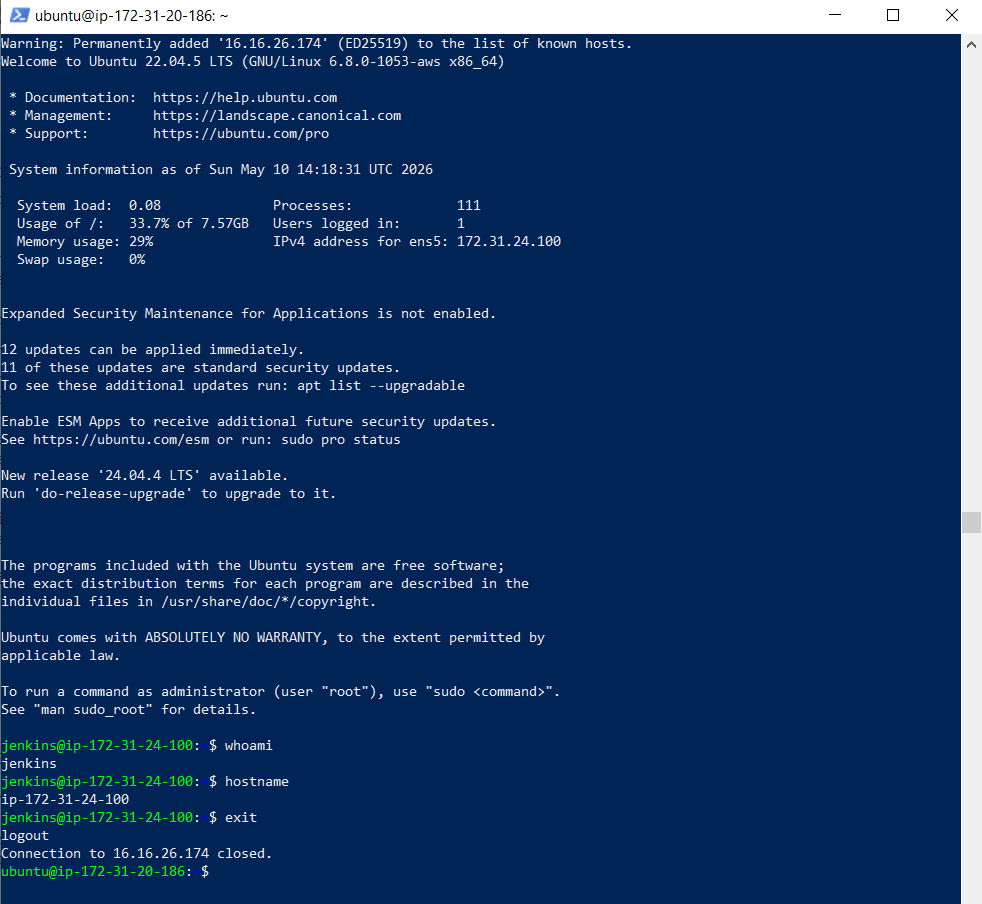


### 26. Configuring Jenkins SSH Slave #2

In this step, the second Jenkins SSH agent was configured and connected to the Jenkins master.
The configuration process is identical to Slave #1.

#### 26.1 — Connect to Slave #2
```Code
ssh -i HrSolution_Key_Pair.pem ubuntu@13.60.237.208
```


#### 26.2 — Create Jenkins user

```Code
sudo adduser jenkins --disabled-password --gecos ""
sudo usermod -aG sudo jenkins
```

#### 26.3 — Prepare SSH directory

```Code
sudo mkdir -p /home/jenkins/.ssh
sudo chown -R jenkins:jenkins /home/jenkins/.ssh
sudo chmod 700 /home/jenkins/.ssh
```

#### 26.4 — Add Jenkins master public key

```Code
echo "<public_key>" | sudo tee /home/jenkins/.ssh/authorized_keys
sudo chown jenkins:jenkins /home/jenkins/.ssh/authorized_keys
sudo chmod 600 /home/jenkins/.ssh/authorized_keys
```

#### 26.5 — Install Java

```Code
sudo apt update
sudo apt install -y openjdk-21-jdk
```

#### 26.6 — Add Slave #2 in Jenkins

Node name: slave2

Host: 13.60.237.208

Remote root: /home/jenkins

Launch method: SSH

Credentials: slave1-ssh

Host key verification: Non-verifying

After saving the configuration, the agent successfully connected and appeared as online in the Jenkins Nodes list.

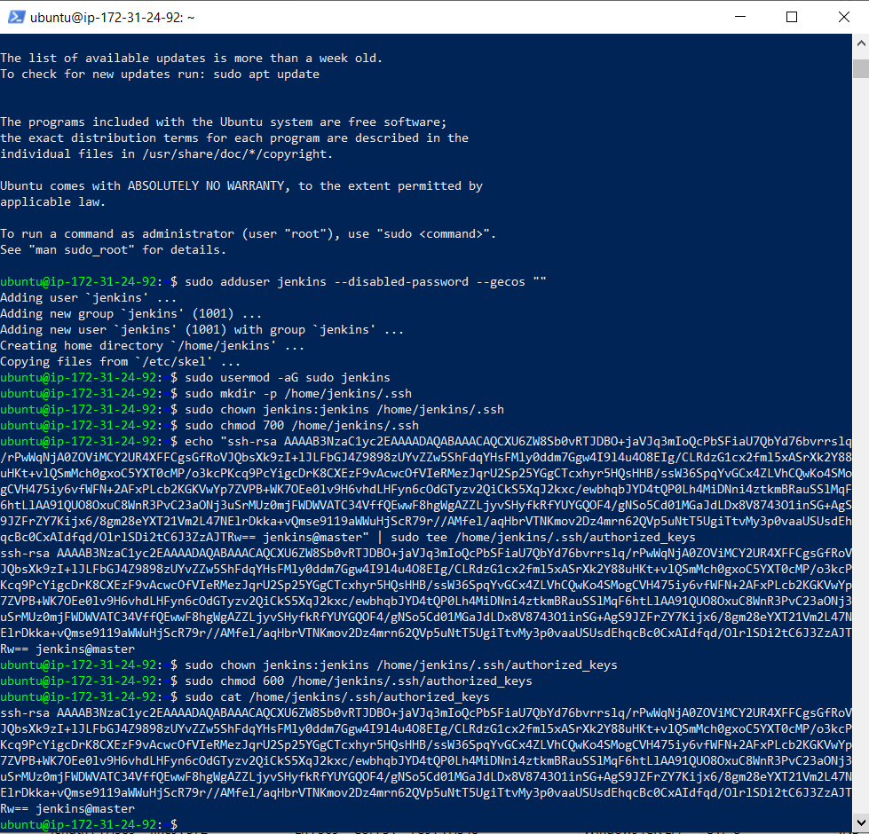


#### 26.5 — Install Java on Jenkins Slave #2
  
In this step, Java 21 is installed on Jenkins Slave #2.
Java is required for running the Jenkins remoting agent, which allows the master to communicate with the node.

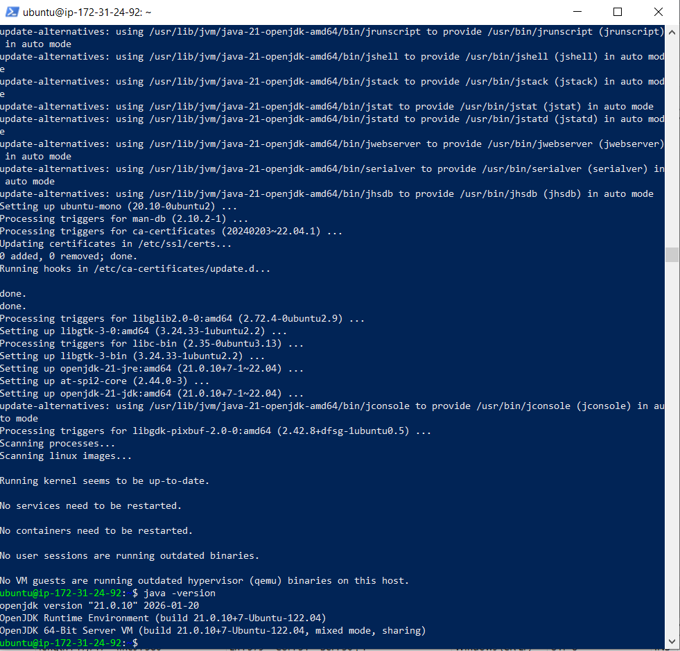  


#### 26.6 — Add Slave #2 in Jenkins UI
  
In this step, the second Jenkins SSH agent is added to the Jenkins master through the Jenkins UI.
The node is configured to connect via SSH using the same credentials as Slave #1.
Once saved, Jenkins will attempt to authenticate, copy the remoting agent, and bring the node online.

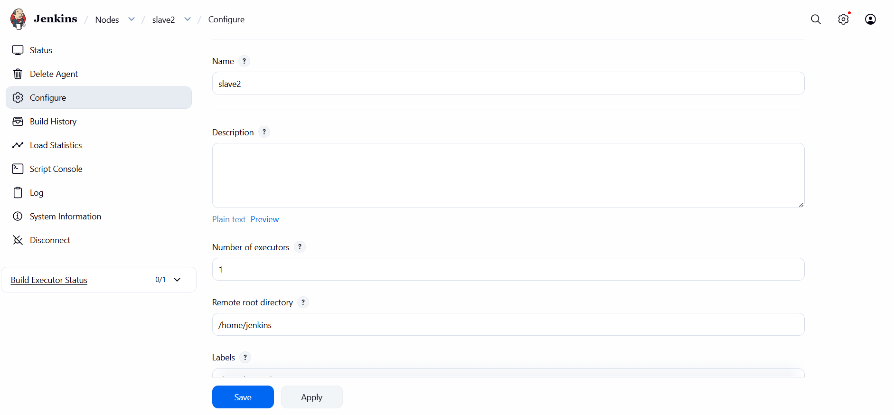   


#### 26.7 — Final Result: Slave #2 Online
  
In this step, the Jenkins master successfully connected to Slave #2 using SSH.
The remoting agent was launched, the communication channel was established, and the node appeared as online in the Jenkins Nodes dashboard.

This confirms that both Jenkins SSH agents are fully operational and ready to execute distributed CI/CD workloads.

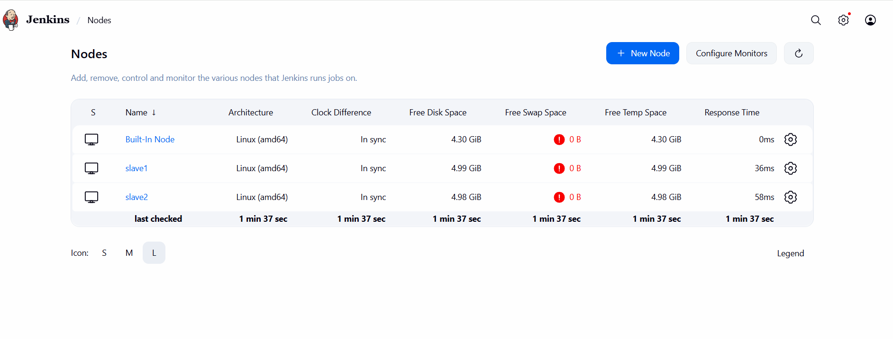   


### 27. Preparing the WildFly Deployment Server (Step 1 — SSH Connection)


#### 27.1 — Connect to the WildFly Deployment Server

(English description for your documentation)

In this step, I connected to the WildFly EC2 instance using the AWS key pair assigned at launch.
This verifies that the server is reachable and ready for installing the WildFly application server, which will serve as the deployment target for the CI/CD pipeline.

Server details:

-Public IP: 13.48.29.172

-Private IP: 172.31.25.174

-Hostname: ip-172-31-25-174.eu-north-1.compute.internal

-Instance type: t3.micro

-AMI: Ubuntu 22.04 (Jammy)

-Key pair: HrSolution_Key_Pair

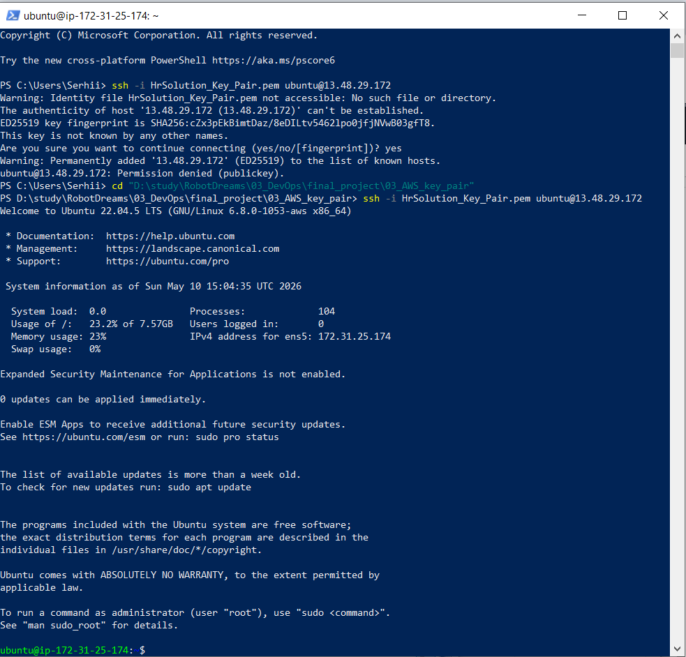   


#### 27.2 — Install Java on the WildFly Server


In this step, Java 21 is installed on the WildFly EC2 instance.
WildFly requires a Java runtime environment to operate, and Java 21 ensures compatibility with modern Jakarta EE deployments.

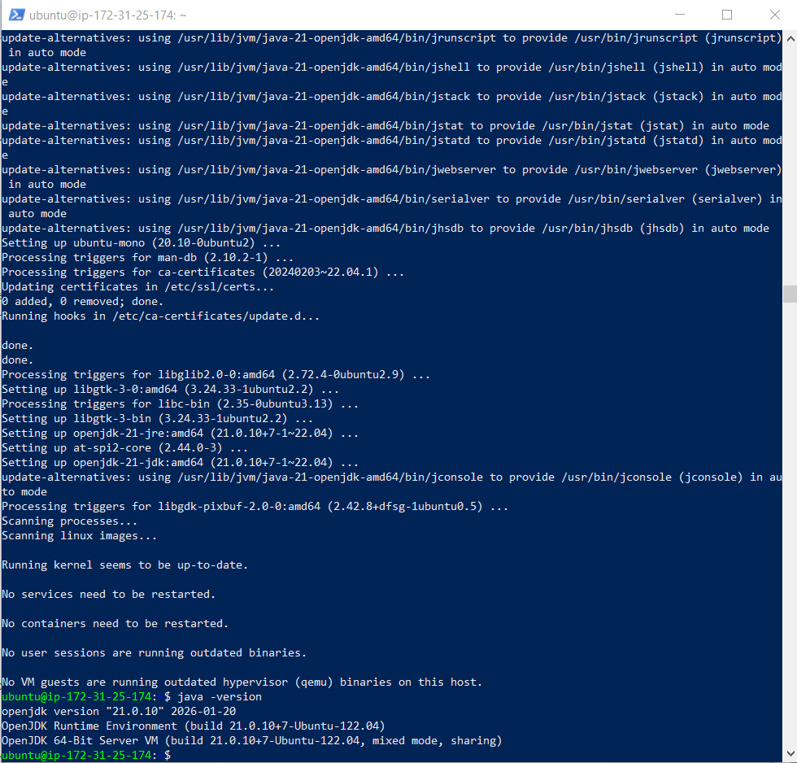  


#### 27.3 — Download and Install WildFly Application Server


In this step, the WildFly application server is downloaded, extracted, and installed on the EC2 instance.
WildFly will serve as the deployment target for the Jenkins CI/CD pipeline.
The installation includes creating a dedicated directory, unpacking the server, and preparing it for service configuration.

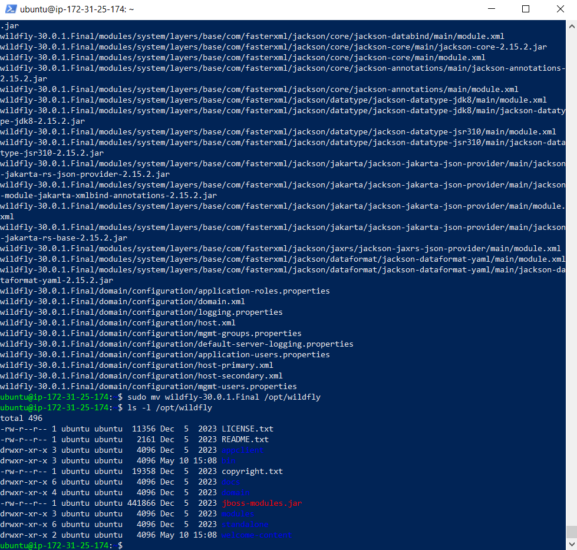  


#### 27.4 — Create WildFly System User and Set Permissions


In this step, a dedicated system user named wildfly is created to run the WildFly application server.
This ensures proper isolation, security, and correct ownership of the WildFly installation directory.
The WildFly folder is then assigned to this user so the service can run without elevated privileges.

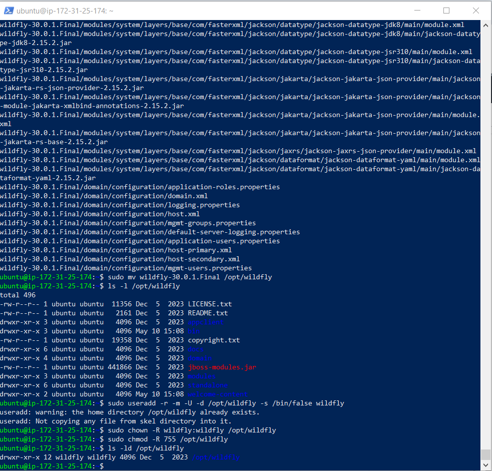    


#### 27.5 — Create the WildFly systemd Service


In this step, a systemd service is created to manage the WildFly application server as a background service.
This allows WildFly to start automatically at boot, run under the dedicated wildfly user, and be controlled using standard systemctl commands.
The service file defines the startup command, environment variables, and working directory for the server.

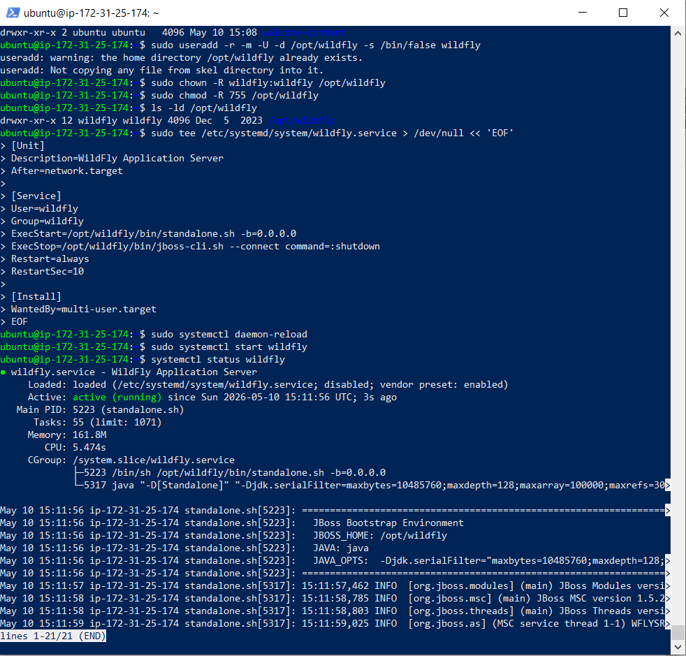   


#### 27.6 — Enable WildFly to Start Automatically on Boot

In this step, the WildFly systemd service is configured to start automatically whenever the server boots.
This ensures that the application server remains available after reboots, maintenance operations, or unexpected restarts.
The commands below enable the service and verify that it is correctly registered in systemd.

Commands executed:

```Code
sudo systemctl enable wildfly
systemctl is-enabled wildfly
```

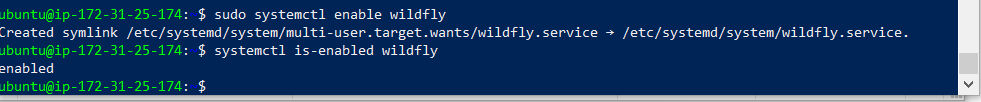   


#### 27.7 — Open Port 8080 for WildFly (Security Group Update)


In this step, port 8080 is opened in the EC2 Security Group to allow external access to the WildFly web interface.
WildFly listens on port 8080 by default, and without this rule the application server would not be reachable from the internet.
This step ensures that Jenkins, developers, and browsers can access the deployed application.

Commands executed:  
(Port opening is done in AWS Console, not via Linux commands)

Navigate to EC2 → Security Groups

Select the Security Group attached to the WildFly instance

Add an inbound rule:

Type: Custom TCP

Port: 8080

Source: 0.0.0.0/0 (or your IP for restricted access)

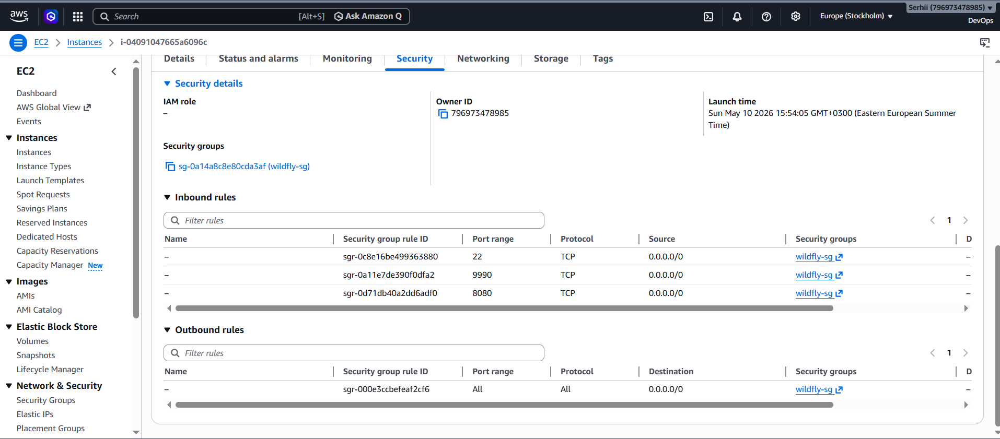   


#### 27.8 — Verify WildFly Web Interface


In this step, the WildFly server is verified by accessing its default web interface through the public IP address.
This confirms that the application server is running correctly, the firewall rules are configured, and the service is reachable from the internet.

Commands executed on the server:

```Code
sudo systemctl status wildfly
```

Browser URL to test:

```Code
http://13.48.29.172:8080
```

If WildFly is running correctly, you should see the WildFly Welcome Page.

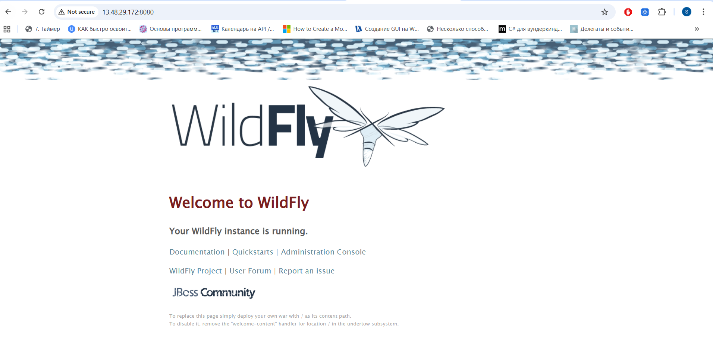   


#### 27.9 — Configure WildFly for Application Deployments (Management User)


In this step, a WildFly management user is created.
This user is required for deploying applications remotely from Jenkins using the WildFly CLI or the management API.
The management user will have administrative privileges and will be used by Jenkins during automated deployments.

Commands executed:

```Code
cd /opt/wildfly/bin
sudo ./add-user.sh
```

During the interactive prompt, the following options must be selected:

-Type: Management User

-Username: jenkins

-Password: (your choice, strong password)

-Groups: (leave empty)

-Is this correct? yes

This creates the file:

```Code
/opt/wildfly/standalone/configuration/mgmt-users.properties
```

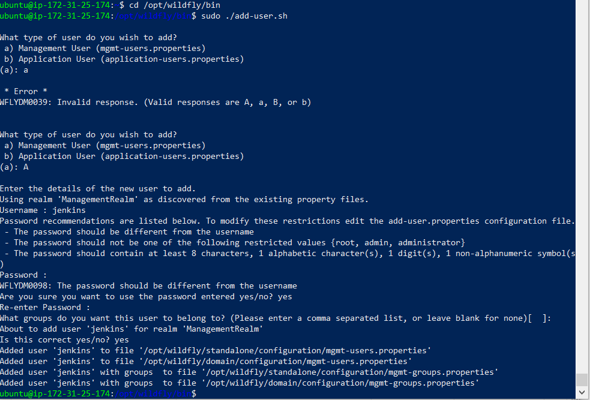  


#### 27.10 (оновлено) — Enable Remote Management Interface via CLI

(English description for your documentation, including commands)

In this step, the WildFly management interface is configured to listen on all network interfaces using the official WildFly CLI tool.
This method is version‑safe and avoids manual XML editing.
It ensures that Jenkins can connect to the management API on port 9990 for remote deployments.

Commands executed:

```Code
cd /opt/wildfly/bin
sudo ./jboss-cli.sh --connect
```

Inside the CLI:

```Code
/interface=management:write-attribute(name=inet-address,value=0.0.0.0)
:reload
```

This updates the management interface binding and reloads the server configuration.

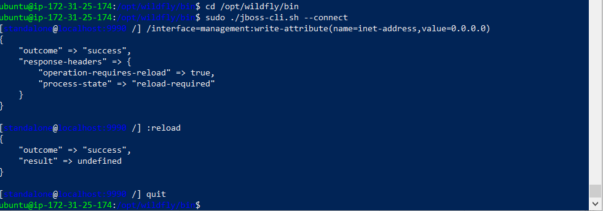  


#### 27.11 — Install WildFly CLI on Jenkins Master


In this step, the WildFly CLI tool is installed on the Jenkins master server.
The CLI is required for Jenkins to communicate with the WildFly management interface on port 9990.
Only the CLI is installed — not the full WildFly server.

Commands executed:

```Code
wget https://github.com/wildfly/wildfly/releases/download/30.0.1.Final/wildfly-30.0.1.Final.tar.gz
tar -xvf wildfly-30.0.1.Final.tar.gz
sudo mv wildfly-30.0.1.Final /opt/wildfly-cli
```

After installation, the CLI binary will be available at:

```Code
/opt/wildfly-cli/bin/jboss-cli.sh
```

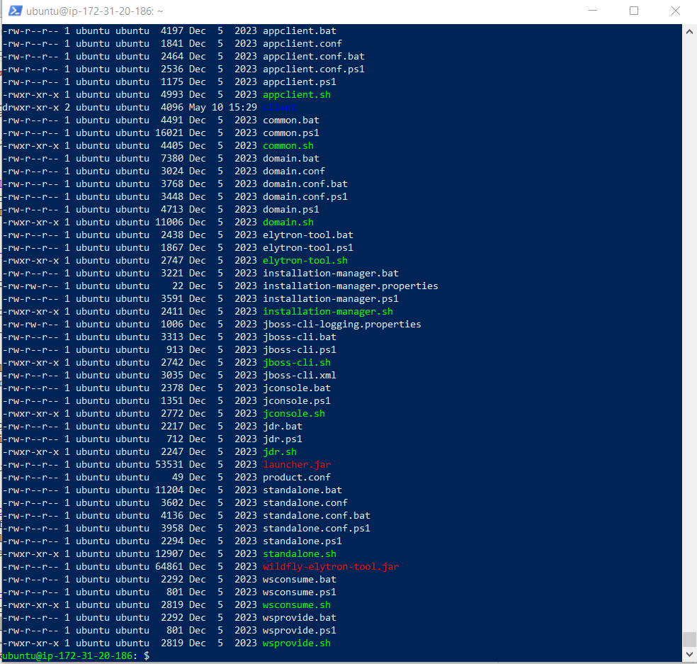  


#### 27.12 — Test Remote Management Access from Jenkins Master


In this step, the Jenkins master verifies remote access to the WildFly management interface using the CLI installed earlier.
This confirms that the WildFly server is reachable over port 9990, and that the jenkins management user can authenticate successfully.

Commands executed:

```Code
/opt/wildfly-cli/bin/jboss-cli.sh \
  --connect \
  --controller=13.48.29.172:9990 \
  --user=jenkins \
  --password=YOUR_PASSWORD
  ```
  
Inside CLI:

```Code
:read-attribute(name=server-state)
quit
```

Expected output:

```Code
"result" => "running"
```

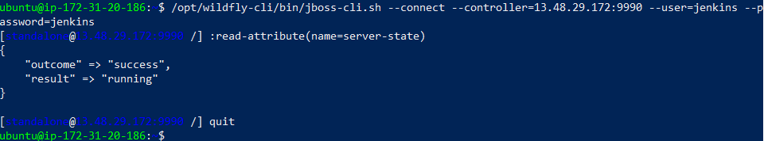   


#### 27.13 — Configure Jenkins for WildFly Deployment


In this step, Jenkins is configured to deploy .war artifacts to the WildFly server using the management API.
Jenkins will use the WildFly CLI installed earlier to perform automated deployments during CI/CD pipelines.

What we will configure:

-Jenkins credentials for WildFly (jenkins / jenkins)

-Jenkins job with build steps

-Deployment command using CLI

-Automatic undeploy + deploy

Verification step

🟩 Step 1 — Add Jenkins Credentials
(English description)

Jenkins needs credentials to authenticate to the WildFly management interface.
We create a username/password credential that will be used in pipeline scripts or freestyle jobs.

Actions performed in Jenkins UI:

-Go to Manage Jenkins

-Open Credentials

-Select System → Global credentials

Add new credential:

-Kind: Username with password

-Username: jenkins

-Password: jenkins

-ID: wildfly-creds

-Description: WildFly Management User

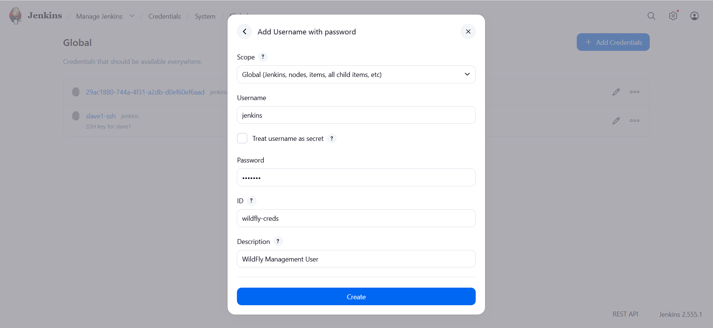   


#### 27.14 — Jenkins Freestyle Job: Deploy WAR to WildFly


In this step, a Jenkins Freestyle Job is created to automatically deploy a .war application to the WildFly server using the management API.
The job uses the WildFly CLI installed on the Jenkins master and the credentials created earlier.

Purpose
This job enables automated CI/CD deployment to the WildFly application server.
It performs undeploy (if the application already exists) and deploys the new .war artifact.

Jenkins Configuration Steps
Create a new Jenkins Freestyle Project named wildfly-deploy.

(Optional) Configure Source Code Management if the .war file is stored in Git.

Add a Build Step → Execute Shell.

Insert the following deployment script:

```Code
/opt/wildfly-cli/bin/jboss-cli.sh \
  --connect \
  --controller=13.48.29.172:9990 \
  --user=jenkins \
  --password=jenkins \
  --command="undeploy myapp.war --keep-content"
  ```
  
```
/opt/wildfly-cli/bin/jboss-cli.sh \
  --connect \
  --controller=13.48.29.172:9990 \
  --user=jenkins \
  --password=jenkins \
  --command="deploy /var/lib/jenkins/workspace/wildfly-deploy/target/myapp.war --force"
  ```
  
Expected Result
The job successfully connects to WildFly, undeploys the previous version, and deploys the new .war file.

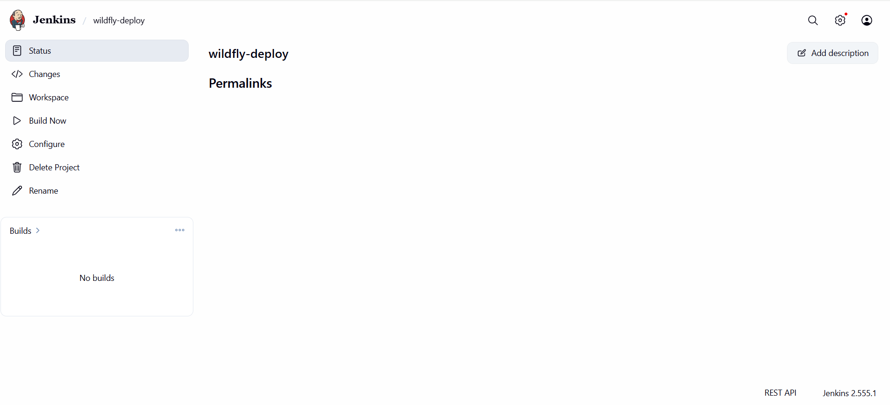 


#### 27.15 — Run Jenkins Job and Verify Deployment on WildFly


In this step, the Jenkins Freestyle Job created earlier is executed to deploy the .war application to the WildFly server.
The job uses the WildFly CLI to perform undeploy (if necessary) and deploy the new application version.

Execution Steps
Open the Jenkins job wildfly-deploy.

Click Build Now to start the deployment process.

Open the build console output to verify that:

Jenkins successfully connects to WildFly

The previous deployment is removed (if present)

The new .war file is deployed

No errors occur during CLI execution

Expected Console Output
Successful CLI connection

undeploy executed (or message that deployment does not exist)

deploy executed with --force

Build marked as SUCCESS

Verification on WildFly
After the job completes, the deployed application should be accessible at:

```Code
http://13.48.29.172:8080/myapp/
```


#### 28.1 — Create a New Jenkins Pipeline Job


Description
In this step, a new Jenkins Pipeline job is created.
This job will later execute the full CI/CD process, including building the project and deploying it to the WildFly server.
At this stage, only the job itself is created — configuration will be done in the next step.

Actions performed
-Open the Jenkins dashboard

-Click “New Item”

Enter the job name:

```Code
cyberpunk-webapp-pipeline
```

Select “Pipeline” as the job type

Click OK

This creates an empty Pipeline job.

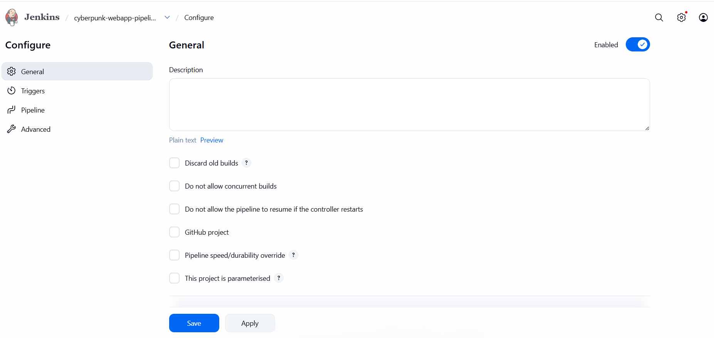


#### 28.3 — Run the First Jenkins Pipeline Build


Description
In this step, the first execution of the Jenkins Declarative Pipeline is performed.
The goal is to verify that Jenkins can successfully connect to the GitHub repository, retrieve the Jenkinsfile from the main branch, and run the pipeline on the configured Jenkins agent.
This confirms that the CI/CD environment is correctly set up and ready for further stages such as building and deploying the application.

Actions performed
Open the Jenkins dashboard

Open the previously created job:

```Code
cyberpunk-webapp-pipeline
```

Click “Build Now”

Open the newly created build (e.g., #1, #2, etc.)

Open Console Output

Verify that Jenkins:

-successfully cloned the GitHub repository

-checked out the main branch

-loaded the Jenkinsfile

-executed the Declarative Pipeline

-completed the Test stage with the message:

```Code
Pipeline is working!
```

The build finishes with the status:

```Code
Finished: SUCCESS
```

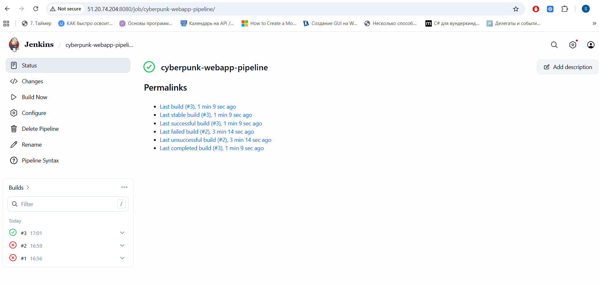


### 29. Add Build Stage to Jenkins Pipeline

Description
In this step, a new Build stage is added to the Jenkins Declarative Pipeline.
The purpose of this stage is to verify that Jenkins can successfully build the project on the configured SSH agent.
This step prepares the CI/CD pipeline for the deployment phase by ensuring that the application can be compiled or packaged without errors.

Actions performed
Open the GitHub repository fork

Switch to the working branch (e.g., main)

Edit the Jenkinsfile and replace its content with:

```Code
pipeline {
    agent any

    stages {

        stage('Build') {
            steps {
                echo 'Building the application...'
                sh 'ls -la'
            }
        }

        stage('Test') {
            steps {
                echo 'Pipeline is working!'
            }
        }
    }
}
```


Commit the changes

Push to GitHub:

```Code
git add Jenkinsfile
git commit -m "Add Build stage"
git push origin main
```

Open Jenkins job:

```Code
cyberpunk-webapp-pipeline
```

Click Build Now

Open Console Output

Verify that Jenkins:

checked out the repository

executed the Build stage

displayed directory contents (ls -la)

executed the Test stage

finished with:

```Code
Finished: SUCCESS
```

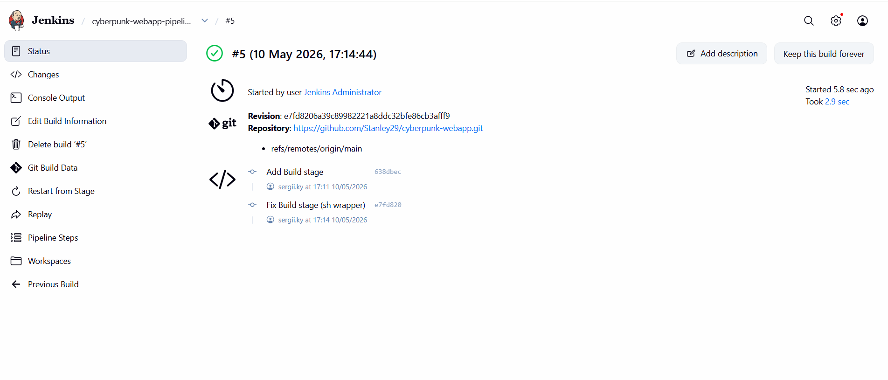


### 30. Create Jenkins Credentials for WildFly Deployment


Description
In this step, a new Jenkins credential is created for authenticating to the WildFly management interface.
These credentials will be used in the Deploy stage of the pipeline to execute CLI commands on the WildFly server.

Actions performed
Виконай у Jenkins:

Відкрий:

```Code
Manage Jenkins
```

Перейди:

```Code
Credentials → System → Global credentials (unrestricted)
```

Натисни:

```Code
Add Credentials
```

Заповни поля:

Kind: Username with password

Username: jenkins

Password: jenkins

ID: wildfly-creds

Description: WildFly Management User

Натисни Create

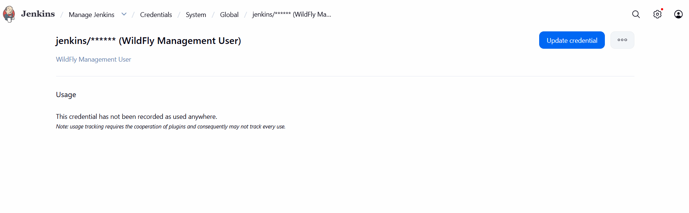


### 31. Add Deploy Stage (WildFly CLI Test)  


Description
In this step, a new Deploy stage was added to the Jenkins Declarative Pipeline.
The purpose of this stage is to verify that Jenkins can connect to the WildFly management interface using the WildFly CLI and the previously created credentials.
This step does not deploy any application yet — it only checks that the connection works.

Actions performed
Opened the Jenkinsfile

Added the Deploy stage with WildFly CLI test

Used Jenkins credentials (wildfly-creds)

Executed the CLI command:

```Code
:read-attribute(name=server-state)
```

Committed and pushed the updated Jenkinsfile

Triggered a new Jenkins build

Verified that the Deploy stage executed successfully and returned:

```Code
"result" => "running"
```

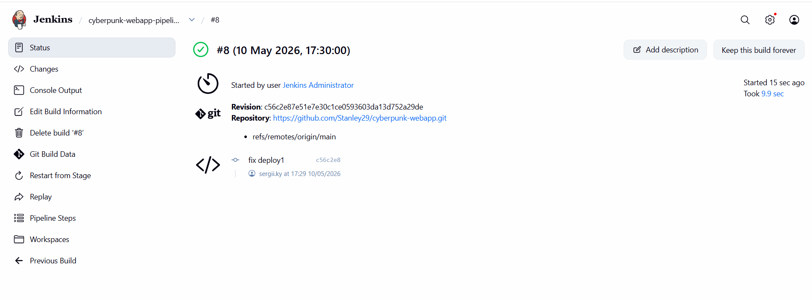


### 32. Deploy WAR to WildFly 

Description
In this step, the Jenkins pipeline was updated to perform a full deployment of the application to the WildFly server.
The pipeline now builds the project using Maven and deploys the generated .war file using the WildFly CLI.

Actions performed
Added Maven build command:
mvn clean package -DskipTests

Added WildFly undeploy + deploy commands

Used Jenkins credentials for authentication

Triggered the pipeline

Verified successful deployment

Confirmed application availability at:

```Code
http://13.48.29.172:8080/cyberpunk-webapp/
```

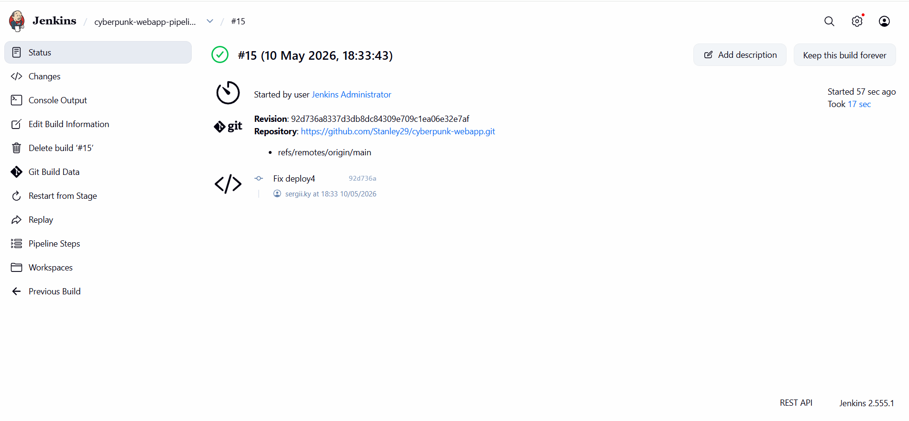


### 33. Final Deployment Verification

Description  
In this step, the final validation of the CI/CD pipeline was performed.
After the successful deployment to WildFly, the application was manually checked to confirm that the new version of the .war file was correctly deployed and accessible via the application endpoint.

Actions performed

Triggered the Jenkins pipeline after updating the deployment stage

Confirmed successful execution of all pipeline stages (Build → Artifact Transfer → Deploy)

Verified that WildFly accepted the new deployment without errors

Checked the application endpoint in a browser

Ensured that the updated web application loads correctly

Application URL 
``` 
http://13.48.29.172:8080/cyberpunk-webapp/
```

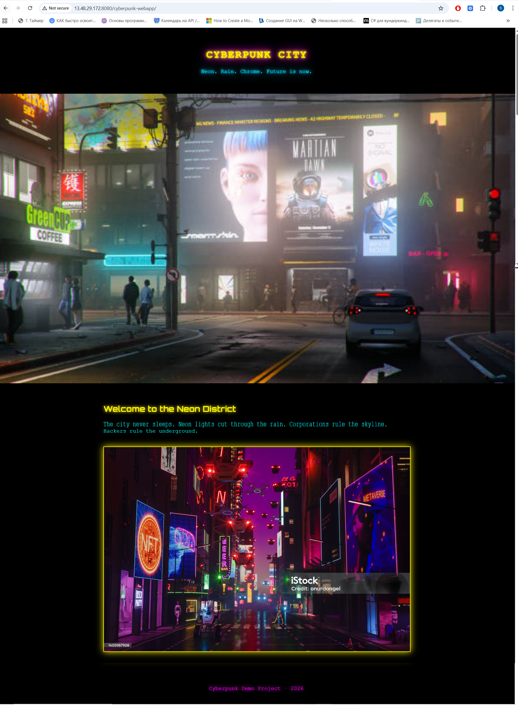  

## Final Result
The CI/CD infrastructure is fully operational:

-Jenkins Master + 2 SSH Slaves

-WildFly deployment server

-Automated build and deployment pipeline

-Secure SSH communication

-Fully documented with screenshots
