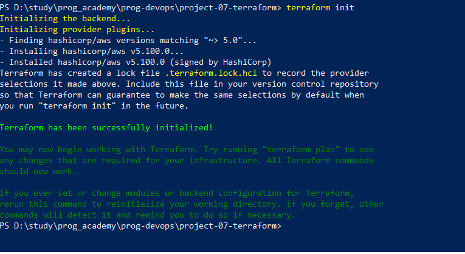
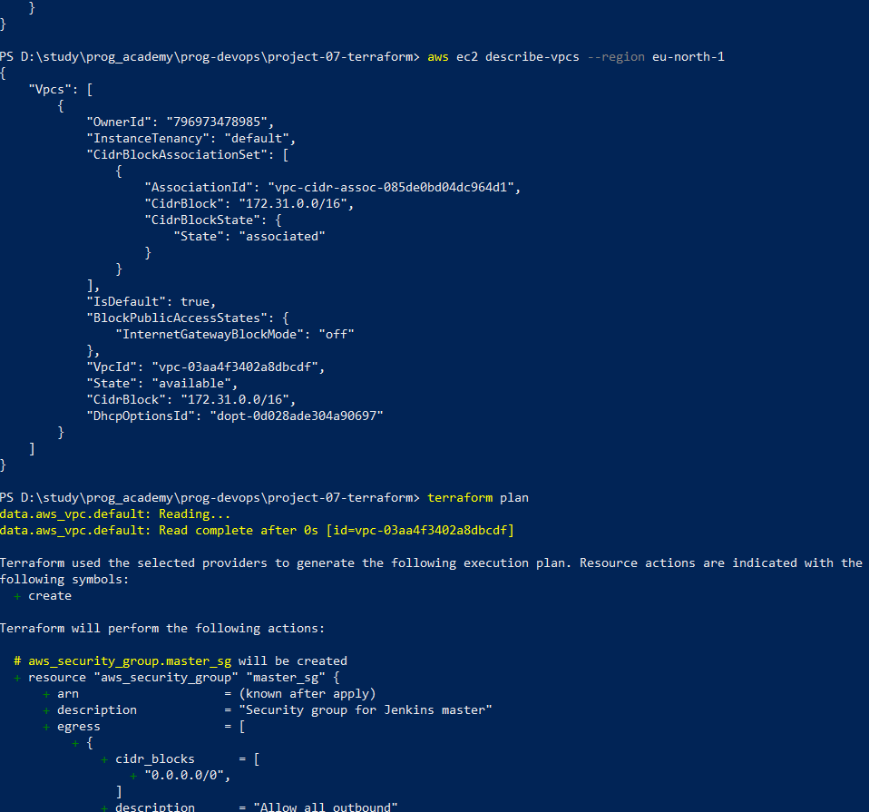
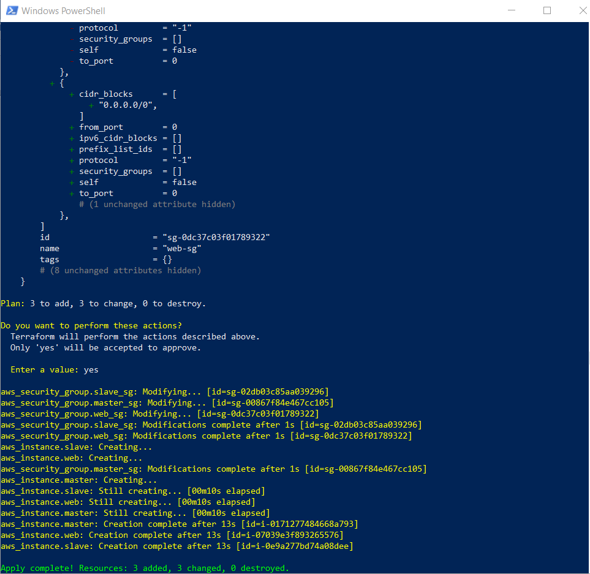
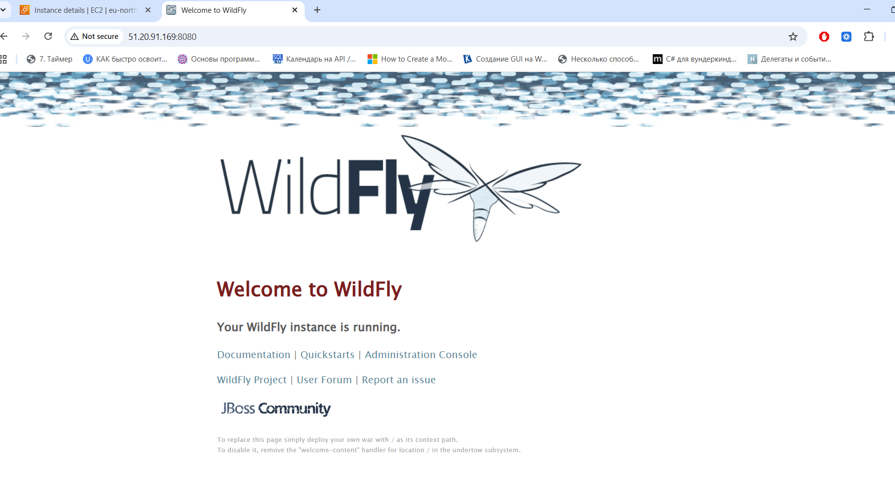
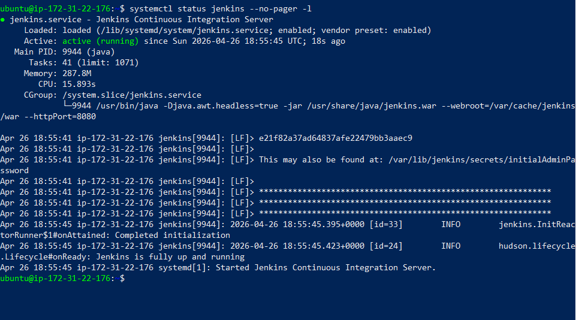
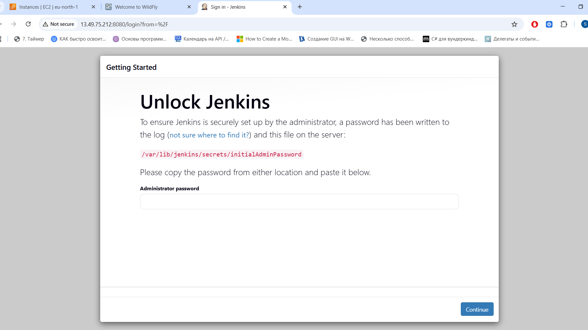

# Terraform Infrastructure: Jenkins Master, Jenkins Slave, and WildFly Web Server on AWS EC2


---

## Project Overview

This project demonstrates a complete automated deployment of a multi‑server CI/CD infrastructure on AWS using Terraform.
The environment includes:

- Three EC2 instances:

-- Jenkins Master (Apache + Jenkins)

-- Jenkins Slave (JDK + Jenkins agent)

-- Web Server (Apache + WildFly)

- Automated software installation using user‑data scripts

- Manual WildFly installation and service configuration

- Full Jenkins Master setup with Java 21

- Automatic restore of JENKINS_HOME from S3 during provisioning

- Automated backup of JENKINS_HOME to S3 using cron

- Full documentation with reproducible steps and screenshots

This project demonstrates practical DevOps skills including AWS provisioning, Terraform IaC, Linux automation, Jenkins configuration, S3 backup/restore, and troubleshooting.

---

## Project Structure

```Code
project-07-terraform/
│
├── main.tf
├── security-groups.tf
├── ec2.tf
├── variables.tf
├── outputs.tf
│
├── user-data/
│   ├── master.sh
│   ├── slave.sh
│   └── web.sh
│
├── scripts/
│   ├── jenkins_backup.sh
│   └── create_structure.ps1
│
├── images/
│   ├── 01_project_structure.png
│   ├── 02_main_tf_content.png
│   ├── 03_terraform_init.png
│   ├── 05_terraform_plan_sg.png
│   ├── 09_terraform_plan_ec2.png
│   ├── 13_terraform_apply_ec2.png
│   ├── 14_wildfly_status_running.png
│   ├── 08_port_8080_listening.png
│   ├── 15_web_sg_open_8080.png
│   ├── 20_jenkins_running.png
│   ├── 22_jenkins_ui.png
│   ├── 23_jenkins_restored_from_s3.png
│   └── 24_s3_backup_list.png
│
└── README.md
```

---

### 1. Terraform Project Structure Creation

A PowerShell script (create_structure.ps1) was used to automatically generate the Terraform project layout.
It created:

- Terraform configuration files

- user‑data scripts

- README.md

- images/ directory


---


### 2. Terraform Initialization and main.tf Configuration

The main.tf file defines:

- Terraform version

- AWS provider

- Region: eu-north-1 (Stockholm)

Example:

```Code
terraform {
  required_version = ">= 1.0.0"

  required_providers {
    aws = {
      source  = "hashicorp/aws"
      version = "~> 5.0"
    }
  }
}

provider "aws" {
  region = "eu-north-1"
}
```

Initialization:

```Code
terraform init
```


Screenshots:  

  




---

### 3. Security Groups Creation

Three Security Groups were created:

***master-sg***
- SSH (22)

- HTTP (80)

- HTTPS (443)

- Jenkins (8080)

***slave-sg***
- SSH (22)

***web-sg***
- SSH (22)

- HTTP (80)

- WildFly (8080)

- WildFly Admin (9990)


A default VPC was missing in eu‑north‑1, so it was created manually:

```Code
aws ec2 create-default-vpc --region eu-north-1
```




---

### 4. EC2 Instances 

Terraform provisions three EC2 instances using the official Ubuntu 22.04 AMI.
SSH access is configured using the existing key pair HrSolution_Key_Pair.

Each instance receives:

- Its own Security Group

- A dedicated user‑data script

Screenshot: 09_terraform_plan_ec2.png

---


### 5. Automatic Server Configuration via user‑data

Three user‑data scripts were created:

**master.sh***

- Installs Jenkins

- Installs Java

- Installs Apache2

- Installs AWS CLI

- Restores JENKINS_HOME from S3

***slave.sh***
- Installs Java

- Creates Jenkins user

***web.sh***
- Installs Java

- Installs Apache2

- Attempts WildFly installation (failed → fixed manually)




---


### 6. Manual WildFly Installation and Service Setup

WildFly installation via user‑data failed, so it was configured manually.

**Steps performed:***

1. SSH into the Web Server:

```Code
ssh -i "HrSolution_Key_Pair.pem" ubuntu@51.20.91.169
```


2. Verify WildFly directory:

```Code
ls /opt/wildfly
```

3. Download and extract WildFly:

```Code
sudo apt update -y
sudo apt install wget unzip -y
wget https://github.com/wildfly/wildfly/releases/download/26.1.3.Final/wildfly-26.1.3.Final.zip
unzip wildfly-26.1.3.Final.zip
sudo mv wildfly-26.1.3.Final /opt/wildfly
```


4. Create WildFly system user:

```Code
sudo useradd -r -s /sbin/nologin wildfly
sudo chown -R wildfly:wildfly /opt/wildfly
```


5. Create systemd service:

```Code
sudo tee /etc/systemd/system/wildfly.service > /dev/null <<EOF
[Unit]
Description=WildFly Application Server
After=network.target

[Service]
Type=simple
User=wildfly
Group=wildfly
ExecStart=/opt/wildfly/bin/standalone.sh -b 0.0.0.0
Restart=always

[Install]
WantedBy=multi-user.target
EOF
```

6. Install Java 17:

```Code
sudo apt install openjdk-17-jdk -y
```

7. Start and enable WildFly:

```Code
sudo systemctl daemon-reload
sudo systemctl start wildfly
sudo systemctl enable wildfly
```

Screenshot: 14_wildfly_status_running.png

8. Verify port 8080:

```Code
sudo ss -tulpn | grep 8080
```

Screenshot: 08_port_8080_listening.png

9. Open port 8080 in Security Group:




---

### 7. Jenkins Master Fix (Java 21 + Service Recovery)

Jenkins failed to start due to Java 17:

```Code
Running with Java 17 … older than the minimum required version (Java 21)
```

Fix applied:
Install Java 21:

```Code
sudo apt install -y openjdk-21-jdk
```

Switch system Java:

```Code
sudo update-alternatives --set java /usr/lib/jvm/java-21-openjdk-amd64/bin/java
```

Update JAVA_HOME in /etc/default/jenkins:

```Code
echo 'JAVA_HOME=/usr/lib/jvm/java-21-openjdk-amd64' | sudo tee -a /etc/default/jenkins
```

Restart Jenkins:

```Code
sudo systemctl restart jenkins
```

Verify status:

```Code
systemctl status jenkins --no-pager -l
```




Retrieve admin password:

```Code
sudo cat /var/lib/jenkins/secrets/initialAdminPassword
```

Access Jenkins UI:

```Code
http://<public-ip>:8080
```




### 8. Automatic Restore of JENKINS_HOME from S3
To ensure Jenkins starts with all plugins and configuration, JENKINS_HOME is restored automatically during provisioning.

Steps:
Create S3 bucket:

```Code
aws s3 mb s3://jenkins-home-backup-bucket
```

Archive JENKINS_HOME:

```Code
sudo tar -czf /tmp/jenkins_home.tar.gz /var/lib/jenkins
```

Upload to S3:

```Code
aws s3 cp /tmp/jenkins_home.tar.gz s3://jenkins-home-backup-bucket/
```

Add restore logic to master.sh:

```Code
sudo apt install -y awscli
aws s3 cp s3://jenkins-home-backup-bucket/jenkins_home.tar.gz /tmp/
sudo tar -xzf /tmp/jenkins_home.tar.gz -C /var/lib/jenkins
sudo chown -R jenkins:jenkins /var/lib/jenkins
sudo systemctl restart jenkins
```


### 9. Automatic Backup of JENKINS_HOME to S3 via cron
Backup script:
/usr/local/bin/jenkins_backup.sh

```
Code
#!/bin/bash

BACKUP_FILE="/tmp/jenkins_backup_$(date +%Y-%m-%d_%H-%M).tar.gz"

sudo tar -czf $BACKUP_FILE /var/lib/jenkins
aws s3 cp $BACKUP_FILE s3://jenkins-home-backup-bucket/backups/
rm $BACKUP_FILE
```

Make executable:

```Code
sudo chmod +x /usr/local/bin/jenkins_backup.sh
```

Cron job (every 6 hours):

```Code
0 */6 * * * /usr/local/bin/jenkins_backup.sh
```


### Final Result

The infrastructure is fully automated and operational:

-Terraform provisions all EC2 instances

-Jenkins Master automatically restores configuration from S3

-Jenkins Slave is ready for CI/CD workloads

-WildFly Web Server is fully functional

-Automated backups ensure Jenkins state persistence

-All steps are documented with screenshots

----