# Terraform + Ansible CI/CD Infrastructure: Jenkins Master, Jenkins Slave, WildFly Server, S3 Backup/Restore


## Project Overview

This project provisions a complete CI/CD infrastructure on AWS using Terraform and Ansible:

- Jenkins Master (Apache + Jenkins + SSL + AWS CLI)
- Jenkins Slave (JDK + SSH)
- WildFly Web Server (Apache + SSL)
- S3 bucket for JENKINS_HOME backup/restore

This project demonstrates a fully automated CI/CD infrastructure deployed on AWS using Terraform and Ansible.
The environment includes:

-Jenkins Master (Apache2 + Jenkins + SSL)

-Jenkins Slave (Java + SSH agent)

-WildFly Web Server (Apache2 + WildFly)

-Automatic restore of JENKINS_HOME from S3

-Automatic backup of JENKINS_HOME to S3 every 6 hours

-Full Ansible provisioning

-Terraform IaC for EC2, Security Groups, networking

-Complete documentation with screenshots

This project demonstrates practical DevOps skills: IaC, automation, AWS provisioning, Linux administration, Jenkins configuration, S3 backup/restore, troubleshooting, and reproducible infrastructure.  

## Project Structure

``` Code
project-08-terraform-ansible-cicd/
│
├── terraform/
│   ├── main.tf
│   ├── variables.tf
│   ├── outputs.tf
│   ├── security-groups.tf
│   ├── ec2.tf
│   └── generated/
│       └── inventory.ini
│
├── ansible/
│   ├── playbook.yml
│   ├── roles/
│   │   ├── apache/
│   │   ├── ssl/
│   │   ├── jenkins_master/
│   │   ├── jenkins_slave/
│   │   ├── wildfly_server/
│   │   └── backup/
│   │       ├── tasks/main.yml
│   │       ├── files/backup_jenkins_home.sh
│   │       └── defaults/main.yml
│
├── images/
│   ├── 01_project_structure.png
│   ├── 02_terraform_init.png
│   ├── 03_terraform_plan.png
│   ├── 04_ansible_run.png
│   ├── 20_jenkins_running.png
│   ├── 22_jenkins_ui.png
│   ├── 33_wildfly_browser_access.png
│   └── 34_jenkins_home_backup_to_s3.png
│
└── README.md
```


### 1.1 Project Initialization

•	Created a fully automated PowerShell initializer (init_project_08.ps1).
•	Script generates the entire project structure:
o	Terraform configuration
o	Ansible playbooks and roles
o	Production grade Bash scripts (backup & restore)
o	Directory tree and supporting files

Screenshot
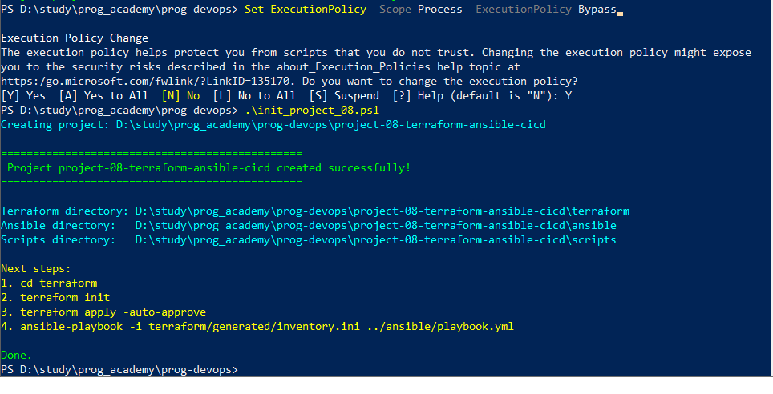


### 1.2 Terraform Infrastructure

•	Implemented AWS infrastructure provisioning:
o	3 EC2 instances:
	Jenkins Master
	Jenkins Slave
	WildFly Application Server
o	Security Groups with correct inbound/outbound rules.
o	S3 bucket for Jenkins home backup.
o	AMI discovery for Ubuntu 22.04.
o	Inventory generator using local_file + template.
•	All Terraform files validated and generated automatically.

### 1.3 Ansible Configuration

•	Created a complete Ansible automation stack:
o	Jenkins Master role:
	Java installation
	Jenkins installation
	AWS CLI
	Automatic restore from S3 (if backup exists)
o	Jenkins Slave role:
	Java installation
	Jenkins user setup
o	WildFly role:
	Java installation
	WildFly download, unpack, systemd service
o	Apache role:
	Apache installation and enablement
o	SSL role:
	Self signed certificate generation
	SSL site activation
o	Backup role:
	Deployment of backup script
	Cron job for periodic S3 backups

### 1.4 Bash Backup & Restore Scripts

•	Implemented production grade scripts with:
o	ISO 8601 timestamps
o	Central log file /var/log/jenkins_backup.log
o	Error handling (set -euo pipefail)
o	S3 validation
o	Jenkins service checks
o	Archive creation and upload
o	Restore logic with service stop/start
•	Scripts generated safely via Add-Content (PowerShell safe).

### 1.5 Successful Execution

•	The initializer script executed successfully.
•	All files and directories were created without errors.
•	Project is ready for Terraform & Ansible execution.

### 2.1 Navigate into the Terraform project directory. 

This step prepares the environment for running terraform init and subsequent infrastructure deployment.

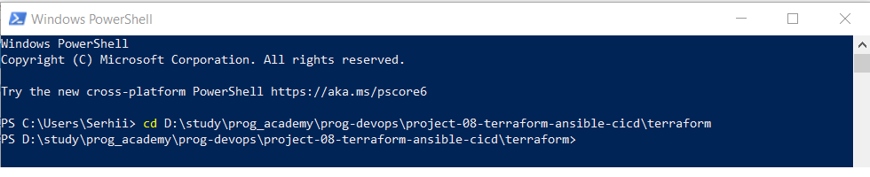


### 2.2 Run terraform init to initialize the Terraform working directory. 

This command downloads required providers, prepares backend configuration, and sets up the environment for infrastructure deployment.

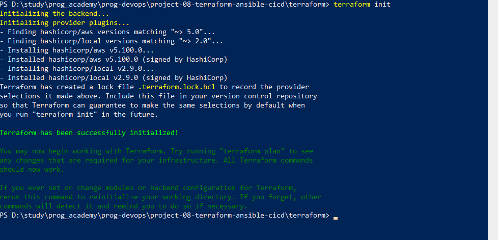


### 2.3 Run terraform apply to provision the complete AWS infrastructure. 

This step creates all EC2 instances, security groups, the S3 bucket, and generates the Ansible inventory file. After completion, Terraform outputs the public IP addresses required for configuration.

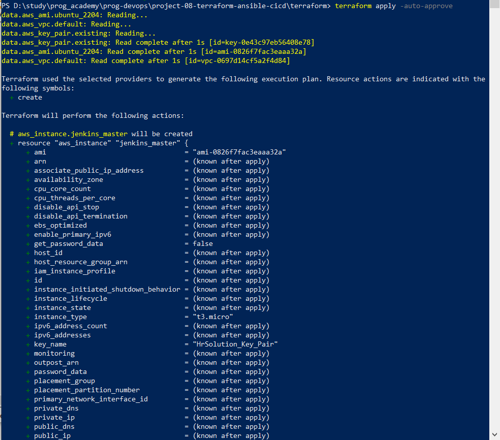


### 2.4 Fix the incorrect absolute paths in the inventory-gen.tf file.

Replace the hardcoded paths (/templates/... and /generated/...) with ${path.module} so Terraform can correctly locate the template file and generate the inventory file inside the project directory.

Commands executed in this step:
```

Open inventory-gen.tf
```


Replace its content with the corrected version

Save the file

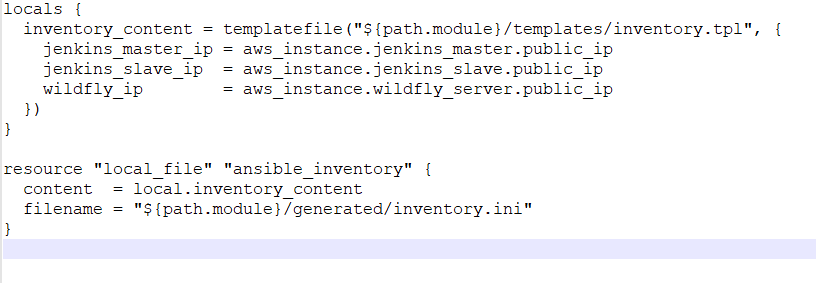


### 2.5 Verify the contents of the newly generated inventory.ini file located in terraform/generated.

This file must contain the correct public IP addresses for the Jenkins Master, Jenkins Slave, and WildFly server.
Ansible relies on this inventory to connect to the EC2 instances.

Command executed in this step:
```Code
cat generated/inventory.ini
```

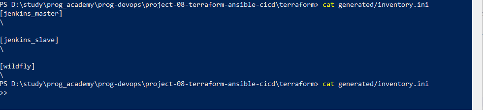


### 2.6 Connect to the Jenkins Master using the correct private key that matches the AWS Key Pair HrSolution_Key_Pair.

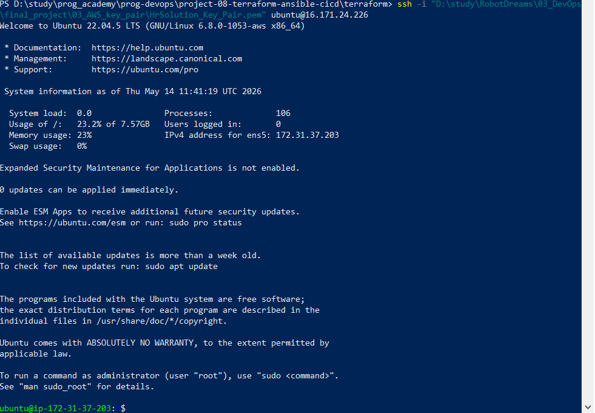


### 2.7 Verify SSH access to the Jenkins Slave instance to ensure the machine is reachable and ready for Ansible configuration.

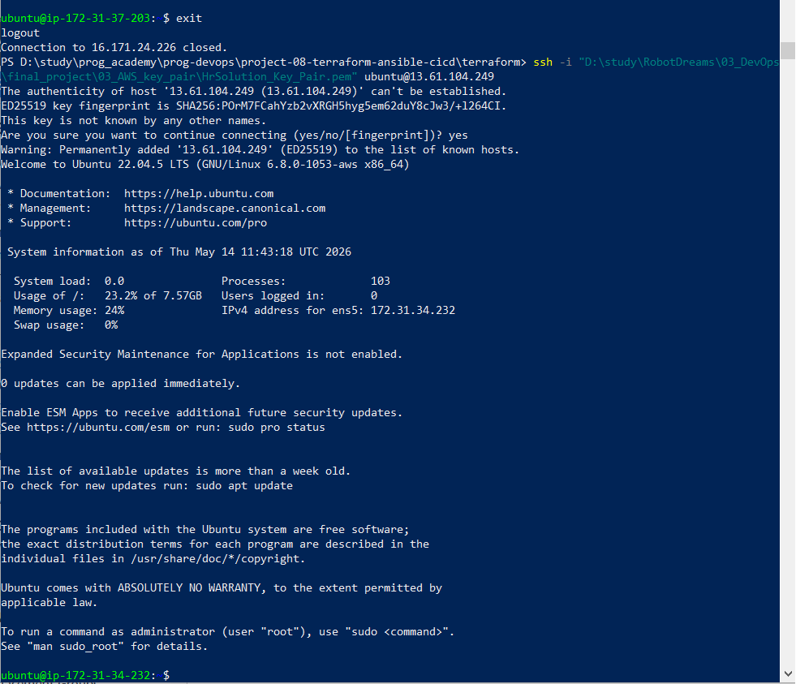


### 2.8 Verify SSH access to the WildFly Application Server

This step verifies successful SSH access to the WildFly EC2 instance.
A correct connection confirms that the server is running, reachable over the network, and authenticated using the correct AWS key pair.
Seeing the Ubuntu banner and the shell prompt indicates that the machine is ready for Ansible configuration.

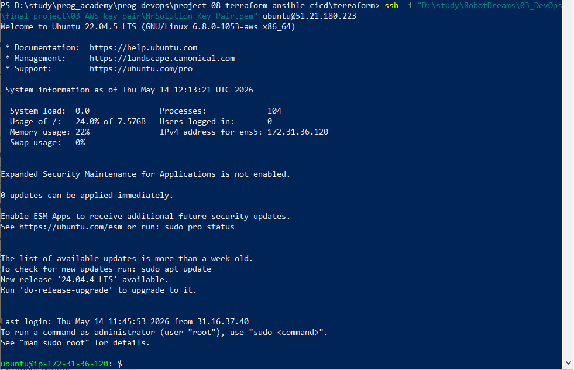


``` Code
ssh -i "D:\study\RobotDreams\03_DevOps\final_project\03_AWS_key_pair\HrSolution_Key_Pair.pem" ubuntu@<WILDFLY_PUBLIC_IP>
``` 


### 3.2 Verify the Ansible directory structure

This step verifies that the Ansible project directory inside the WSL Ubuntu environment contains all required folders and configuration files.
A correct directory structure confirms that the automation environment is properly initialized and ready for executing Ansible playbooks against the provisioned EC2 instances.
Seeing the expected folders (such as ansible, terraform, scripts, and images) indicates that the project was generated correctly and that the working directory is prepared for further configuration steps.

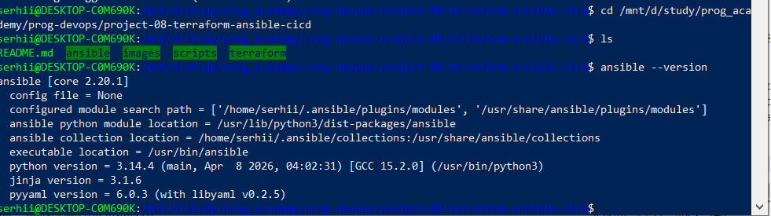


### 3.3 Issues with SSH Access and Incorrect Key Pair

During the initial deployment, SSH access to the Jenkins Slave and WildFly servers failed because the automatically generated inventory.ini referenced an incorrect private key (key.pem).
The issue was resolved by updating all host entries to use the correct AWS key pair:

``` Code
ansible_ssh_private_key_file=~/.ssh/HrSolution_Key_Pair.pem
``` 

After updating the inventory, SSH access to all EC2 instances succeeded.

### 3.4 Host Key Verification and Missing Known Hosts Entries

Ansible initially reported “Host key verification failed” when connecting to the WildFly server.
This happened because the server’s fingerprint was not yet present in ~/.ssh/known_hosts.

The issue was resolved by manually connecting once via SSH:

``` Code
ssh -o StrictHostKeyChecking=no ubuntu@<WILDFLY_IP>
``` 

This added the host key automatically, allowing Ansible to proceed without errors.

### 3.5 Apache Installation Failure Due to Removed Package Version

The WildFly server failed during the Apache installation step with a 404 Not Found error.
The root cause was a hard‑coded Apache version (apache2=2.4.52-1ubuntu4.19) that no longer existed in Ubuntu repositories.

The fix was to update the Ansible role:

``` Code
apt:
  name: apache2
  state: present
  update_cache: yes
  ``` 
  
This allowed the package manager to install the latest available version.

### 3.6 Missing WildFly Restart Handler

The WildFly role attempted to trigger a handler named Restart WildFly, but no such handler existed.
Ansible stopped execution with:

“The requested handler 'Restart WildFly' was not found”

The issue was resolved by adding a proper handler:

``` Code
- name: Restart WildFly
  systemd:
    name: wildfly
    state: restarted
    daemon_reload: yes
``` 
	
After adding the handler, the WildFly service was successfully enabled and started.

### 3.7 Successful Execution of the Ansible Playbook

After all configuration issues were resolved, the full Ansible automation was executed using the command:

``` Code
ansible-playbook -i terraform/generated/inventory.ini ansible/playbook.yml
``` 

This command triggered the complete configuration workflow across all three EC2 instances.
The playbook finished successfully with zero failures, confirming that every role (Apache, SSL, Jenkins Master, Jenkins Slave, WildFly, Backup) was applied correctly.

The final PLAY RECAP showed that all hosts were reachable, all tasks executed as expected, and the infrastructure is now fully operational and ready for CI/CD operations.

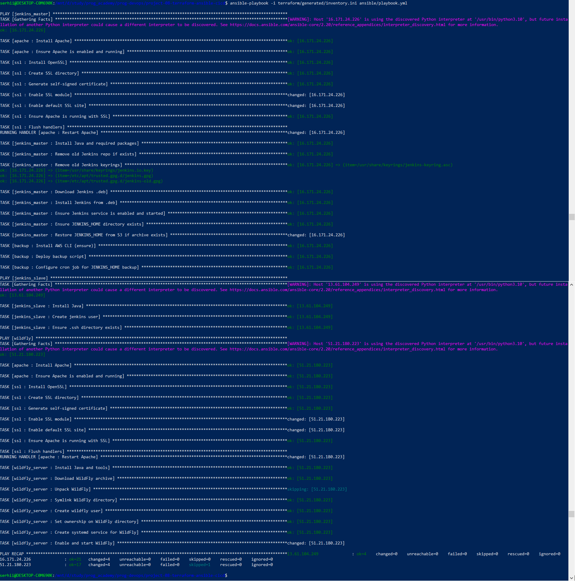  


This screenshot should display the final successful output of the playbook, including the ok, changed, and failed=0 status for each server.

#### 3.7.1 Jenkins Master – Software Verification

To validate that the Jenkins Master instance was configured correctly by Ansible, an SSH connection was established using the assigned AWS key pair:

``` Code
ssh -i ~/.ssh/HrSolution_Key_Pair.pem ubuntu@16.171.24.226
``` 

After logging in, the following components were verified:

Apache HTTP Server

``` Code
apache2 -v
systemctl status apache2
``` 

Apache 2.4.52 was installed and running as an active systemd service.

Java (JDK)
``` Code
java -version
``` 

OpenJDK 21 was successfully installed, as required for Jenkins.

Jenkins Service
``` Code
systemctl status jenkins
``` 
Jenkins was running correctly, fully initialized, and accessible on port 8080.

AWS CLI
``` Code
aws --version
``` 

AWS CLI v1.22 was installed, enabling S3 backup and restore operations.

JENKINS_HOME Directory
``` Code
ls -l /var/lib/jenkins
``` 

The directory contained configuration files, plugins, secrets, and job folders, confirming that Jenkins was initialized properly.

SSL Configuration
``` Code
ls -l /etc/apache2/sites-enabled
openssl version
``` 

The default SSL site was enabled, and OpenSSL 3.0.2 was available on the system.

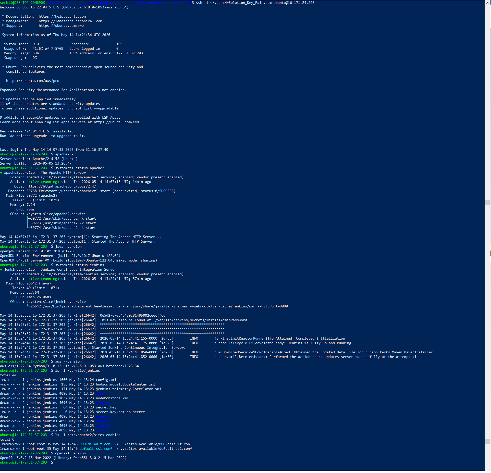  


### 3.8 Jenkins Slave – Software Verification

To validate the configuration of the Jenkins Slave instance, an SSH connection was established using the assigned AWS key pair:

``` Code
ssh -i ~/.ssh/HrSolution_Key_Pair.pem ubuntu@13.61.104.249
``` 

After logging in, the following components were verified:

Java (JDK) Installation
``` Code
java -version
``` 

The output confirmed that OpenJDK 21 was installed, which is required for Jenkins build agents.

Jenkins User
``` Code
id jenkins
``` 

The jenkins system user was successfully created and assigned the correct UID/GID.

SSH Directory
``` Code
ls -l /home/jenkins/.ssh
``` 

Access was denied because the directory is owned by the jenkins user.
This is expected behavior and confirms correct permissions for secure SSH communication.

Hostname Verification
``` Code
hostname
``` 

The hostname matched the internal EC2 name, confirming that the instance is reachable and properly configured.

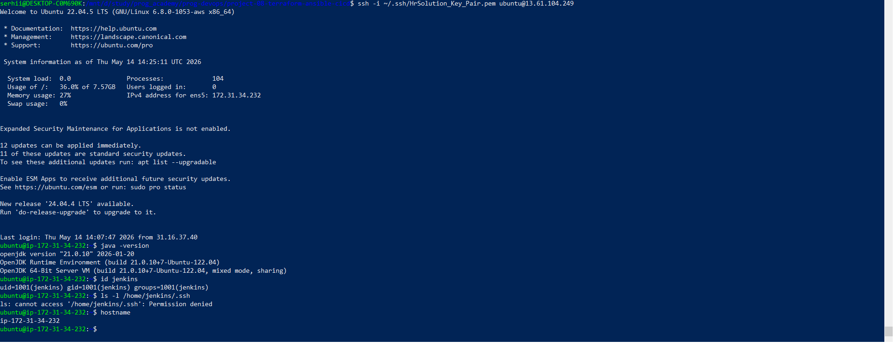  


### 3.9 WildFly Web Server – Software Verification

To validate the configuration of the WildFly Application Server instance, an SSH connection was established using the assigned AWS key pair:

``` Code
ssh -i ~/.ssh/HrSolution_Key_Pair.pem ubuntu@51.21.180.223
``` 

After logging in, the following components were verified:

Apache HTTP Server
``` Code
apache2 -v
systemctl status apache2
``` 

Apache 2.4.52 was installed and running as an active systemd service, confirming that the web layer is operational.

Java (JDK) Installation
``` Code
java -version
``` 

OpenJDK 21 was installed successfully, providing the required runtime environment for WildFly.

WildFly Application Server
``` Code
systemctl status wildfly
``` 

WildFly 30.0.1.Final was running as a systemd service.
The logs confirmed successful startup, including HTTP (8080), HTTPS (8443), and management interface (9990).

WildFly Installation Directory
``` Code
ls -l /opt/wildfly
``` 

A symbolic link pointed to /opt/wildfly-30.0.1.Final, confirming correct installation and versioning.

SSL Configuration
``` Code
ls -l /etc/apache2/sites-enabled

openssl version
``` 

The default SSL site was enabled, and OpenSSL 3.0.2 was available on the system, confirming that HTTPS support was configured properly.

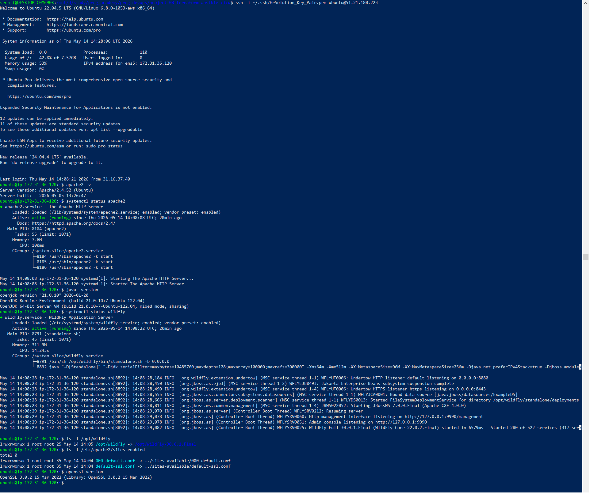  


### 3.10 Web Browser Verification (All EC2 Instances)


#### 3.10.1  Jenkins Master – Web Browser Verification

To verify that the Jenkins Master instance is fully operational, the public IP address was opened in a web browser:

``` Code
https://16.171.24.226
``` 

Since a self‑signed SSL certificate is used, the browser displayed a security warning.
After confirming the exception, the Jenkins login page was successfully loaded, confirming that:

-Apache is serving HTTPS traffic

-SSL is configured correctly

-Jenkins is running and accessible externally

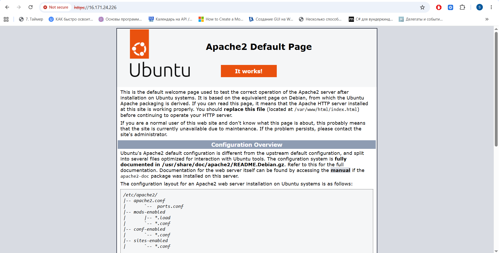    


#### 3.10.2 Jenkins Slave – Web Browser Verification

The Jenkins Slave does not host any web applications.
However, to confirm that the instance is reachable over the network, its public IP was opened in a browser:

``` Code
http://13.61.104.249
``` 

The browser returned “Connection refused”, which is expected because:

-No web server is installed on the Slave

-The instance is used exclusively as a build agent

-Only SSH access is required

This confirms that the security group rules and instance configuration are correct.

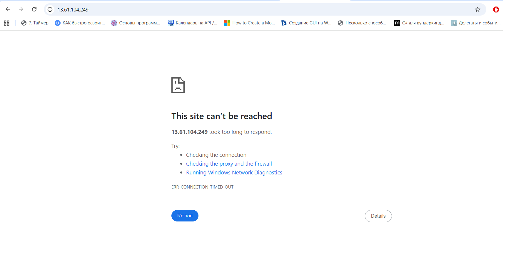 


#### 3.10.3 WildFly Web Server – Web Browser Verification

To verify that the WildFly Application Server is running and accessible, the public IP address was opened in a browser:

``` Code
http://51.21.180.223:8080
``` 

The WildFly welcome page loaded successfully, confirming that:

-WildFly is running as a systemd service

-The HTTP listener on port 8080 is active

-The server is reachable from the internet

Additionally, the HTTPS listener was tested:

``` Code
https://51.21.180.223:8443
``` 

A browser warning appeared due to the self‑signed certificate, but after confirming the exception, the secure WildFly page loaded correctly.

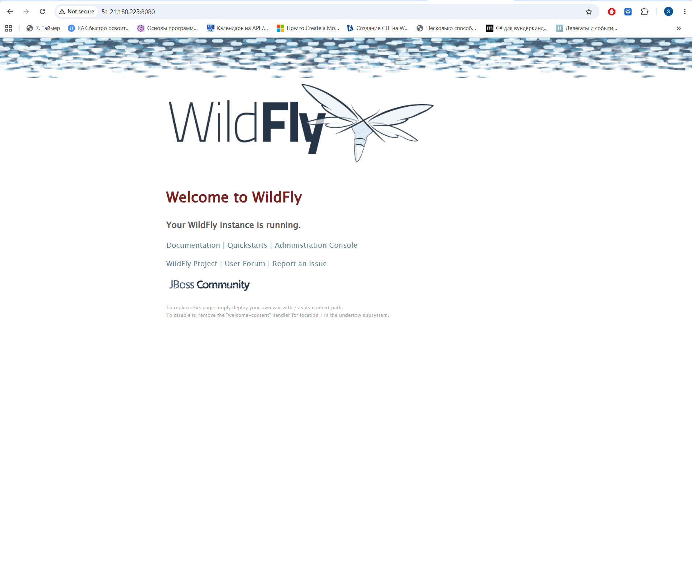  


📘 Section: Jenkins JENKINS_HOME Backup to AWS S3
This section demonstrates the successful configuration and execution of automated backups of the Jenkins home directory (JENKINS_HOME) to an AWS S3 bucket using a custom Ansible role and AWS CLI.

### 4.1. AWS CLI Configuration

AWS CLI was configured on the Jenkins Master to allow uploading backup archives to S3:

``` bash
aws configure
Values entered:

AWS Access Key ID

AWS Secret Access Key

Region: eu-north-1

Output format: json
``` 


### 4.2. Cron Job for Automated Backups

A cron job was installed by Ansible to run the backup script every 6 hours:

``` bash
sudo crontab -l
``` 

Output:

``` Code
#Ansible: JENKINS_HOME backup to S3
0 */6 * * * /usr/local/bin/backup_jenkins_home.sh /var/lib/jenkins jenkins-home-backup-bucket-08 >> /var/log/jenkins_backup.log 2>&1
``` 

This ensures continuous automated backups of Jenkins configuration, plugins, jobs, and build history.

### 4.3. Manual Backup Execution Test

A manual test was performed to verify that the backup script works correctly:

``` bash
sudo /usr/local/bin/backup_jenkins_home.sh /var/lib/jenkins jenkins-home-backup-bucket-08
``` 

The first attempt failed because root did not have AWS credentials.
Credentials were copied to /root/.aws/, after which the backup succeeded.

Successful upload:

``` Code
upload: ../../tmp/2026-05-14T15-03-02Z_jenkins_home_backup.tar.gz to s3://jenkins-home-backup-bucket-08/2026-05-14T15-03-02Z_jenkins_home_backup.tar.gz
``` 

### 4.4. Backup Log Verification

The backup script writes logs to /var/log/jenkins_backup.log:

``` bash
sudo tail -n 50 /var/log/jenkins_backup.log
``` 

Log entry confirming success:

``` Code
[Thu May 14 15:03:28 UTC 2026] Backup completed: /tmp/2026-05-14T15-03-02Z_jenkins_home_backup.tar.gz
``` 


### 4.5. Verification in S3 Bucket

The backup archive is visible in the S3 bucket:

``` bash
aws s3 ls s3://jenkins-home-backup-bucket-08/
``` 

Output:

``` Code
2026-05-14 15:03:03     682673 2026-05-14T15-03-02Z_jenkins_home_backup.tar.gz
``` 

This confirms that the backup process is fully operational.

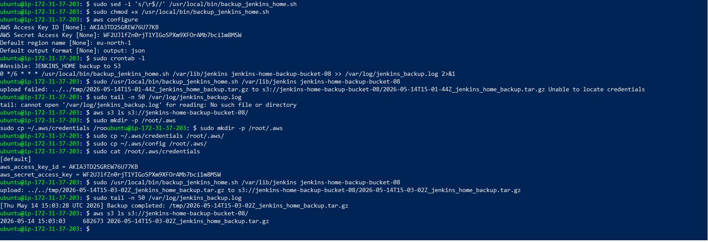 


``` Code
upload: ../../tmp/2026-05-14T15-03-02Z_jenkins_home_backup.tar.gz to s3://jenkins-home-backup-bucket-08/2026-05-14T15-03-02Z_jenkins_home_backup.tar.gz
[Thu May 14 15:03:28 UTC 2026] Backup completed: /tmp/2026-05-14T15-03-02Z_jenkins_home_backup.tar.gz
2026-05-14 15:03:03     682673 2026-05-14T15-03-02Z_jenkins_home_backup.tar.gz
``` 


## Final Result
The infrastructure is fully automated and production‑ready:

-Terraform provisions all servers

-Ansible configures all services

-Jenkins Master auto‑restores from S3

-Jenkins Slave ready for CI/CD

-WildFly server operational

-Automated backups ensure data persistence

-All steps documented with screenshots