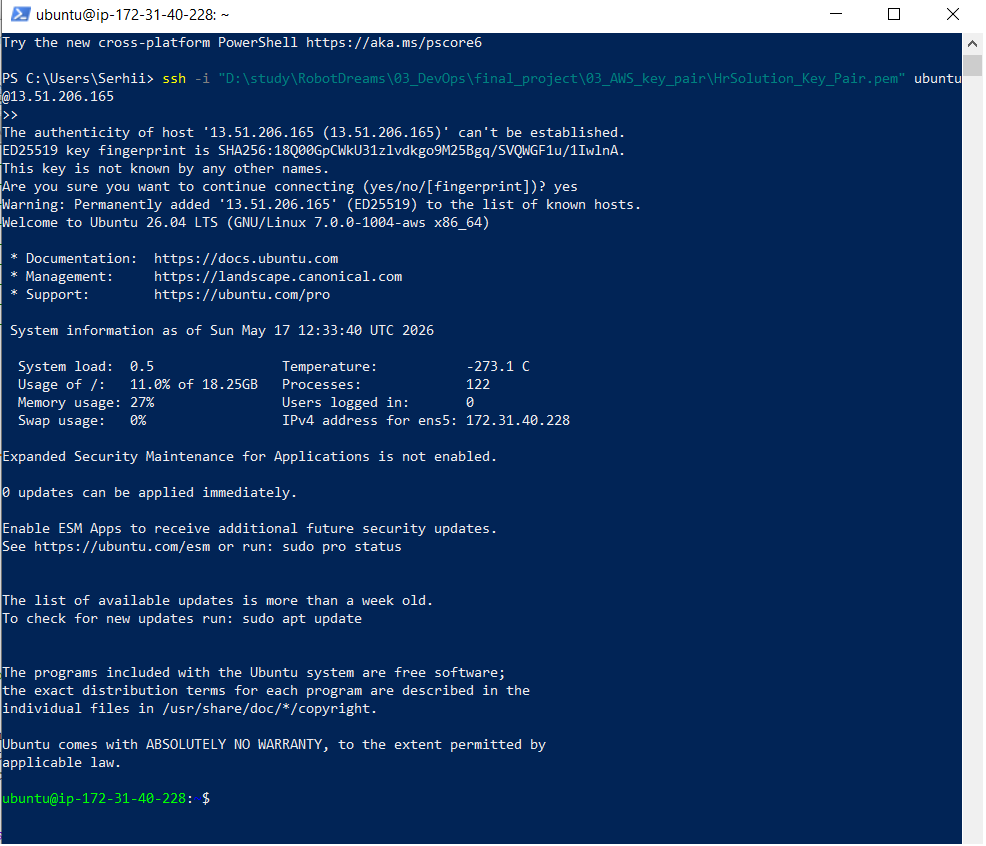
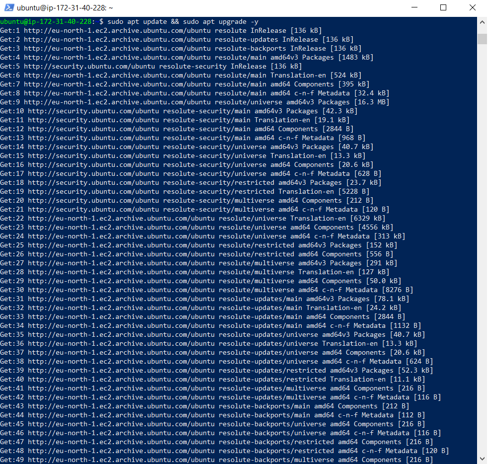
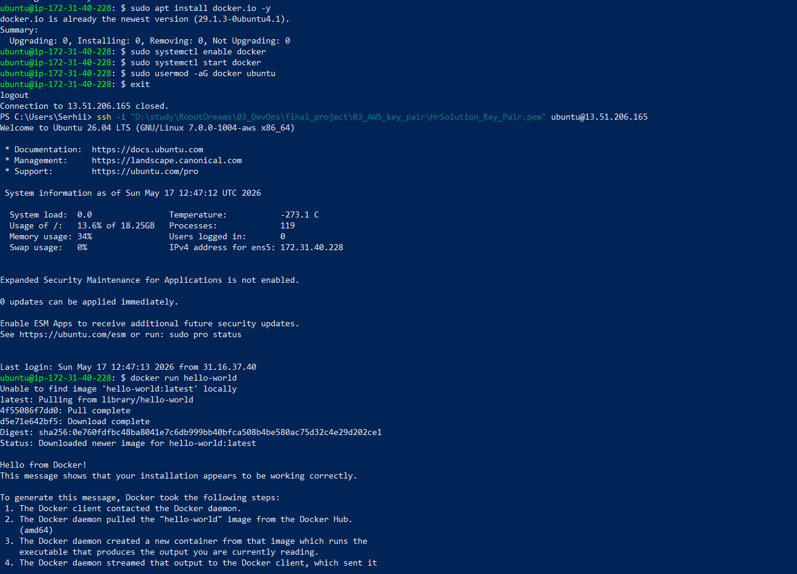
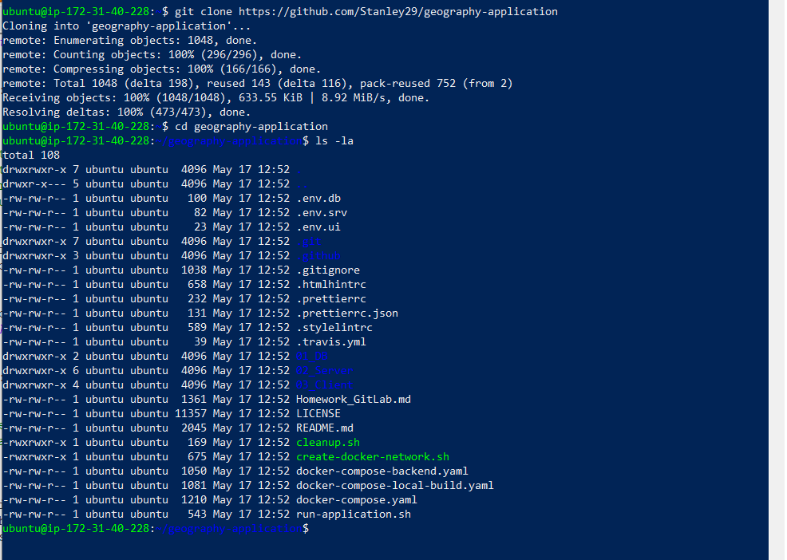
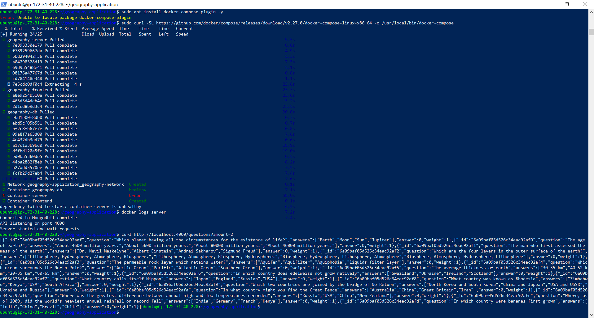
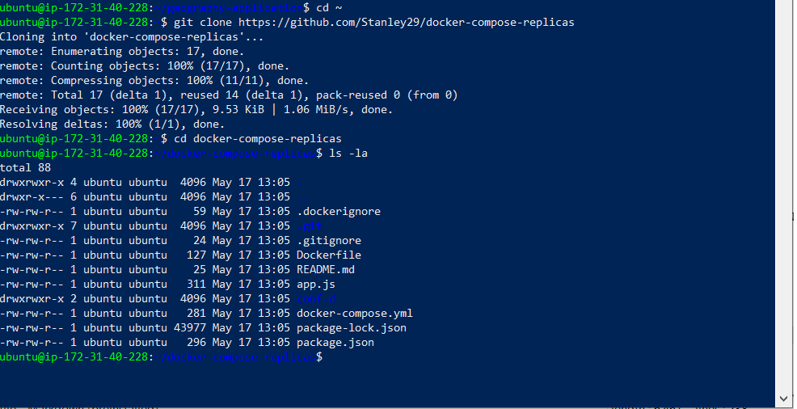
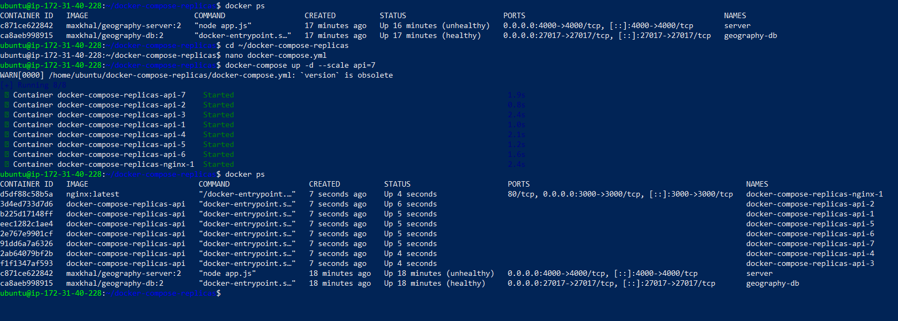
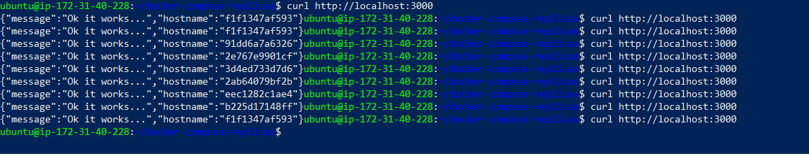

# 🌍 Geography Application + 7 API Replicas — Full Docker Deployment on AWS EC2


---

## 📘 Project Overview

This project demonstrates a complete DevOps deployment pipeline on AWS EC2 using Docker and Docker Compose.
It includes:

Part 1 — Geography Application
-MongoDB container with seeded data

-Node.js API server container

-/questions endpoint returning geography questions

-Docker Hub image usage

-Full troubleshooting and stabilization

-API validation via curl

Part 2 — Horizontal Scaling with Nginx
-7 API replicas using Docker Compose scaling

-Nginx load balancer distributing traffic (round‑robin)

-Removal of conflicting container_name and ports

-Validation of load balancing via hostname rotation

-Clean, reproducible deployment

This project demonstrates practical DevOps skills:

-Docker image creation

-Multi‑container orchestration

-Linux server administration

-Debugging and troubleshooting

-AWS EC2 provisioning

-API testing and validation

-Horizontal scaling

-Nginx load balancing

---


## 📁 Project Structure

``` text
project-10-docker-compose-replicas/
│
├── images/
│   ├── 01_ec2_ssh_connection.png
│   ├── 02_system_update_upgrade.png
│   ├── 03_docker_hello_world.png
│   ├── 04_geography_app_repo_structure.png
│   ├── 05_geography_app_success.png
│   ├── 06_replicas_repo_structure.png
│   ├── 07_api_replicas_running.png
│   ├── 08_load_balancing_success.png
│
├── scripts/
│   └── docker-compose/
│       └── Dockerfile
│   └── docker-compose-replicas/
│       ├── Dockerfile
│       ├── docker-compose.yml
│   
│
└── README.md

``` 

---

## 🧩 Step-by-Step Deployment


### Step 1 — Connect to EC2 Instance
Command:

``` Code
ssh -i HrSolution_Key_Pair.pem ubuntu@13.51.206.165
``` 

Description:  
Connected to the EC2 instance named project-10-docker-compose-replicas-ec2 using SSH.
The instance is running Ubuntu Server and is ready for Docker installation.

Screenshot:  


### Step 2 — Update and Upgrade System Packages
Command:

``` Code
sudo apt update && sudo apt upgrade -y
``` 

Description:  
Updated the Ubuntu package index and upgraded all installed packages to the latest available versions.
This ensures the EC2 environment is fully patched and ready for Docker installation.

Screenshot:  


### Step 3 — Install Docker Engine and Verify Installation
Commands:

``` Code
sudo apt install docker.io -y
sudo systemctl enable docker
sudo systemctl start docker
sudo usermod -aG docker ubuntu
docker run hello-world
``` 

Description:  
Installed Docker Engine and enabled the Docker service.
Verified the installation by running the hello-world container, confirming that Docker daemon, networking, and image pulling from Docker Hub work correctly.

Screenshot:  


### Step 4 — Clone the Geography Application Repository
Commands:

``` Code
git clone https://github.com/Stanley29/geography-application
cd geography-application
ls -la
``` 

Description:  
Cloned the fork of the geography-application project to the EC2 instance and verified the directory structure.
The repository contains the required components: MongoDB service, Node.js server, client UI, and Docker Compose configuration files.

Screenshot:  


### Step 5 — Deploy and Verify the Geography Application (with Issue Resolution)

***Commands Executed***
``` Code
docker-compose up -d
docker ps
curl http://localhost:4000/questions?amount=2
``` 

***Description***

The Geography Application was deployed using Docker Compose.
Three services were launched:

-MongoDB database

-Node.js backend server

-Frontend application

After deployment, the API was tested using a curl request to confirm that the backend and database were functioning correctly.

***Issues Encountered***

During the initial startup, the server container entered an Error / Unhealthy state.
This happened because:

MongoDB requires additional time to initialize on first launch

The Node.js server attempted to connect before MongoDB was fully ready

Docker marked the server container as unhealthy due to failed initial health checks

***How the Issue Was Resolved***

No code changes were required.
After MongoDB finished initialization, the server container automatically retried the connection and successfully established communication with the database.

Verification via logs confirmed successful startup:

``` Code
Connected to Mongodb
API listening on port 4000
Server started and wait requests
``` 

A subsequent API request returned valid data, confirming that the application was fully operational.

Result
The Geography Application backend and database are running correctly, and the API responds with valid question data.

Screenshot


### Step 6 — Clone the docker-compose-replicas Repository

Commands Executed
``` Code
cd ~
git clone https://github.com/Stanley29/docker-compose-replicas
cd docker-compose-replicas
ls -la
``` 

Description
The repository docker-compose-replicas was successfully cloned from GitHub and the directory structure was verified.
The project contains:

-docker-compose.yml — main file for scaling API replicas

-Dockerfile — build instructions for the API service

-app.js — simple Node.js API returning hostname

-conf.d/ — Nginx load‑balancer configuration

-package.json / package-lock.json — Node.js dependencies

This confirms that the environment is ready for configuring and launching 7 API replicas behind Nginx.

Result
The environment is fully prepared for the next step:
modifying docker-compose.yml and launching 7 replicas of the API service.

Screenshot



### Step 7 — Deploy 7 API Replicas with Nginx Load Balancing

***Commands Executed***
``` Code
cd ~/docker-compose-replicas
nano docker-compose.yml
docker-compose up -d --scale api=7
docker ps
``` 

***Description***

The docker-compose-replicas project was configured to run 7 instances of the Node.js API service behind an Nginx load balancer.
The docker-compose.yml file was updated to:

-remove the static container name

-remove direct port mapping from the API service

-enable Nginx as the single public entry point on port 3000

-allow Docker to automatically create 7 independent API containers

After applying the changes, the system successfully built the API image and launched:

-**7 API containers** (docker-compose-replicas-api-1 … api-7)

-**1 Nginx load balancer** (docker-compose-replicas-nginx-1)


***Issues Encountered***

-Docker initially refused to scale the API service because the original configuration used a **fixed container_name**, which prevents scaling.

-This was resolved by **commenting out the container_name** and **commenting out the ports section** for the API service.

***How the Issue Was Resolved***

-The container_name and ports directives were removed from the API service.

-Nginx was re-enabled as the only service exposing port 3000.

-After updating the compose file, scaling worked correctly.

Result
The system now runs:

-7 API replicas

-1 Nginx load balancer

All containers are up and healthy

This completes the horizontal scaling task.

Screenshot


### Step 8 — Verify Load Balancing Across 7 API Replicas

Commands Executed
``` Code
curl http://localhost:3000
``` 

Repeated multiple times to observe load balancing behavior.

Description
The Nginx load balancer was tested to ensure that incoming HTTP requests are distributed across all 7 API replicas.
Each API instance returns a JSON response containing its container hostname.

Observed Output
Example responses:

``` Code
{"message":"Ok it works...","hostname":"f1f1347af593"}
{"message":"Ok it works...","hostname":"91dd6a7a6326"}
{"message":"Ok it works...","hostname":"2e767e9901cf"}
{"message":"Ok it works...","hostname":"3d4ed733d7d6"}
{"message":"Ok it works...","hostname":"2ab64079bf2b"}
{"message":"Ok it works...","hostname":"eec1282c1ae4"}
{"message":"Ok it works...","hostname":"b225d17148ff"}
``` 

Each response came from a **different container**, confirming that Nginx is performing round‑robin load balancing.

Issues Encountered
No issues occurred during this step.
All replicas responded correctly and consistently.

Result
Nginx successfully distributes traffic across all 7 API replicas

All containers are healthy and responding

Horizontal scaling is fully operational

Part 2 of the homework is completed

Screenshot


## ⚙️ Key Technical Steps Completed

### 1️⃣ EC2 Setup

-Installed Docker & Docker Compose

-Enabled Docker service

-Verified installation

### 2️⃣ Geography Application Deployment

-Cloned repository

-Launched MongoDB + Server

-Verified API response

-Fixed initial unhealthy state (MongoDB startup delay)

### 3️⃣ 7 API Replicas Deployment

-Cloned docker-compose-replicas

-Updated docker-compose.yml:

---removed container_name

---removed ports from API

---kept Nginx as entrypoint

-Built API image

-Launched 7 replicas

-Verified via docker ps

### 4️⃣ Load Balancing Validation

Repeated curl requests:

Code
curl http://localhost:3000
Received responses from different hostnames:

``` Code
{"message":"Ok it works...","hostname":"f1f1347af593"}
{"message":"Ok it works...","hostname":"91dd6a7a6326"}
{"message":"Ok it works...","hostname":"2e767e9901cf"}
{"message":"Ok it works...","hostname":"3d4ed733d7d6"}
{"message":"Ok it works...","hostname":"2ab64079bf2b"}
{"message":"Ok it works...","hostname":"eec1282c1ae4"}
{"message":"Ok it works...","hostname":"b225d17148ff"}
``` 

This confirms:

-Nginx works

-Round‑robin works

-All 7 replicas respond

## 🟩 Final Conclusion
Both parts of the assignment are fully completed:

✔ Part 1 — Geography Application
MongoDB + Node.js API deployed, stable, responding.

✔ Part 2 — 7 API Replicas
Nginx load balancer + 7 scaled containers working perfectly.

✔ All validation steps passed
API responses, container health, load balancing, scaling — everything works.

✔ Documentation ready
You now have a professional, portfolio‑grade report.