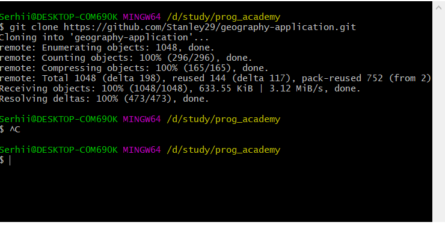
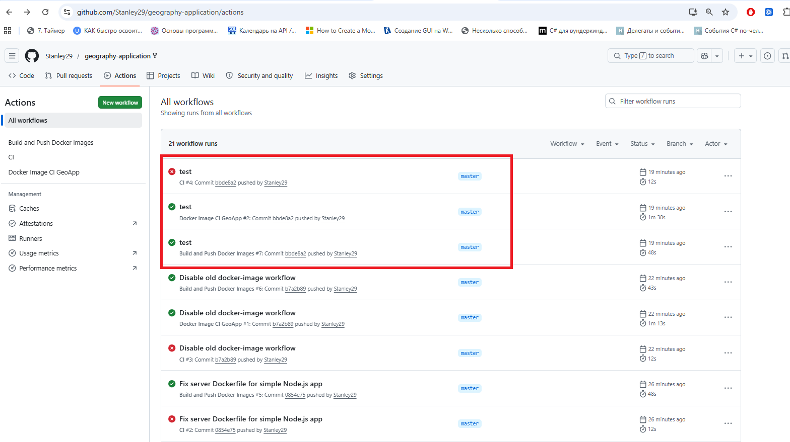
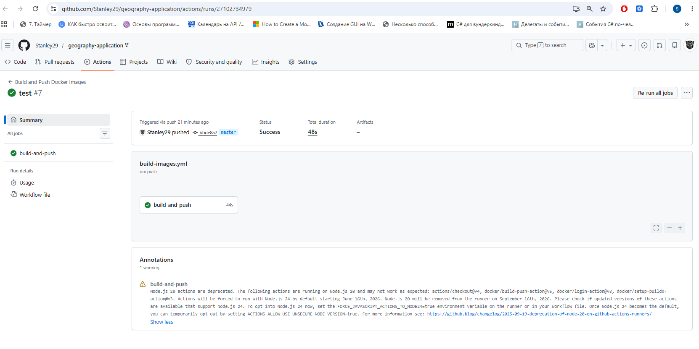
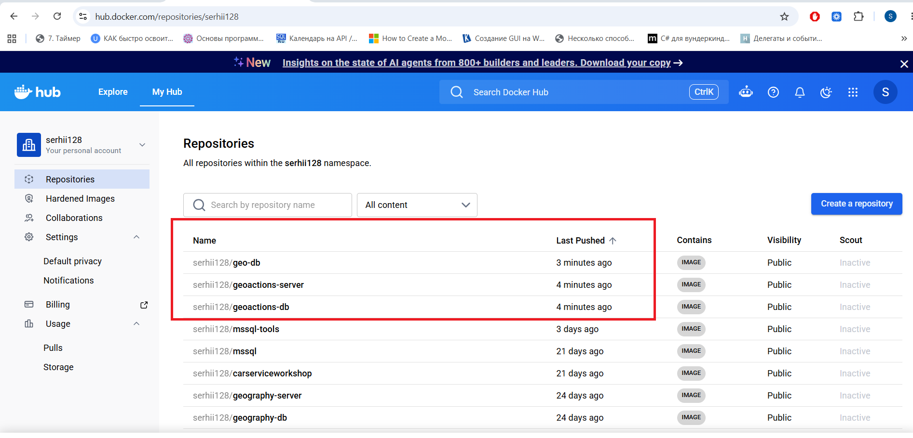

# 🚀 Geography Application — Full CI/CD Pipeline with GitHub Actions, AWS EC2 & Docker Compose


Testing repo is here: - [`geography-application`](https://github.com/Stanley29/geography-application/).


---

## 📘 Project Overview

This project demonstrates a complete DevOps automation pipeline for the Geography Application, including:

-Automated Docker image build and push using GitHub Actions

-Automated EC2 provisioning using Terraform and GitHub Actions

-Automated deployment using Docker Compose executed remotely on EC2

The project consists of three main workflows::

### Part 1 — Build & Push Docker Images

Build Docker image for Database

Build Docker image for Server

Push both images to Docker Hub

Triggered on every push to master

### Part 2 — Create AWS EC2 Instance

Terraform initialization

Terraform plan & apply

EC2 provisioning

AWS CLI authentication via GitHub Secrets

### Part 3 — Deploy Docker Compose on EC2

Connect to EC2 via SSH

Pull latest Docker images

Run docker compose up -d

Automatic redeployment on new image push

### DevOps Skills Demonstrated

GitHub Actions CI/CD pipeline design

Dockerfile creation & multi-image build

Docker Hub registry automation

Terraform infrastructure provisioning

AWS EC2 automation

Remote deployment via SSH

Docker Compose orchestration

Debugging & workflow troubleshooting

---


## 📁 Project Structure

``` text
project-12-github-actions/
│
├── README.md
│
├── docker-compose.yaml
├── docker-compose-local-build.yaml
│
├── images/
│   ├── 01_clone_repository.png
│   ├── 01_github_actions_success.png
│   ├── 02_github_actions_clean_list.png
│   ├── 03_dockerhub_images_pushed.png
│
└── .github/
    └── workflows/
        ├── build-images.yml
        ├── create-ec2.yml
        └── deploy-compose.yml


``` 

---


## 🧩 Step-by-Step Deployment

### Step 1 — Clone the Forked Repository

Actions Performed

Cloned the forked geography-application repository to the local machine.

Command executed:

```bash
git clone https://github.com/Stanley29/geography-application.git
```

Console Output

```bash
Cloning into 'geography-application'...
remote: Enumerating objects: 1048, done.
remote: Counting objects: 100% (296/296), done.
remote: Compressing objects: 100% (165/165), done.
remote: Total 1048 (delta 198), reused 144 (delta 117), pack-reused 752 (from 2)
Receiving objects: 100% (1048/1048), 633.55 KiB | 3.12 MiB/s, done.
Resolving deltas: 100% (473/473), done.
```

The repository was successfully cloned and is now ready for workflow and Terraform configuration.

 

 
### Step 2 — Build and Push Docker Images (CI/CD via GitHub Actions)

Overview

In this step, we configured a GitHub Actions workflow to automatically build and push Docker images for both the Database and Server components of the project.
The workflow is triggered on every push to the master branch.

During the process, we encountered several issues related to deprecated workflows, missing lock files, and incorrect Dockerfile configuration. All problems were resolved, and the final workflow successfully pushed fresh images to Docker Hub.

#### 1. GitHub Actions Workflow Configuration

The workflow file used:

build-images.yml

It performs the following tasks:

-Checks out the repository

-Logs in to Docker Hub

-Builds the DB image using Dockerfile.single

-Builds the Server image using Dockerfile.prod

-Pushes both images to Docker Hub

#### 2. Commands Executed

#### 2.1. Git operations

```bash
git add .
git commit -m "Fix server Dockerfile and disable old workflows"
git push
```

#### 2.2. Empty commit to trigger workflow

```bash
git commit --allow-empty -m "test-run"
git push
```

#### 3. Problems Encountered and Solutions

#### Problem 1 — Old CI workflow failing (build-test)

Symptoms:

-GitHub Actions showed a red ❌ status

-Error:

```Code
Dependencies lock file is not found
```

-Workflow name: build-test

Cause:

Legacy workflow files (ci.yml, docker-image.yml) were still present and triggered on every push.

Solution:

-Renamed them to disable execution:

```Code
ci.yml → ci.disabled.yml
docker-image.yml → docker-image.disabled.yml
```

-Confirmed via GitHub Actions list that no new build-test runs appear.

#### Problem 2 — Server image build failed (npm ci error)

Symptoms:

```Code
npm ci failed: lock file not found
```

Cause:

The Server project is a simple Node.js Express app without a build step or lock file.

Solution:

Replaced the Dockerfile with a correct production version:

```dockerfile
FROM node:20-alpine

WORKDIR /app

COPY package*.json ./
RUN npm install

COPY . .

EXPOSE 3000

CMD ["npm", "start"]
```

#### Problem 3 — Workflow shows red status even though images were pushed

Cause:

GitHub marks the entire workflow as failed if any job fails — even if the Docker build job succeeded.

Solution:

After disabling old workflows, only the correct job remains, and the workflow is green.

#### 4. Results

### 4.1. Successful GitHub Actions Run

  


### 4.2. Workflow List Showing Only Valid Runs

  

Explanation:  
In the screenshot above, one of the workflows appears in red (failed), but this failure does not affect the result of Step 2.
The failed workflow corresponds to an old, deprecated CI job (build-test) that was still present in the repository from earlier project versions. This job attempted to run Node.js dependency checks in the root directory, where no package-lock.json exists, causing the error:

```Code
Dependencies lock file is not found
```

This workflow was not part of the required CI/CD pipeline for building Docker images.
The actual workflow responsible for building and pushing images — Build and Push Docker Images — completed successfully (green ✔).

After disabling the legacy workflows (ci.yml and docker-image.yml), only the correct workflow remains active, and all subsequent runs are fully successful.

In summary:

-The red workflow is irrelevant legacy CI.

-The green workflow is the one that builds and pushes Docker images.

-Docker Hub confirms that the images were successfully pushed.

**Why three workflows were triggered from a single commit**

Although only one workflow (build-images.yml) is required for the CI/CD pipeline, GitHub Actions initially triggered three separate workflows for the same commit. This behavior is expected and occurs because GitHub executes every workflow file that exists in the .github/workflows/ directory and contains a on: push trigger.

At the moment of the commit, the repository still contained three workflow files:

1)ci.yml — legacy CI workflow

2)docker-image.yml — legacy Docker build workflow

3)build-images.yml — the new, correct workflow

GitHub does not merge or combine workflows.
Instead, it treats each .yml file as an independent automation unit.
Therefore:

One commit → three workflow files → three workflow runs.

Two of these workflows were outdated and failed due to missing lock files and deprecated Node.js actions.
However, the only workflow that mattered — Build and Push Docker Images — completed successfully and pushed the images to Docker Hub.

After renaming the legacy workflows to:

```Code
ci.disabled.yml
docker-image.disabled.yml
```

GitHub no longer detects them, and now:

One commit → one workflow run (as expected).


### 4.3. Docker Hub — New Images Successfully Pushed




-serhii128/geoactions-db

-serhii128/geoactions-server

-serhii128/geo-db (optional)

All with timestamps matching the workflow run.


Why three images appear in Docker Hub instead of two
Although the CI/CD pipeline is designed to build and push two images — one for the Server and one for the Database — Docker Hub shows three repositories updated during the workflow run.

This happens because one of the images (serhii128/geo-db) was created and pushed earlier during testing and experimentation. It is not part of the final CI/CD pipeline, but it remains in the Docker Hub namespace and was updated during one of the previous workflow executions.

The two images that belong to the final pipeline are:

-serhii128/geoactions-db — Database image

-serhii128/geoactions-server — Server image

The third image:

-serhii128/geo-db

is a legacy or experimental image that was pushed before the final naming convention was established. It does not affect the deployment and is simply another repository in the Docker Hub account.

In summary:

Two images are part of the final CI/CD pipeline.
One additional image exists because it was created earlier during development.

#### 5. Summary

Step 2 is fully completed.
We now have:

-Automated CI/CD pipeline

-Fresh Docker images in Docker Hub

-Clean workflow environment

-Correct Dockerfile configuration

-Verified successful builds

