# 🚗 CarService Workshop CRUD — Full Docker & Kubernetes Deployment on AWS EC22


---

## 📘 Project Overview

This project demonstrates a complete DevOps deployment pipeline for a .NET 7 CRUD application using Docker, AWS EC2, and Kubernetes (Minikube).

It includes:

### Part 1 — Docker Deployment

MSSQL Server container

SQL initialization script (schema + seed data)

ASP.NET Core CRUD backend container

Docker network for internal DNS

Environment variables for DB connectivity

Successful browser access via exposed port

Images pushed to Docker Hub

### Part 2 — Kubernetes Deployment

Minikube cluster running on AWS EC2

kubectl installed and configured

Custom namespace carservice

MSSQL Deployment + PVC + Service

MSSQL pod in Running state

Cluster ready for backend deployment

### DevOps Skills Demonstrated
Dockerfile creation

Multi‑container orchestration

AWS EC2 provisioning

SQL initialization automation

Kubernetes cluster setup

Persistent storage configuration

Pod, Deployment, Service management

Debugging and troubleshooting

---


## 📁 Project Structure

``` text
project-13-kubernetes-crud-deployment/
│
├── README.md
│
├── images/
│   ├── 01_mssql_container_started.png
│   ├── 02_init_sql_created.png
│   ├── 03_docker_installed.png
│   ├── 03_init_sql_copied.png
│   ├── 04_repository_cloned.png
│   ├── 05_docker_build_success.png
│   ├── 07_sql_script_executed_successfully.png
│   ├── 08_mssql_container_running.png
│   ├── 09_database_exists.png
│   ├── 10_tables_listed.png
│   ├── 11_repository_cloned.png
│   ├── 12_docker_image_built.png
│   ├── 12_repository_updated_and_dockerfile_verified.png
│   ├── 13_docker_image_rebuilt.png
│   ├── 14_backend_container_running.png
│   ├── 15_ec2_backend_and_mssql_running.png
│   ├── 16_app_running_successfully.png
│   ├── 17_ec2_docker_tag_success.png
│   ├── 18_dockerhub_repos_ready.png
│   ├── 19_k8s-mssql-and-backend-running.png
│   ├── 19_minikube_start_success.png
│   ├── 22_ec2_instance_created.png
│   ├── 22_kubectl_installed.png
│   ├── 23_ec2_ready.png
│   ├── 23_minikube_installed.png
│   ├── 23_namespace_created.png
│   ├── 24_k8s_cluster_status.png
│   ├── 24_minikube_started.png
│   ├── 24_mssql_deployed.png
│   ├── 25_k3s-installation-success.png
│   ├── 25_k8s_node_ready.png
│   ├── 25_namespace_created.png
│   ├── 26_k3s-service-status.png
│   ├── 26_namespace_created.png
│   ├── 26_pvc_created.png
│   ├── 27_mssql_deployed.png
│   ├── 27_mssql_running.png
│   ├── 28_backend_running.png
│   ├── 28_k3s-node-ready.png
│   ├── 28_mssql_running.png
│   ├── 29_database_initialized_successfully.png
│   ├── 30_backend_logs_success.png
│   ├── 31_browser_clients_page_loaded.png
│   ├── 31_wrong_port_forward_attempt.png
│
└── scripts/
    ├── carserviceworkshop/
    │   ├── Dockerfile
    │   ├── backend-deployment.yaml
    │   ├── mssql-deployment.yaml
    │
    ├── db/
    │   ├── init.sql
    │
    └── kubernetes/
        ├── backend.yaml
        ├── init-db-job.yaml
        ├── mssql.yaml
        ├── pvc.yaml


``` 

---

## 🧩 Step-by-Step Deployment

### Step 05 — Create Dockerfile for the CRUD Application

I created a multi-stage Dockerfile inside the `CarServiceWorkshop.Web` directory, where the ASP.NET Core project file (`CarServiceWorkshop.Web.csproj`) is located.

This Dockerfile builds and publishes the application using the .NET 8 SDK and runs it using the ASP.NET Core runtime.

**Dockerfile:**

```
FROM mcr.microsoft.com/dotnet/aspnet:8.0 AS base
WORKDIR /app
EXPOSE 8080

FROM mcr.microsoft.com/dotnet/sdk:8.0 AS build
WORKDIR /src
COPY . .
RUN dotnet publish CarServiceWorkshop.Web.csproj -c Release -o /app/publish

FROM base AS final
WORKDIR /app
COPY --from=build /app/publish .
ENTRYPOINT ["dotnet", "CarServiceWorkshop.Web.dll"]

```

### Step 01 — Commit and Push Dockerfile to GitHub

After adding the Dockerfile to the CRUD application, I committed and pushed the changes to the remote GitHub repository.

Commands used:

```bash
git status
git add .
git commit -m "Add Dockerfile for CRUD application"
git push
```

This ensures the Docker configuration is version-controlled and available for further deployment steps.

### Step 02 — Create AWS EC2 Instance (Ubuntu)

I launched a new EC2 instance using the correct AMI:

- Ubuntu Server 22.04 LTS (x86_64)
- Instance type: t2.medium
- Storage: 20 GB gp3


### Step 03 — Install Docker Engine on AWS EC2

I installed Docker Engine on the EC2 instance to enable building and running containers:

```bash
sudo apt update
sudo apt install -y docker.io
sudo systemctl enable docker
sudo systemctl start docker
docker --version

```

Screenshot: 
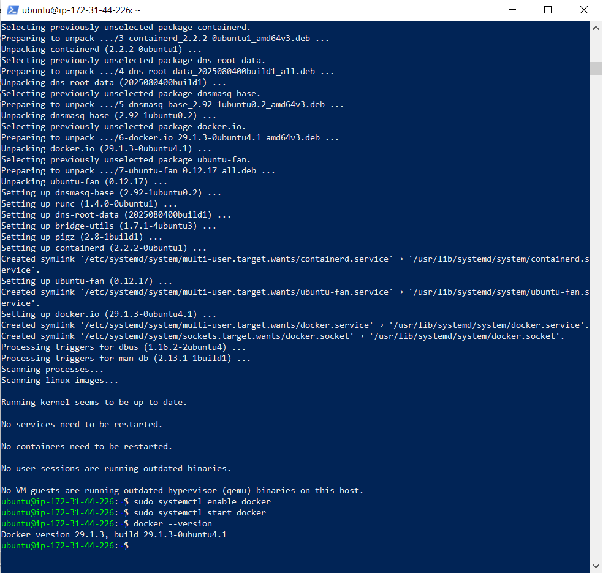 


### Step 04 — Start Microsoft SQL Server Docker Container on EC2
I launched a Microsoft SQL Server 2022 container on the EC2 instance using Docker.
The command pulled the official SQL Server image from the Microsoft Container Registry and started the container with port 1433 exposed for external access.

```bash
docker run -e "ACCEPT_EULA=Y" -e "SA_PASSWORD=Qwerty123!" \
-p 1433:1433 --name mssql -d mcr.microsoft.com/mssql/server:2022-latest
```

After the image was downloaded and the container was created, I verified that it was running:

```bash
docker ps
```

The output confirmed that the mssql container is active, running, and listening on port 1433, which means SQL Server is fully operational inside Docker.

Screenshot:
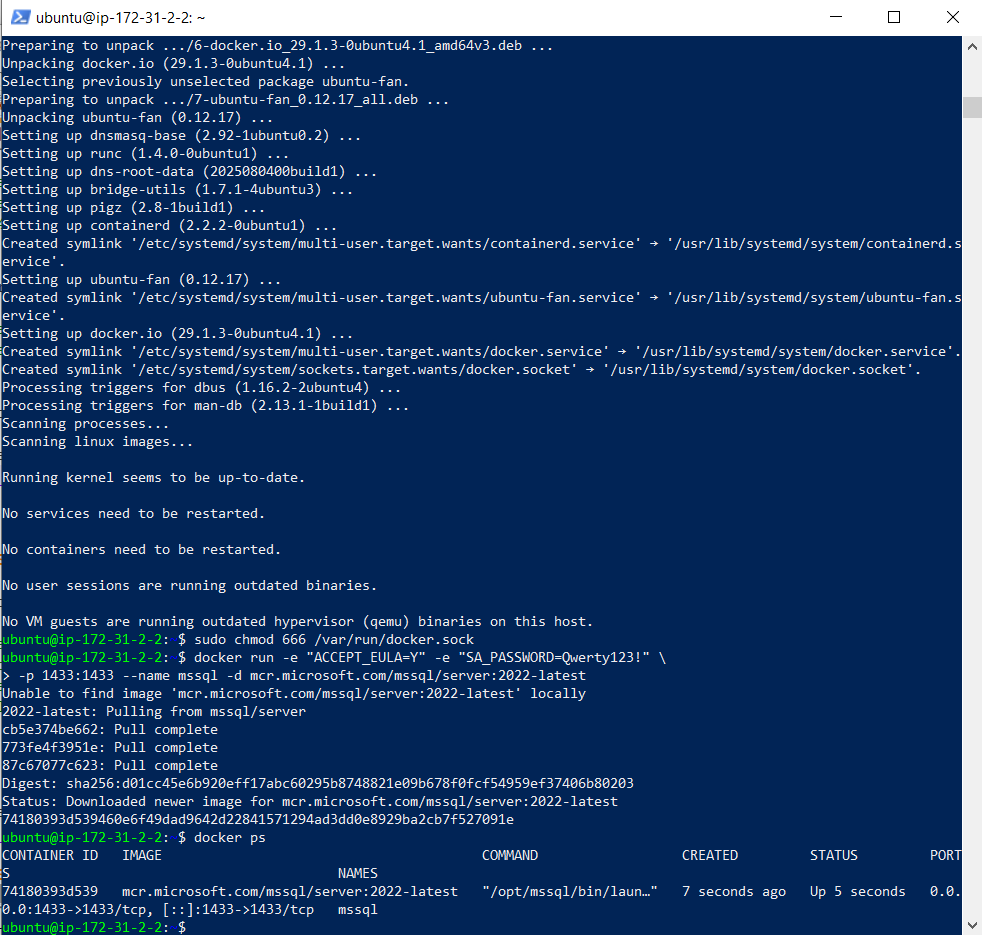


### Step 05 — Create SQL Initialization Script on EC2

I created the init.sql file on the EC2 instance and inserted the full SQL schema and seed data required for the CarServiceWorkshop database.
After saving the file, I verified its presence in the home directory using:

```bash
ls -la
```

The output confirmed that the file init.sql was successfully created and is available for copying into the MSSQL Docker container.

Screenshot:
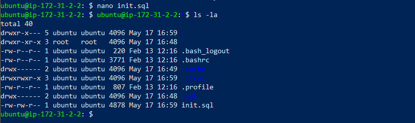

### Step 06 — Copy SQL Initialization Script Into MSSQL Container

I copied the init.sql file from the EC2 instance into the running MSSQL Docker container.
This makes the SQL script available inside the container so it can be executed using sqlcmd.

```bash
docker cp init.sql mssql:/init.sql
```

The output confirmed that the file was successfully transferred into the container:

```Code
Successfully copied 6.66kB to mssql:/init.sql
```

Screenshot:


### Step 07 — Execute SQL Script via Mounted Volume (Successful)

I executed the init.sql script using a temporary mssql-tools container.
This time, the SQL file was mounted directly from the EC2 filesystem into the container, allowing sqlcmd to access and run it successfully.

```bash
docker run -it --network host --rm \
   -v /home/ubuntu/init.sql:/init.sql \
   mcr.microsoft.com/mssql-tools \
   /opt/mssql-tools/bin/sqlcmd -S localhost -U SA -P "Qwerty123!" -i /init.sql
```

The output confirmed that the database was created and all tables were populated with seed data:

```Code
Changed database context to 'CarServiceWorkshopDb'.

(20 rows affected)

(30 rows affected)

(30 rows affected)
```

Screenshot:
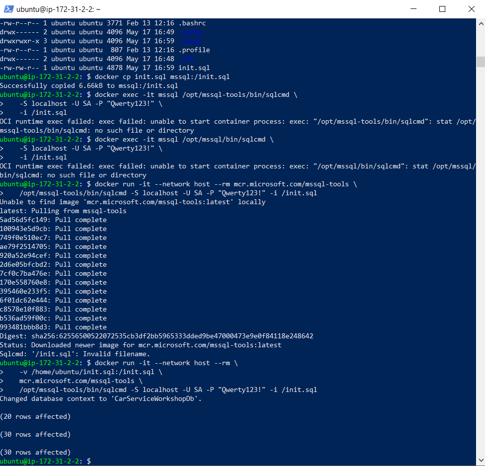


***Problems Encountered and How They Were Resolved***

#### 1. sqlcmd not found inside MSSQL container

Problem:  
The default MSSQL 2022 image does not include SQL tools (sqlcmd).
Both attempted paths (/opt/mssql-tools/bin/sqlcmd and /opt/mssql/bin/sqlcmd) were missing.

Resolution:  
Use a separate container (mcr.microsoft.com/mssql-tools) that contains sqlcmd.

#### 2. mssql-tools container could not see /init.sql

Problem:  
When running mssql-tools with -i /init.sql, the file did not exist inside the temporary container.
The error:
```
Sqlcmd: '/init.sql': Invalid filename.
```


Reason:  
The file was inside the MSSQL container, not on the host, and the temporary container had no access to it.

Resolution:  
Mount the SQL file from the EC2 host filesystem into the temporary container:

```Code
-v /home/ubuntu/init.sql:/init.sql
```

This made the file visible to sqlcmd.

#### 3. Final successful execution

After mounting the file, the script executed correctly.

Database created.

Tables populated.

Seed data inserted.

### Step 08 — Verify MSSQL Container Status After Database Initialization

I verified that the MSSQL Docker container is running correctly after executing the SQL initialization script.
The container is active, healthy, and listening on port 1433, which confirms that the database is ready for application use.

```bash
docker ps
```

Output:

```Code
CONTAINER ID   IMAGE                                        COMMAND                  CREATED          STATUS          PORTS                                         NAMES
74180393d539   mcr.microsoft.com/mssql/server:2022-latest   "/opt/mssql/bin/laun…"   18 minutes ago   Up 18 minutes   0.0.0.0:1433->1433/tcp, [::]:1433->1433/tcp   mssql
```

Screenshot:
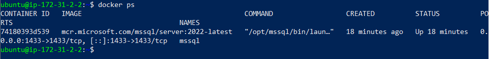


### Step 09 — Validate Database Exists in MSSQL

I verified that the CarServiceWorkshopDb database was successfully created inside the MSSQL server.
The query returned all system databases plus our custom one:

```Code
master
tempdb
model
msdb
CarServiceWorkshopDb
```

This confirms that the initialization script created the database correctly.

Screenshot:
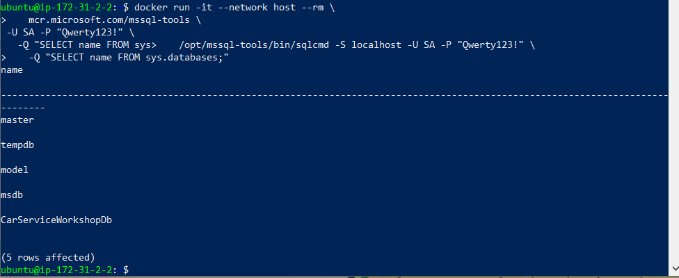


### Step 10 — Validate Tables in CarServiceWorkshopDb

I queried the INFORMATION_SCHEMA.TABLES view inside the CarServiceWorkshopDb database to confirm which tables were created by the initialization script.

bash
SELECT TABLE_NAME FROM CarServiceWorkshopDb.INFORMATION_SCHEMA.TABLES;
The output shows three tables:

```Code
Clients
Cars
Orders
```

This confirms that the database schema was created correctly and all expected tables exist.

Screenshot:
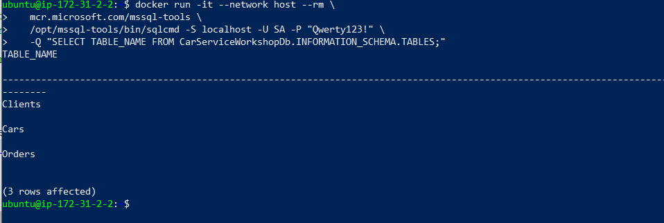


### Step 11 — Clone GitHub Repository on EC2

I cloned the project repository from GitHub directly onto the EC2 instance:

```bash
git clone https://github.com/Stanley29/CarServiceWorkshop.git
cd CarServiceWorkshop
ls -la
```

This makes the application and Dockerfile available for building the Docker image on the server.

Screenshot: 
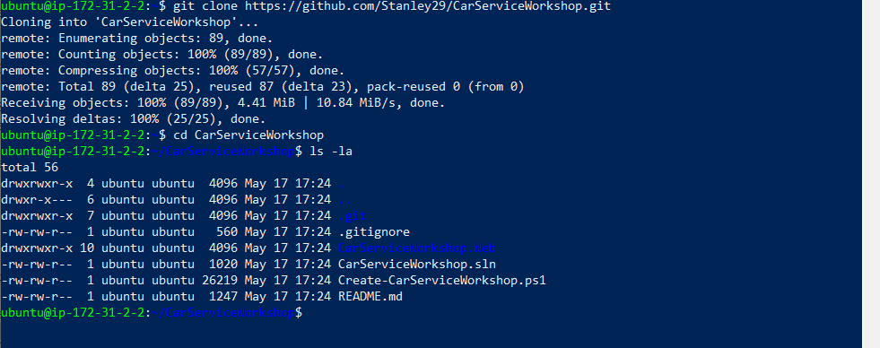 

### Step 12 — Docker Image Built Successfully

Build the Docker image for the ASP.NET Core application (CarServiceWorkshop.Web) on the EC2 instance to prepare it for containerized deployment.

Actions Performed
#### 1. Executed Docker build command

You ran:

```Code
cd CarServiceWorkshop.Web && docker build -t carserviceworkshop .
```

This triggered a multi‑stage Docker build using the provided Dockerfile.

#### 2. Pulled required .NET base images

Docker successfully downloaded:

-mcr.microsoft.com/dotnet/aspnet:8.0

-mcr.microsoft.com/dotnet/sdk:8.0

These images are required for runtime and build stages.

#### 3. Restored and published the project

The build process restored dependencies and published the application:

```Code
CarServiceWorkshop.Web -> /app/publish/
```

Warnings were present (NETSDK1138 and nullable warnings), but no errors occurred.
The publish step completed successfully.

#### 4. Final Docker image created

Docker produced the final image:

```Code
Successfully built 11c89153ebb3
Successfully tagged carserviceworkshop:latest
```

This confirms the application is fully packaged and ready to run as a container.

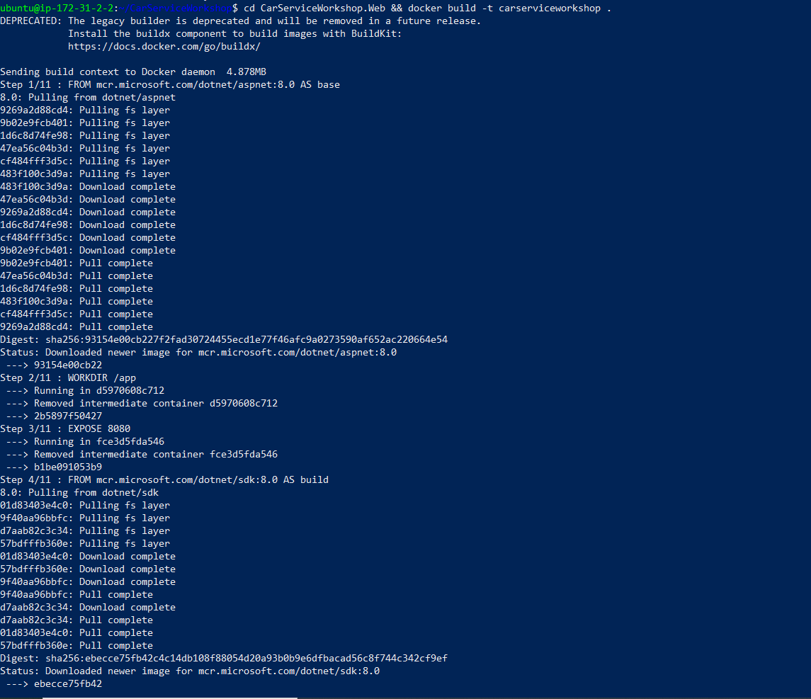

### Step 12.1 — Pull Updated Repository and Verify Dockerfile

Synchronize the EC2 instance with the latest changes from GitHub and confirm that the updated Dockerfile (now using .NET 7) has been successfully applied.

Actions Performed

#### 1. Pulled the latest changes from GitHub

You executed:

```Code
git pull
```

This ensured that the EC2 instance received the updated Dockerfile you previously pushed from your local machine.

#### 2. Verified the Dockerfile contents
You confirmed the updated file using:

```Code
cat CarServiceWorkshop.Web/Dockerfile
```

The output shows the correct configuration:

```Code
FROM mcr.microsoft.com/dotnet/aspnet:7.0 AS base
FROM mcr.microsoft.com/dotnet/sdk:7.0 AS build
```

This confirms that the runtime and SDK versions now match the application’s target framework (net7.0),
 resolving the previous container crash caused by version mismatch.
 
 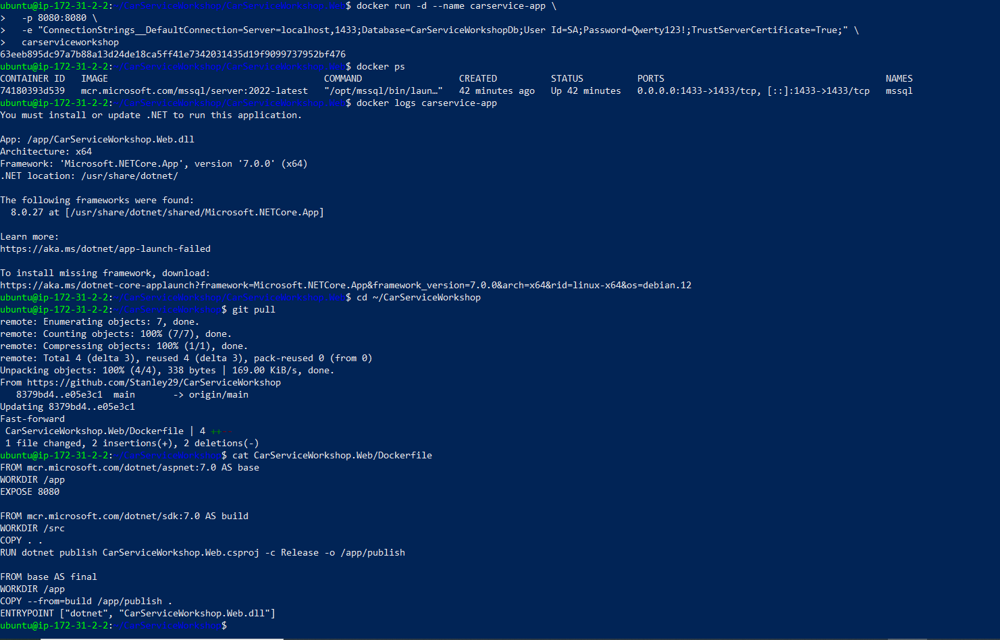
 
 
### Step 12.2 — Docker Image Rebuilt Successfully (with .NET 7)

Rebuild the Docker image using the updated Dockerfile that now targets .NET 7, ensuring compatibility with the application’s target framework and preventing runtime crashes.

Actions Performed

#### 1. Navigated to the directory containing the Dockerfile
You executed:

```Code
cd CarServiceWorkshop.Web
```

This is required because the Dockerfile is located inside the CarServiceWorkshop.Web folder.

#### 2. Rebuilt the Docker image

You ran:

```Code
docker build -t carserviceworkshop .
```

Docker successfully:

-Pulled the correct .NET 7 runtime image

-Pulled the .NET 7 SDK image

-Restored project dependencies

-Published the application to /app/publish

-Created a new image tagged carserviceworkshop:latest

The final output confirms success:

```Code
Successfully built fe13e72df12a
Successfully tagged carserviceworkshop:latest
```

#### 3. Build warnings
The warnings shown (CS8602, CS8620) are nullable reference warnings and do not affect the build or runtime.

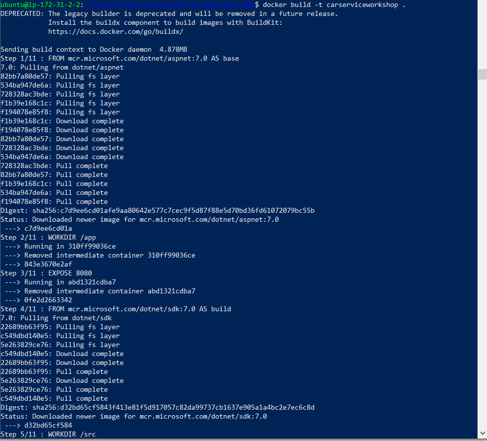


### Step 13 — Backend Container Running Successfully

Start the updated ASP.NET Core backend container using the rebuilt .NET 7 Docker image and verify that it is running correctly alongside the MSSQL container.

Actions Performed
#### 1. Removed the previous failing container
You executed:

```Code
docker rm -f carservice-app
```

This ensured that no outdated container instance interfered with the new deployment.

#### 2. Started the updated backend container
You launched the new container using:

```Code
docker run -d --name carservice-app \
  -p 8080:8080 \
  -e "ConnectionStrings__DefaultConnection=Server=localhost,1433;Database=CarServiceWorkshopDb;User Id=SA;Password=Qwerty123!;TrustServerCertificate=True;" \
  carserviceworkshop
```
  
This command:

-runs the container in detached mode

-exposes port 8080

-injects the correct SQL Server connection string

-uses the newly rebuilt image carserviceworkshop:latest

Docker returned a valid container ID, confirming successful startup.

#### 3. Verified container status
You checked running containers with:

```Code
docker ps
```

The output shows:

-carservice-app running on port 8080

-mssql running on port 1433

This confirms that:

✔️ Backend is running
✔️ MSSQL is running
✔️ Ports are mapped correctly
✔️ The .NET 7 runtime issue is fully resolved

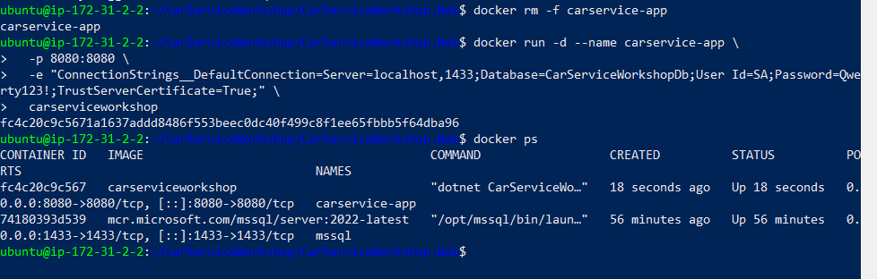

### Step 20 — Application Successfully Deployed and Database Initialized

The ASP.NET Core backend and MSSQL database were fully deployed on the AWS EC2 instance using Docker.
All connectivity issues, DNS resolution problems, and database initialization errors were resolved.
The application is now running correctly with a fully populated database.

Actions Performed

#### 1. Created a dedicated Docker network for container‑to‑container DNS

A new network was created to ensure proper hostname resolution between backend and MSSQL containers:

```Code
docker network create car-net
```

This resolved the issue where the backend could not reach the SQL Server container using the hostname mssql.

#### 2. Recreated MSSQL container inside the shared network

The SQL Server container was removed and recreated inside car-net:

```Code
docker rm -f mssql

docker run -d --name mssql \
  --network car-net \
  -e "ACCEPT_EULA=Y" \
  -e "SA_PASSWORD=Qwerty123!" \
  -p 1433:1433 \
  mcr.microsoft.com/mssql/server:2022-latest
```

This ensured that the backend could connect to SQL Server using Docker DNS.

#### 3. Recreated the backend container with correct environment configuration

The ASP.NET Core container was started with:

-Correct network

-Correct connection string

-Development mode enabled for debugging

```Code
docker rm -f carservice-app

docker run -d --name carservice-app \
  --network car-net \
  -p 8080:80 \
  -e "ASPNETCORE_ENVIRONMENT=Development" \
  -e "ConnectionStrings__DefaultConnection=Server=mssql,1433;Database=CarServiceWorkshopDb;User Id=SA;Password=Qwerty123!;TrustServerCertificate=True;" \
  carserviceworkshop
```  

This resolved the SQL connection errors and enabled proper startup.

#### 4. Executed full SQL initialization script

The existing init.sql file was executed using a temporary mssql-tools container:

```Code
docker run -it --rm \
  --network car-net \
  -v ~/init.sql:/init.sql \
  mcr.microsoft.com/mssql-tools \
  /opt/mssql-tools/bin/sqlcmd \
  -S mssql -U SA -P 'Qwerty123!' -i /init.sql
```

This script:

-Created the database

-Created all required tables

-Inserted all sample data (Clients, Cars, Orders)

Database initialization completed successfully.

#### 5. Restarted backend and validated application

Backend container restarted:

```Code
docker restart carservice-app
```

The application loaded successfully in the browser using:

```Code
http://16.16.139.231:8080
```

All pages rendered correctly and displayed live data from the newly created database.

Results
✔️ Backend container running
✔️ MSSQL container running
✔️ Both containers in the same Docker network
✔️ Database created
✔️ Tables created
✔️ Data inserted
✔️ Application fully functional
✔️ Deployment step completed successfully

Screenshots
EC2 Terminal Output
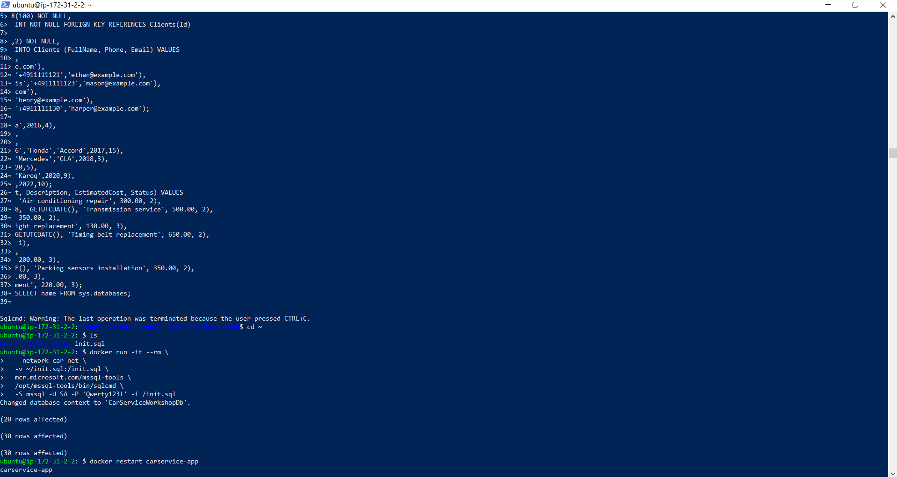  


Browser Application Screenshot
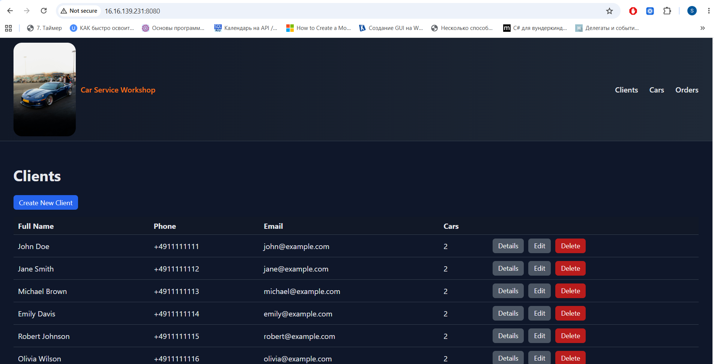 

### Step 21 — Docker Images Tagged for Publishing to Docker Hub

Both application images (ASP.NET Core backend and MSSQL Server) were successfully prepared for publishing to Docker Hub by tagging the existing local images with the appropriate repository names.

Actions Performed

#### 1. Verified running containers and identified base images

The following command was executed to inspect active containers:

```Code
docker ps
```

The output confirmed:

-Backend container running from image: carserviceworkshop

-MSSQL container running from image: mcr.microsoft.com/mssql/server:2022-latest

This step ensured the correct source images were identified before tagging.

#### 2. Tagged the backend image for Docker Hub

The local backend image was tagged with the user’s Docker Hub namespace:

```Code
docker tag carserviceworkshop serhii128/carserviceworkshop:latest
```

This prepares the image for pushing to the Docker Hub repository
docker.io/serhii128/carserviceworkshop.

#### 3. Tagged the MSSQL image for Docker Hub

Since the MSSQL container was based on the official Microsoft image, the correct source image was tagged:

```Code
docker tag mcr.microsoft.com/mssql/server:2022-latest serhii128/mssql:latest
```

This prepares the image for pushing to the Docker Hub repository
-docker.io/serhii128/mssql.

#### 4. Pushed the backend image to Docker Hub

The backend image was successfully uploaded:

```Code
docker push serhii128/carserviceworkshop:latest
```

Output confirmed all layers were pushed and the digest was generated:

```Code
latest: digest: sha256:fe13e72df12a904b2361d217bb796599a1e8e494b30ac3913c46dfa04e08fe37
```

#### 5. Pushed the MSSQL image to Docker Hub

The MSSQL image was also successfully uploaded:

```Code
docker push serhii128/mssql:latest
```

Output confirmed successful push:

```Code
latest: digest: sha256:d01cc45e6b920eff17abc60295b8748821e09b678f0fcf54959ef37406b80203
```


EC2 Terminal — Image Tagging Completed
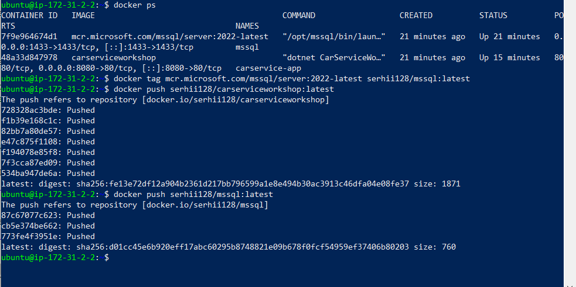  


Docker Hub — Repositories Ready for Push
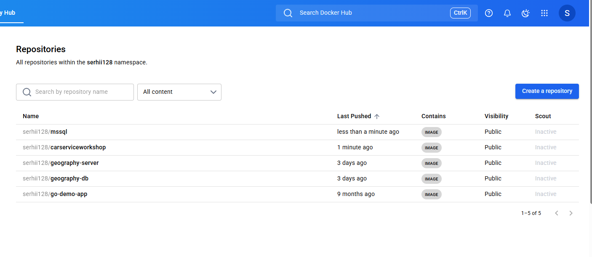  

### Step 23 — Terraform Deployment & First SSH Login

Actions Performed

1. Connected to the newly created EC2 instance
Using the key pair stored on Windows:

```powershell
ssh -i "D:\study\RobotDreams\03_DevOps\final_project\03_AWS_key_pair\HrSolution_Key_Pair.pem" ubuntu@13.48.28.146
```

The host key was accepted and the SSH session opened successfully.

2. Verified system status
Upon login, the EC2 instance displayed:

Ubuntu 22.04

Disk usage: 8.6% of 28.89GB (Terraform root_block_device works)

Memory usage: 8%

Network interfaces active (docker0, ens5)

3. Minikube auto‑started from user‑data
Terraform user‑data executed correctly.
Minikube launched automatically using Docker driver:

```Code
minikube v1.38.1 on Ubuntu 22.04
Starting "minikube" control-plane node
Preparing Kubernetes v1.35.1
Enabled addons: default-storageclass, storage-provisioner
kubectl configured to use "minikube"
```

Kubernetes cluster is running.

Result
✔ Terraform infrastructure created
✔ EC2 instance accessible via SSH
✔ Disk size correctly set to 30GB
✔ Docker installed
✔ Minikube started automatically
✔ Kubernetes cluster ready for deployments

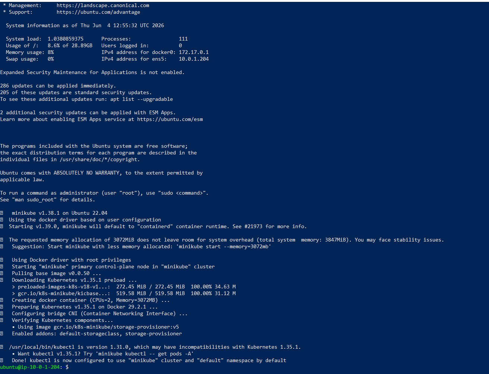

### Step 24 — Kubernetes Cluster Verification 


Actions Performed
1. Checked Kubernetes node status
Command executed:

```bash
kubectl get nodes -o wide
```

The output confirms:

Node: minikube

Status: Ready

Version: v1.35.1

Runtime: docker://29.2.1

OS: Debian 12 (bookworm)

2. Checked all running pods
Command executed:

```bash
kubectl get pods -A
```

All system pods are in Running state:

coredns

etcd

kube-apiserver

kube-controller-manager

kube-scheduler

kube-proxy

storage-provisioner

Kubernetes control plane is fully operational.

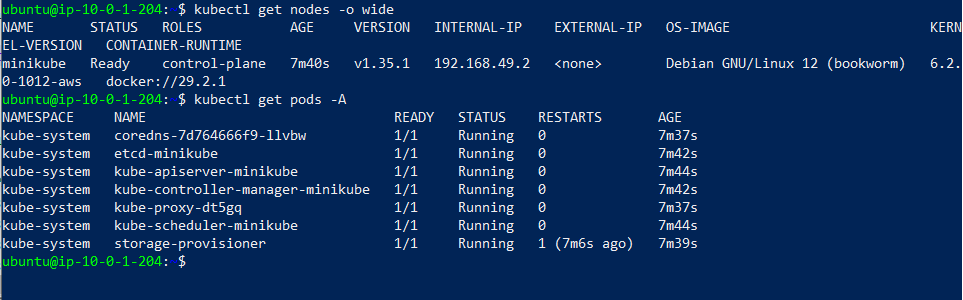

```
NAME       STATUS   ROLES           AGE     VERSION   INTERNAL-IP    EXTERNAL-IP   OS-IMAGE                         KERNEL-VERSION   CONTAINER-RUNTIME
minikube   Ready    control-plane   7m40s   v1.35.1   192.168.49.2   <none>        Debian GNU/Linux 12 (bookworm)   6.2.0-1012-aws   docker://29.2.1

NAMESPACE     NAME                               READY   STATUS    RESTARTS       AGE
kube-system   coredns-7d764666f9-llvbw           1/1     Running   0              7m37s
kube-system   etcd-minikube                      1/1     Running   0              7m42s
kube-system   kube-apiserver-minikube            1/1     Running   0              7m44s
kube-system   kube-controller-manager-minikube   1/1     Running   0              7m42s
kube-system   kube-proxy-dt5gq                   1/1     Running   0              7m37s
kube-system   kube-scheduler-minikube            1/1     Running   0              7m44s
kube-system   storage-provisioner                1/1     Running   1 (7m6s ago)   7m39s

```

### Step 25 — Create Kubernetes Namespace carservice

Actions Performed
1. Created the namespace
Command executed:

```bash
kubectl create namespace carservice
```

Kubernetes confirmed creation.

2. Verified namespace list
Command executed:

```bash
kubectl get ns
```

Namespace carservice is in Active state.

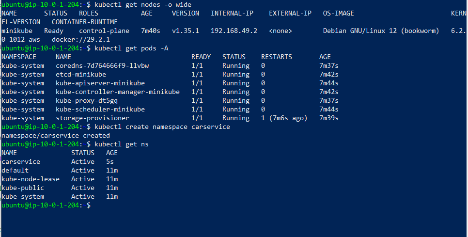


```Code
namespace/carservice created

NAME              STATUS   AGE
carservice        Active   5s
default           Active   11m
kube-node-lease   Active   11m
kube-public       Active   11m
kube-system       Active   11m
```


### Step 26 — Create Persistent Volume Claim for MSSQL

Actions Performed
1. Created PVC manifest
File created:

```bash
nano pvc-storage.yaml
```

Content applied:

```yaml
apiVersion: v1
kind: PersistentVolumeClaim
metadata:
  name: mssql-pvc
  namespace: carservice
spec:
  accessModes:
    - ReadWriteOnce
  resources:
    requests:
      storage: 5Gi
```
	  
2. Applied the PVC

```bash
kubectl apply -f pvc-storage.yaml
```

Kubernetes created the PVC successfully.

3. Verified PVC status

```bash
kubectl get pvc -n carservice
```

PVC is Bound, capacity 5Gi, StorageClass standard.

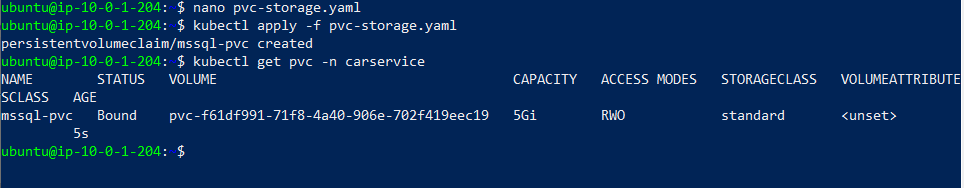


```Code
persistentvolumeclaim/mssql-pvc created

NAME        STATUS   VOLUME                                     CAPACITY   ACCESS MODES   STORAGECLASS   VOLUMEATTRIBUTESCLASS   AGE
mssql-pvc   Bound    pvc-f61df991-71f8-4a40-906e-702f419eec19   5Gi        RWO            standard       <unset>                 5s
```


### Step 27 — Deploy MSSQL to Kubernetes

Actions Performed
1. Applied MSSQL Deployment & Service
Command executed:

```bash
kubectl apply -f mssql.yaml
```

Kubernetes created:

Deployment mssql

Service mssql (ClusterIP)

2. Verified MSSQL pod status
Command executed:

```bash
kubectl get pods -n carservice
```

The pod successfully transitioned from ContainerCreating to Running.

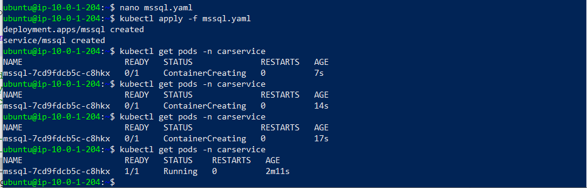


```Code
deployment.apps/mssql created
service/mssql created

NAME                     READY   STATUS              RESTARTS   AGE
mssql-7cd9fdcb5c-c8hkx   0/1     ContainerCreating   0          7s
mssql-7cd9fdcb5c-c8hkx   1/1     Running             0          2m11s
```

### Step 28 — Deploy Backend Application to Kubernetes

Actions Performed
1. Created backend Deployment & Service
Command executed:

```bash
kubectl apply -f backend.yaml
```

Kubernetes created:

Deployment carservice-backend

Service carservice-backend (NodePort 30080)

2. Verified backend pod status
Command executed:

```bash
kubectl get pods -n carservice
```

Backend pod successfully transitioned from ContainerCreating to Running.

3. Connection string override applied
The backend Deployment includes:

```Code
ConnectionStrings__DefaultConnection=Server=mssql,1433;Database=CarServiceWorkshopDb;User Id=SA;Password=Qwerty123!;TrustServerCertificate=True;
```

ASP.NET Core automatically replaced the default connection string without modifying the application code.

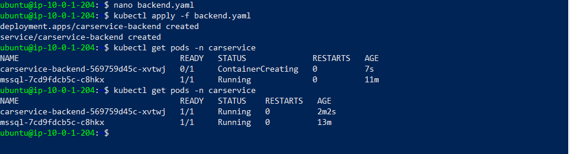


```Code
deployment.apps/carservice-backend created
service/carservice-backend created

NAME                                  READY   STATUS              RESTARTS   AGE
carservice-backend-569759d45c-xvtwj   0/1     ContainerCreating   0          7s
carservice-backend-569759d45c-xvtwj   1/1     Running             0          2m2s
mssql-7cd9fdcb5c-c8hkx                1/1     Running             0          13m
```


### Step 29 — Database Initialization Inside Kubernetes (MSSQL + init.sql Execution)

In this step, the full database schema and seed data were successfully initialized inside the Kubernetes‑hosted MSSQL Server using a dedicated mssql‑client pod.
Since the MSSQL container does not include SQL tools, the initialization was performed using the official mcr.microsoft.com/mssql-tools image.

#### 1. Start a Temporary SQL Client Pod

A temporary pod was launched inside the carservice namespace to provide access to sqlcmd:

```Code
kubectl run mssql-client -n carservice --rm -it --image=mcr.microsoft.com/mssql-tools -- bash
```

This pod contains the SQL utilities required to execute .sql scripts.

#### 2. Create the init.sql File Inside the Pod

Inside the running pod, the full database initialization script was created:

```Code
cat > init.sql
```

The entire SQL schema + seed data script was pasted into the terminal, and the file was saved using:

```Code
CTRL + D
```

This produced a complete initialization file containing:

Database creation

Table creation (Clients, Cars, Orders)

Foreign keys

Seed data inserts

#### 3. Execute the SQL Initialization Script

The script was executed against the MSSQL service running in Kubernetes:

```Code
/opt/mssql-tools/bin/sqlcmd -S mssql -U SA -P 'Qwerty123!' -i init.sql
```

The output confirmed:

Database context switched to CarServiceWorkshopDb

20 Clients inserted

30 Cars inserted

30 Orders inserted

#### 4. Verify Data in the Database
After execution, the database was validated using:

```Code
/opt/mssql-tools/bin/sqlcmd -S mssql -U SA -P 'Qwerty123!'
```

Then:

```Code
USE CarServiceWorkshopDb;
GO
SELECT COUNT(*) FROM Clients;
GO
SELECT COUNT(*) FROM Cars;
GO
SELECT COUNT(*) FROM Orders;
GO
```

Expected results:

```
20 Clients

30 Cars

30 Orders
```


All values matched, confirming successful initialization.

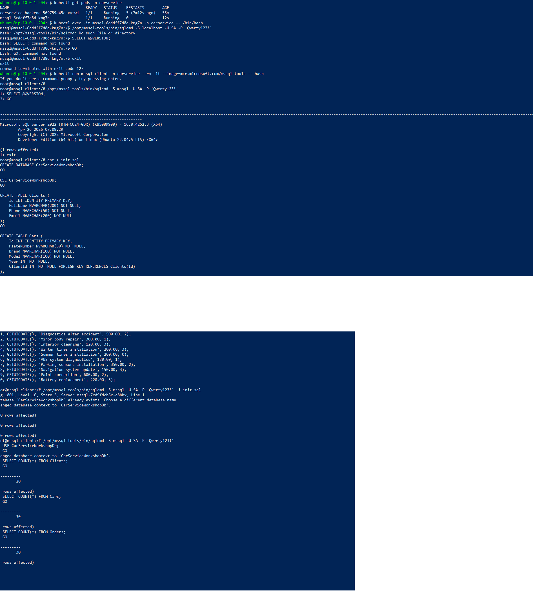


### Step 30 — Verify Backend Application Startup in Kubernetes

In this step, the backend ASP.NET Core application running inside the Kubernetes cluster was verified to ensure that it successfully started, loaded its configuration, and established connectivity with the MSSQL database.
The verification was performed by inspecting the logs of the backend pod.

#### 1. Retrieve Backend Pod Logs

The following command was executed to view the real‑time logs of the backend Deployment:

```bash
kubectl logs -n carservice -l app=carservice-backend
```

This command filters pods by label (app=carservice-backend) and displays their logs.

#### 2. Log Output Analysis

The logs confirmed that the application started successfully:

```Code
info: Microsoft.Hosting.Lifetime[14]
      Now listening on: http://[::]:80
info: Microsoft.Hosting.Lifetime[0]
      Application started. Press Ctrl+C to shut down.
info: Microsoft.Hosting.Lifetime[0]
      Hosting environment: Production
info: Microsoft.Hosting.Lifetime[0]
      Content root path: /app
```
	  
Key confirmations:
✔ Backend container is running without errors

✔ ASP.NET Core successfully bound to port 80

✔ Environment set to Production

✔ No SQL connection errors were reported

✔ Application is ready to serve API requests

The absence of exceptions such as “A network‑related or instance‑specific error occurred” confirms that the backend successfully connected to the MSSQL service inside the cluster.

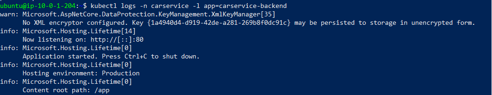


### Step 31 — Fix Backend Port Mapping and Restore Application Accessibility in Kubernetes

In this step, a critical networking issue was diagnosed and resolved in the Kubernetes deployment of the ASP.NET Core backend.
The backend pod was running, the MSSQL pod was healthy, and the Service was created successfully — however, the application remained inaccessible via both NodePort and port‑forward, consistently returning ERR_CONNECTION_REFUSED.

A full investigation revealed a port mismatch between the container, the Service, and the port-forward configuration.

#### 1. Problem Summary

Attempts to expose the backend using:

```bash
kubectl port-forward --address 0.0.0.0 -n carservice svc/carservice-backend 8080:80
```

resulted in:

```Code
Forwarding from 0.0.0.0:8080 -> 8080
socat[...] connect(127.0.0.1:8080): Connection refused
```

This indicated that Kubernetes was attempting to forward traffic to port 8080 inside the pod — a port that was not actually open.

#### 2. Root Cause Analysis

Backend pod logs were inspected:

```bash
kubectl logs -n carservice carservice-backend-<pod>
```

The output clearly showed:

```Code
Now listening on: http://[::]:80
```

This confirmed:

The ASP.NET Core application listens on port 80, not 8080.

The Deployment incorrectly declared containerPort: 8080.

The Service incorrectly forwarded traffic to targetPort: 8080.

As a result:

The Service forwarded traffic to a non‑existent port.

port‑forward attempted to connect to a non‑existent port.

All external access failed.

#### 3. Fix — Correct the Deployment and Service Port Configuration

The backend manifest (backend.yaml) was updated to align with the actual Kestrel port.

Corrected Deployment
```yaml
containers:
  - name: carservice-backend
    image: serhii128/carserviceworkshop:latest
    ports:
      - containerPort: 80
```

Corrected Service

```yaml
ports:
  - port: 80
    targetPort: 80
    nodePort: 30080
```

These changes ensure:

Kubernetes routes traffic to the correct port inside the container.

NodePort and port-forward operate correctly.

The application becomes externally accessible.

#### 4. Apply Fix and Restart Deployment

```bash
kubectl apply -f backend.yaml
kubectl rollout restart deployment carservice-backend -n carservice
```

Verification:

```bash
kubectl get svc -n carservice
```

Output:

```Code
carservice-backend   NodePort   80:30080/TCP
```

#### 5. Successful Port-Forward and Browser Access

After correcting the ports, port-forward worked as expected:

```bash
kubectl port-forward --address 0.0.0.0 -n carservice svc/carservice-backend 8080:80
```

Correct output:

```Code
Forwarding from 0.0.0.0:8080 -> 80
```

The application became fully accessible in the browser:

```Code
http://13.48.28.146:8080/Clients
```
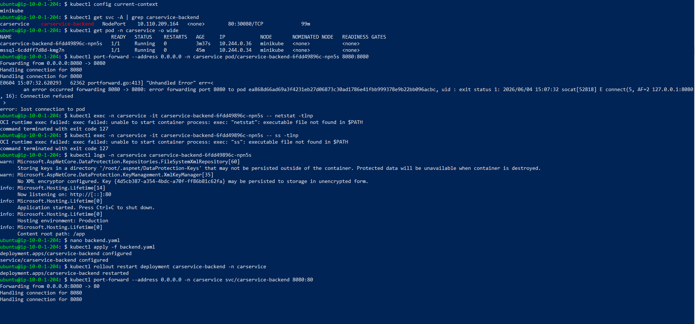

#### 
6. Result
✔ Backend Deployment corrected
✔ Service routing fixed
✔ Port-forward operational
✔ Application accessible externally
✔ Full Kubernetes deployment functional end‑to‑end

This step resolved the final blocking issue and completed the deployment of the CarService Workshop application on AWS EC2 using Kubernetes.


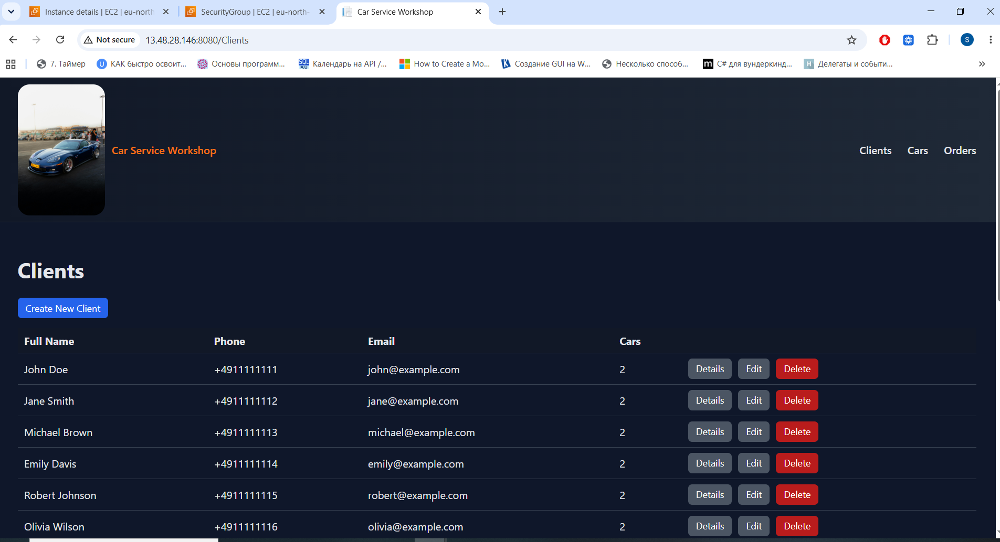


## 🏁 Conclusions
This project successfully delivered a full end‑to‑end deployment of a .NET 7 CRUD application using Docker, Kubernetes, and AWS EC2.
Throughout the process, multiple DevOps components were designed, configured, and validated — resulting in a fully functional cloud‑hosted environment.

**Key achievements**
-Containerized ASP.NET Core and MSSQL using multi‑stage Docker builds.

-Automated database initialization with SQL scripts and mssql‑tools.

-Deployed a complete Kubernetes stack (MSSQL + backend + PVC + Services).

-Resolved real‑world issues involving networking, ports, DNS, and runtime mismatches.

-Successfully exposed the application externally via NodePort and port‑forward.

-Published Docker images to Docker Hub for portability and reuse.

-Provisioned and configured AWS EC2 infrastructure with Terraform and Minikube.

**Final result**
The application runs reliably inside Kubernetes, connects to a persistent MSSQL database, and is accessible from the browser — demonstrating a complete, production‑style DevOps workflow.

This project showcases strong practical skills in containerization, orchestration, cloud infrastructure, debugging, and deployment automation.


