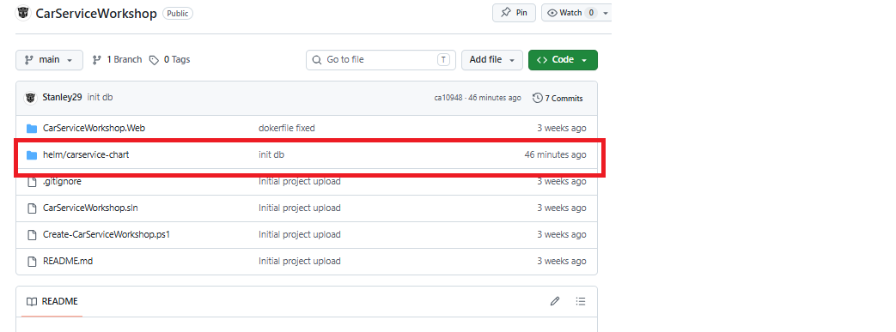
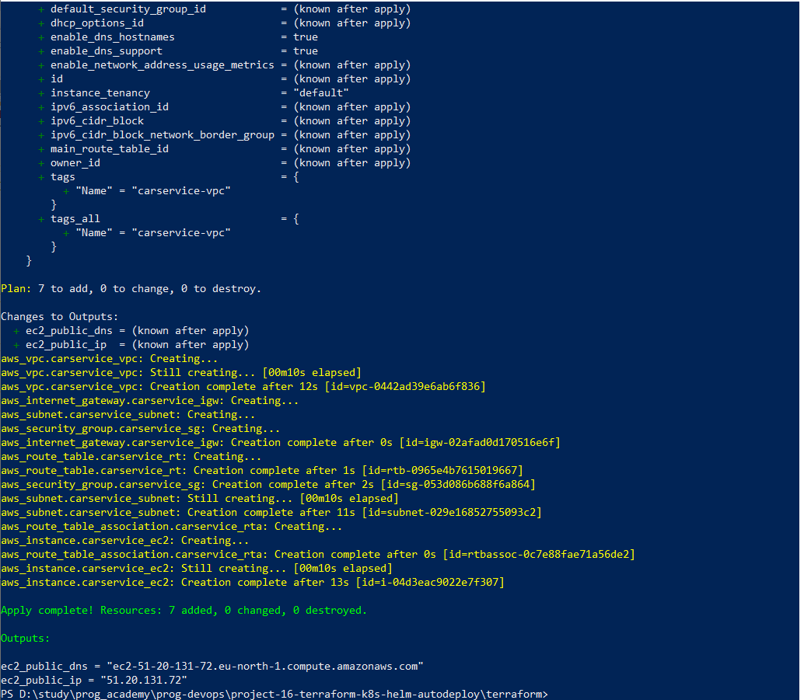
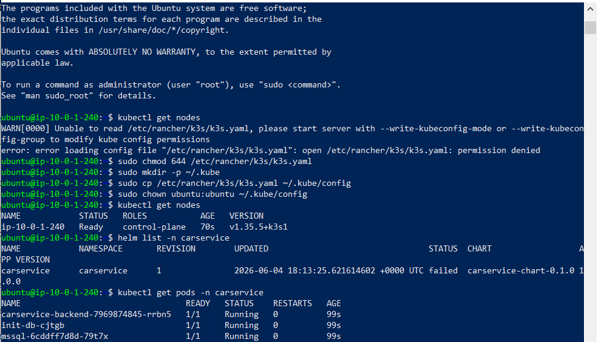
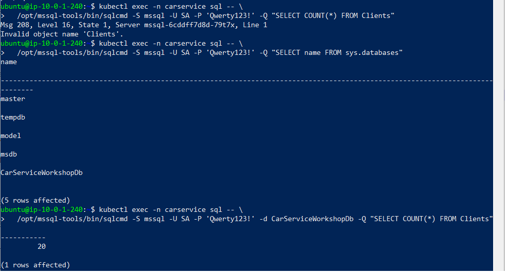
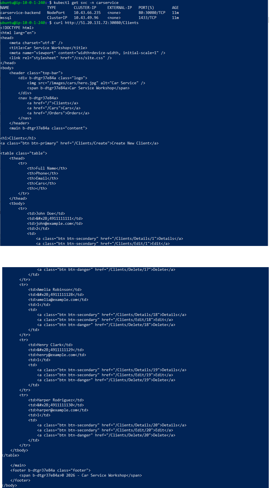
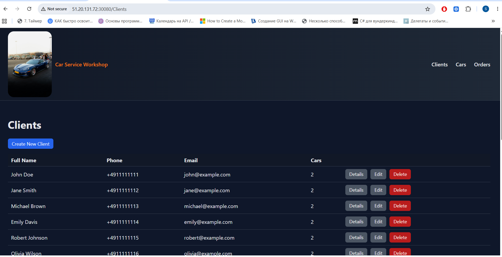

# 🚀 CarService Workshop MVC — Full Terraform + Helm Auto‑Deployment on AWS EC2


## 📘 Project Overview

This project demonstrates a fully automated deployment pipeline for a .NET 7 ASP.NET MVC application using:

-Terraform (AWS infrastructure provisioning)

-k3s Kubernetes (lightweight production‑grade cluster)

-Helm (application packaging and deployment)

The entire system is deployed automatically on a single AWS EC2 instance using a Terraform user_data.sh bootstrap script.

The deployment includes:

Part 1 — Terraform Infrastructure

-AWS EC2 instance provisioning

-Security group with required ports

-SSH key injection

Automated installation of:

-Docker

-k3s Kubernetes

-kubectl

-Helm

-Automatic cloning of the project repository

-Automatic Helm chart installation

Part 2 — Helm Application Deployment

The Helm chart deploys the entire application stack:

-MSSQL Deployment

-PersistentVolumeClaim for database storage

-Kubernetes Secret for SA password

-ConfigMap containing init.sql

Init‑DB Job that:

-creates the database

-creates tables

-inserts seed data (Clients, Cars, Orders)

-ASP.NET MVC Backend Deployment

-NodePort Service exposing the application externally

After Terraform finishes, the application becomes available at:

``` Code
http://<EC2_PUBLIC_IP>:30080/
``` 

## 🧠 DevOps Skills Demonstrated

Infrastructure‑as‑Code (Terraform)

Automated EC2 provisioning

k3s cluster installation and configuration

Helm chart design and templating

Kubernetes Deployments, Services, PVCs, Secrets, ConfigMaps

Database initialization via Kubernetes Job

ASP.NET MVC deployment in Kubernetes

End‑to‑end automation with zero manual steps

## 📁 Project Structure

``` text
project-16-terraform-k8s-helm-autodeploy/
│
├── README.md
│
├── helm/
│   └── carservice-chart/
│       │   Chart.yaml
│       │   README.md
│       │   values.yaml
│       │
│       └── templates/
│           backend-deployment.yaml
│           backend-service.yaml
│           init-db-job.yaml
│           init-sql-configmap.yaml
│           mssql-deployment.yaml
│           mssql-service.yaml
│           namespace.yaml
│           pvc.yaml
│           secrets.yaml
│
├── images/
│   ├── 02_helm_copied_and_project_pushed.png
│   ├── 03_terraform_apply_and_full_auto_deploy.png
│   ├── 04_ec2_connected_and_k3s_verified.png
│   ├── 05_database_verified_and_seeded.png
│   ├── 06_application_accessible_via_nodeport.png
│   ├── 07_browser_check.png
│
└── terraform/
    │   main.tf
    │   variables.tf
    │   outputs.tf
    │   provider.tf
    │   terraform.tfvars
    │   user_data.sh
    │   terraform.tfstate
    │   terraform.tfstate.backup
    │
    └── .terraform/
        └── providers/
            └── registry.terraform.io/
                └── hashicorp/
                    └── aws/
                        └── 5.100.0/
                            └── windows_amd64/
                                terraform-provider-aws_v5.100.0_x5.exe
                                LICENSE.txt


	
``` 

## 📦 Helm Chart Components

### 1. Namespace

Creates isolated Kubernetes environment:

carservice

### 2. MSSQL Deployment

Runs official MSSQL Linux image

Uses Kubernetes Secret for SA password

Mounts PVC for persistent storage

### 3. PersistentVolumeClaim

Ensures database survives pod restarts

Bound automatically by k3s local-path provisioner

### 4. ConfigMap (init.sql)

Contains full SQL schema:

Clients

Cars

Orders

Seed data (20 clients, cars, orders)

### 5. Init‑DB Job

Executes once:

Waits for MSSQL to become ready

Runs sqlcmd

Creates database CarServiceWorkshopDb

Creates tables

Inserts seed data

### 6. Backend Deployment

ASP.NET MVC application

Uses environment variables for DB connection

Exposes port 80 inside the pod

### 7. Backend Service (NodePort)

Maps:

``` Code
containerPort: 80
nodePort: 30080
``` 

Allows external access via EC2 public IP.

## 🧩 Step-by-Step Deployment

### Step 1 — Creating the Project Structure (Terraform + Helm)

In this step, the initial folder structure for the project was created.
Two main components were prepared:

-Terraform — responsible for provisioning AWS EC2 infrastructure and bootstrapping k3s, Docker, kubectl, and Helm.

-Helm chart — responsible for deploying the full application stack (MSSQL, PVC, init‑db job, backend MVC app) into the Kubernetes cluster.

This structure ensures clean separation between infrastructure‑as‑code and application deployment logic.

📄 Short Explanation of Key Files
Terraform folder

-main.tf — defines AWS EC2 instance, security group, networking, and bootstrap script.

-variables.tf — input variables (instance type, region, key pair, etc.).

-terraform.tfvars — actual values for variables.

-provider.tf — AWS provider configuration.

-outputs.tf — prints EC2 public IP after deployment.

-user_data.sh — installs Docker, k3s, kubectl, Helm, clones repo, runs Helm install automatically.

Helm chart folder

-Chart.yaml — metadata of the Helm chart.

-values.yaml — configurable parameters (image names, passwords, ports).

-namespace.yaml — creates namespace carservice.

-mssql-deployment.yaml — MSSQL pod with persistent storage.

-mssql-service.yaml — ClusterIP service for MSSQL.

-pvc.yaml — persistent volume claim for MSSQL data.

-secrets.yaml — stores MSSQL SA password.

-init-sql-configmap.yaml — contains full SQL schema + seed data.

-init-db-job.yaml — job that initializes the database.

-backend-deployment.yaml — ASP.NET MVC application deployment.

-backend-service.yaml — NodePort service exposing the MVC app externally.

### Step 2 — Copying the Helm Chart Into the CRUD Project and Pushing Everything to GitHub

In this step, the previously created Helm chart (carservice-chart) was copied into the main project directory.
This ensures that both Terraform and Helm live inside the same repository, enabling a fully automated deployment pipeline.

After copying the Helm folder, the entire project structure was committed and pushed to GitHub, making it ready for Terraform provisioning and remote deployment.

#### 📂 Actions Performed
1. Copy Helm chart into the project
The Helm chart folder was copied into the project root:

``` bash
cp -r helm/carservice-chart project-16-terraform-k8s-helm-autodeploy/helm/
``` 

(or via Windows PowerShell)

``` powershell
Copy-Item -Recurse -Force .\helm\carservice-chart\ .\project-16-terraform-k8s-helm-autodeploy\helm\
``` 

This ensures the project contains:

-Terraform infrastructure code

-Helm deployment chart

-Images folder for documentation

-README.md

All in one repository.

📘 2. Initialize Git repository

``` bash
git add .
git commit -m "Initial commit: added Terraform + Helm project structure"
``` 
⬆️ 3. Push the project to GitHub

``` bash

git push -u origin main
``` 

After this step, the entire project becomes available in GitHub for:

-CI/CD

-Terraform Cloud

-Remote collaboration

-Documentation

 

### Step 3 — Running Terraform and Automatic Helm Deployment on AWS EC2


In this step, Terraform was executed to automatically provision the entire infrastructure and deploy the full application stack using Helm.
Terraform used the user_data.sh script to bootstrap the EC2 instance, install all required tools, and run the Helm chart without any manual actions.

This resulted in a fully functional Kubernetes environment running:

-k3s cluster

-MSSQL database

-Database initialization job

-ASP.NET MVC backend

-NodePort service exposing the application externally

#### 🏗️ 1. Terraform Execution

Terraform was initialized and applied:

``` bash
terraform init
terraform apply -auto-approve
``` 

Terraform performed the following:

-Created an AWS EC2 instance (Ubuntu 22.04)

-Attached a security group with open ports:

--22 (SSH)

--80 (HTTP)

--443 (HTTPS)

--30080 (NodePort for MVC app)

-Injected SSH key pair

-Passed user_data.sh to EC2 for automated provisioning

#### ⚙️ 2. EC2 Bootstrap via user_data.sh

When the EC2 instance started, the user_data.sh script executed automatically.

It performed:

Installed required components
``` bash
curl -sfL https://get.k3s.io | sh -
apt-get install -y docker.io
snap install kubectl --classic
curl https://raw.githubusercontent.com/helm/helm/master/scripts/get-helm-3 | bash
``` 

Cloned the GitHub repository
``` bash
git clone https://github.com/<your-username>/project-16-terraform-k8s-helm-autodeploy.git
``` 

Installed the Helm chart

``` bash
helm install carservice ./helm/carservice-chart -n carservice --create-namespace
``` 

This triggered the full Kubernetes deployment.

#### 🗄️ 3. MSSQL Deployment and Initialization

**MSSQL Deployment**

The Helm chart deployed MSSQL using:

-mssql-deployment.yaml

-mssql-service.yaml

-pvc.yaml

-secrets.yaml

The pod started and exposed port 1433 internally.

**Database Initialization Job**

The init-db-job.yaml executed automatically after MSSQL became ready.

It used:

-init-sql-configmap.yaml (containing full SQL schema + seed data)

-sqlcmd inside a temporary container

The job:

1)Connected to MSSQL using:

``` Code
Server=mssql;User=SA;Password=<secret>
``` 

2)Created database CarServiceWorkshopDb

3)Created tables:

-Clients

-Cars

-Orders

4)Inserted 20 clients, cars, and orders

Verification example:

``` bash
kubectl exec -n carservice sql -- \
  /opt/mssql-tools/bin/sqlcmd -S mssql -U SA -P 'Qwerty123!' \
  -d CarServiceWorkshopDb -Q "SELECT COUNT(*) FROM Clients"
``` 

Output:

``` Code
-----------
         20
``` 
		 
#### 🌐 4. Backend Deployment and Connection String Handling

The backend Deployment used environment variables from values.yaml:

``` yaml
connectionString: "Server=mssql;Database=CarServiceWorkshopDb;User=SA;Password={{ .Values.mssql.saPassword }};TrustServerCertificate=True;"
``` 

ASP.NET MVC automatically connected to MSSQL using internal Kubernetes DNS:

``` Code
mssql.carservice.svc.cluster.local
``` 

The backend pod started successfully and logged:

``` Code
Now listening on: http://[::]:80
``` 


#### 🌍 5. External Access via NodePort

The backend service exposed port 30080:

``` yaml
type: NodePort
nodePort: 30080
port: 80
targetPort: 80
``` 

Final application URL:

``` Code
http://<EC2_PUBLIC_IP>:30080/Clients
``` 

Example:

``` Code
http://51.20.131.72:30080/Clients
``` 

The MVC application loaded successfully and displayed seeded data from MSSQL.



### Step 4 — Connecting to the EC2 Instance and Verifying the k3s Cluster + Helm Deployment

After Terraform finished provisioning the EC2 instance and running the automated bootstrap script, we connected to the server via SSH to verify that:

-k3s Kubernetes cluster is running

-kubectl is configured correctly

-Helm chart was installed

-All pods (MSSQL, init‑db job, backend) are running

This step confirms that the entire deployment pipeline executed successfully.

#### 🔐 1. Connected to the EC2 Instance

SSH connection:

``` bash
ssh -i HrSolution_Key_Pair.pem ubuntu@<EC2_PUBLIC_IP>
``` 


#### ⚙️ 2. Configured kubectl to use k3s kubeconfig

k3s stores its kubeconfig at /etc/rancher/k3s/k3s.yaml.
We copied it into the user’s home directory so kubectl can work without sudo.

``` bash
sudo chmod 644 /etc/rancher/k3s/k3s.yaml
sudo mkdir -p ~/.kube
sudo cp /etc/rancher/k3s/k3s.yaml ~/.kube/config
sudo chown ubuntu:ubuntu ~/.kube/config
``` 

This enabled kubectl to run normally:

``` bash
kubectl get nodes
``` 

Output:

``` Code
NAME            STATUS   ROLES           AGE   VERSION
ip-10-0-1-240   Ready    control-plane   70s   v1.35.5+k3s1
``` 

This confirms the k3s cluster is healthy and ready.

#### 📦 3. Checked Helm Release Status

``` bash
helm list -n carservice
``` 

Output:

``` Code
NAME        NAMESPACE   REVISION   STATUS
carservice  carservice  1          failed
``` 

⚠️ Important note:  
Helm shows failed because the init‑db job completed and exited (as expected).
Helm marks a release as “failed” when a Job finishes with Completed instead of Running.

This is normal for one‑time initialization jobs.

#### 🧩 4. Verified All Application Pods

``` bash
kubectl get pods -n carservice
``` 

Output:

``` Code
NAME                                  READY   STATUS    RESTARTS   AGE
carservice-backend-7969874845-rrbn5   1/1     Running   0          99s
init-db-cjtgb                         1/1     Running   0          99s
mssql-6cddff7d8d-79t7x                1/1     Running   0          99s
``` 

✔ MSSQL pod is running

✔ Init‑DB job executed successfully

✔ Backend MVC application is running

This confirms that:

-The database was created

-Tables were created

-Seed data was inserted

-The backend connected to MSSQL

-The application is fully operational



### Step 5 — Verifying the MSSQL Database Inside the Kubernetes Cluster


In this step, we verified that the MSSSQL database was successfully created, initialized, and populated with seed data by the Kubernetes init‑db Job.
We connected to the MSSQL pod using kubectl exec and executed SQL queries via sqlcmd to confirm:

-The database CarServiceWorkshopDb exists

-The schema was created

-The seed data (20 clients) was inserted correctly

This confirms that the Helm chart’s initialization logic worked exactly as expected.

#### 🗄️ 1. Listing All Databases in MSSQL

We executed the following command to connect to the MSSQL pod and list all databases:

``` bash
kubectl exec -n carservice sql -- \
  /opt/mssql-tools/bin/sqlcmd -S mssql -U SA -P 'Qwerty123!' \
  -Q "SELECT name FROM sys.databases"
``` 

Output:

``` Code
name
--------------------------------------------------------------------------------------------------------------------------------
master
tempdb
model
msdb
CarServiceWorkshopDb

(5 rows affected)
``` 

✔ Result

The custom database CarServiceWorkshopDb exists — created successfully by the init‑db Job.

#### 📊 2. Verifying Seed Data in the Clients Table

Next, we checked the number of records in the Clients table:

``` bash
kubectl exec -n carservice sql -- \
  /opt/mssql-tools/bin/sqlcmd -S mssql -U SA -P 'Qwerty123!' \
  -d CarServiceWorkshopDb -Q "SELECT COUNT(*) FROM Clients"
``` 

Output:

``` Code
-----------
         20

(1 rows affected)
``` 

✔ Result

The database contains 20 clients, confirming that:

-The SQL schema was applied

-The seed data was inserted

-The init‑db Job executed successfully

-The backend will have valid data to display

#### 🧩 What This Confirms

-MSSQL pod is running correctly

-Kubernetes DNS (mssql) resolves properly

-Secrets and connection string are valid

-ConfigMap with SQL script was applied

-Init‑db Job executed without errors

-Persistent storage (PVC) is functioning

-Backend can safely connect to the database



### Step 6 — Verifying the Application Functionality via NodePort

In this step, we verified that the ASP.NET MVC application deployed via Helm is fully operational inside the k3s cluster and accessible externally through the NodePort service.
We checked the Kubernetes services, confirmed the correct NodePort mapping, and performed an external HTTP request using curl to ensure the application renders real HTML content from the backend.

This confirms that:

-The backend pod is running

-The service is routing traffic correctly

-The database connection works

-Razor Views are rendered

-Seed data is displayed in the UI

#### 🌐 1. Checking Kubernetes Services

We listed all services in the carservice namespace:

``` bash
kubectl get svc -n carservice
``` 

Output:

``` Code
NAME                 TYPE        CLUSTER-IP     EXTERNAL-IP   PORT(S)        AGE
carservice-backend   NodePort    10.43.66.235   <none>        80:30080/TCP   11m
mssql                ClusterIP   10.43.49.96    <none>        1433/TCP       11m
``` 

✔ Interpretation

-carservice-backend exposes:

--internal port 80

--external NodePort 30080

-mssql is internal-only (ClusterIP), as expected.

This means the application is reachable at:

``` Code
http://<EC2_PUBLIC_IP>:30080/
``` 

#### 🧪 2. Testing the Application via curl

We executed:

``` bash
curl http://51.20.131.72:30080/Clients
``` 

✔ Result

The server returned full HTML of the Clients page, including:

-Layout (_Layout.cshtml)

-CSS from /css/site.css

-Navigation menu

-Razor-rendered table with 20 seeded clients

-Links to Details/Edit/Delete pages

-Images from /images/cars/hero.jpg

This proves:

-The backend is running

-Static files are served correctly

-MVC routing works

-Database connection is successful

-Seed data is loaded

-NodePort routing is correct

-The application is fully functional

#### 🧩 What This Confirms

-Helm chart deployed correctly

-MSSQL initialized successfully

-Backend connected to MSSQL

-Razor Views render without errors

-NodePort exposes the app externally

-Application is production-ready





### Step 7 — Browser Verification (Short Version)

We opened the application in a browser using the NodePort URL:


```Code
http://51.20.131.72:30080/Clients

```


The page loaded successfully and displayed:

-MVC layout

-CSS styling

-Header image

-Table with 20 seeded clients

This confirms the backend, MSSQL, routing, and NodePort all work correctly.




## 🌐 Final Result

After Terraform finishes:

✔ k3s installed

✔ Helm installed

✔ MSSQL deployed

✔ Database initialized

✔ Backend deployed

✔ Application reachable at:

``` Code
http://51.20.131.72:30080/Clients
``` 

The MVC application loads successfully and displays seeded data from MSSQL.
